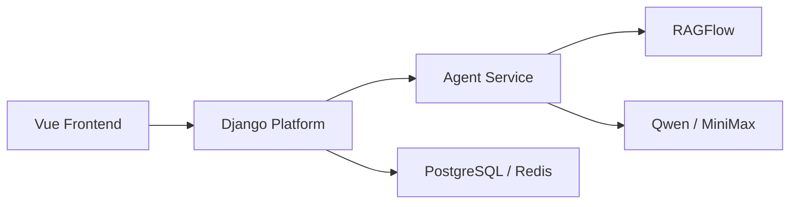

# Django平台层与AgentService分层设计稿

## 1. 目标

本文档用于明确 `Django 平台层 + Agent Service` 的职责边界，避免研发过程中把平台逻辑和智能体逻辑混写在一起。

适用目标：

- 当前 Demo 开发
- 后续账户、认证、权限扩展
- 后续知识库运营和管理后台建设

## 2. 分层原则

一句话原则：

`Django 管平台，Agent Service 管智能体执行。`

## 3. 职责划分

## 3.1 Django 平台层负责

- 用户、组织、角色、权限
- 会话管理
- 历史消息管理
- 配置管理
- 审计日志
- 对前端暴露统一 API
- 保存任务与结果索引
- 控制哪些用户能访问哪些能力

## 3.2 Agent Service 负责

- LangGraph 工作流执行
- 场景意图识别
- 检索编排
- 调用 RAGFlow
- 调用 Qwen / MiniMax
- 生成方案
- 回传流式状态与增量内容

## 4. 交互关系

## 5. 为什么不把 LangGraph 直接写进 Django 业务层

原因：

- 长任务与流式输出逻辑较重
- 检索与模型调用依赖较多
- 后续要独立扩展 Agent 能力
- 避免 Django 业务服务被智能体逻辑拖重

## 6. 推荐通信方式

MVP 建议：

- Django 通过内部 HTTP 调用 Agent Service

后续可演进为：

- 消息队列
- 异步任务系统

## 7. 数据归属建议

## 7.1 Django 存

- 用户
- 会话
- 消息
- 任务
- 审计日志
- 配置

## 7.2 Agent Service 存

- 运行时状态缓存
- LangGraph 中间态
- 临时流式输出缓存

## 8. 返回前端的数据归属

前端最终看到的所有业务对象，应以 Django 为准。

也就是说：

- Agent Service 产出“运行结果”
- Django 保存并整理为“业务对象”
- 前端从 Django 读“业务对象”

## 9. 演进建议

### MVP

- 不启用完整登录
- 但用户模型和权限点先留好

### v1.1

- 加登录
- 加角色
- 加会话权限

### v1.2

- 加知识库管理后台
- 加 Prompt / 模型策略后台

## 10. 最终建议

这条路线最适合你现在的项目状态，因为它同时兼顾了：

- Demo 交付速度
- 后续产品化能力
- 账户与权限演进空间

对研发来说，最关键的是从第一天起就守住边界：

- Django 不直接承载复杂 Agent 逻辑
- Agent Service 不直接承载用户与权限逻辑
