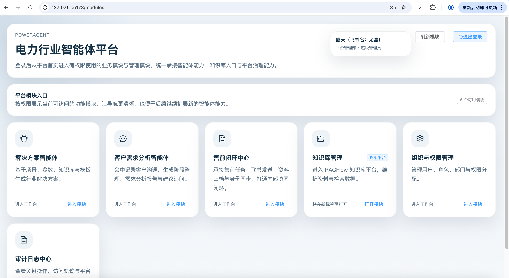
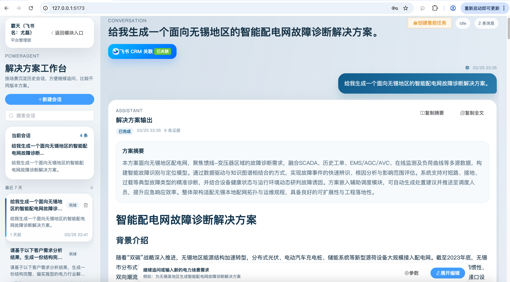
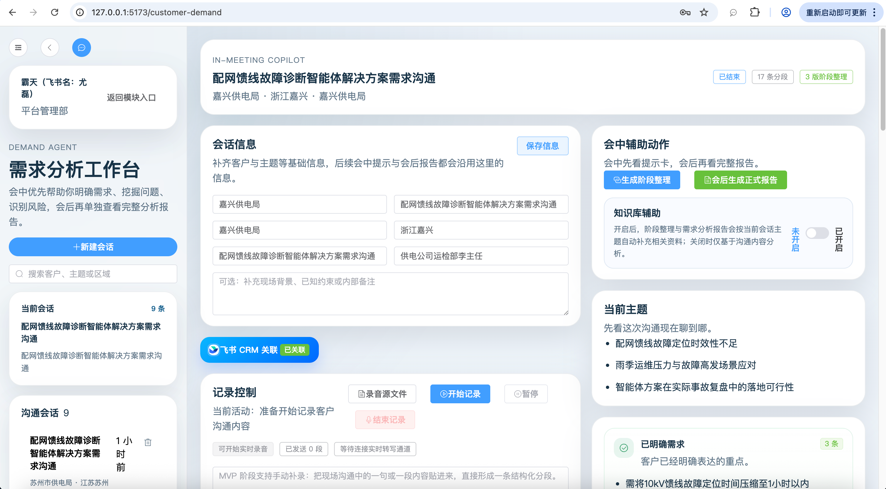
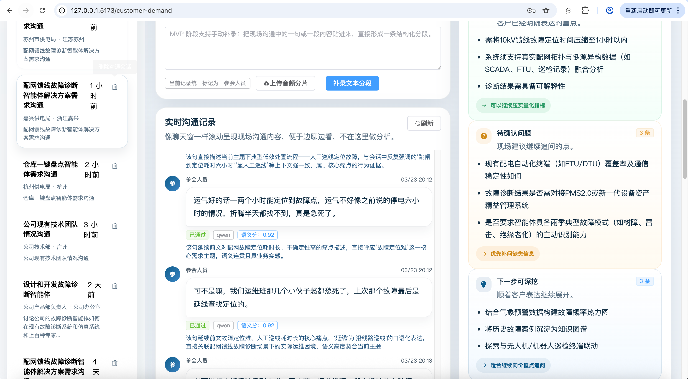
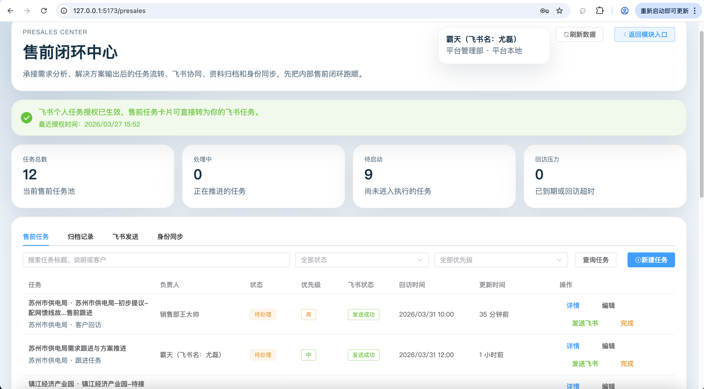
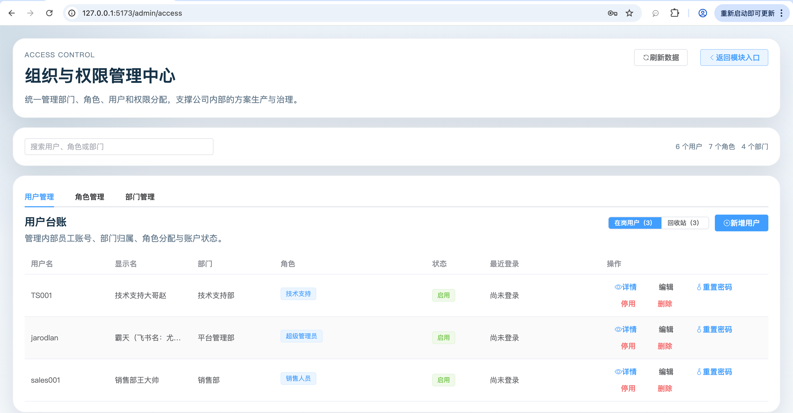
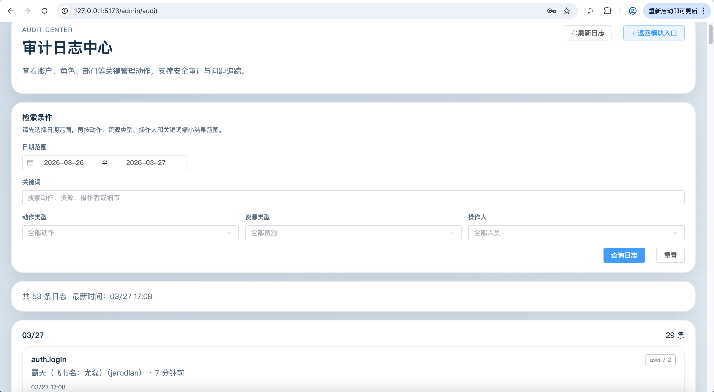
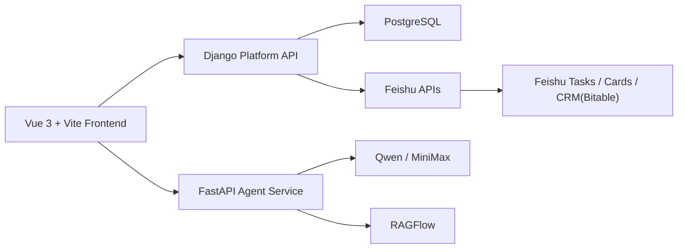

# PowerAgent Presales Platform

> An internal AI platform for power-industry presales, demand discovery, solution generation, task orchestration, and Feishu CRM collaboration.

[中文](#中文) | [English](#english)




---

# 中文

## 项目简介

`PowerAgent Presales Platform` 是一个面向电力行业内部业务场景的售前智能体平台，当前重点覆盖三条核心链路：

- `客户需求分析智能体`
- `解决方案智能体`
- `售前闭环中心（含飞书任务与飞书 CRM 联动）`

项目目标不是做一个单点聊天机器人，而是把售前过程中的核心动作串成闭环：

1. 客户沟通与会中辅助
2. 需求分析与正式报告生成
3. 解决方案生成与参数化确认
4. 售前任务流转、飞书协同、资料归档
5. 飞书 CRM 客户/商机绑定与跟进写回

## 当前能力

### 1. 客户需求分析智能体

- 实时录音、转写、会中辅助
- 分段语义校验与人工复核
- 自动阶段整理与人工触发整理
- 独立需求分析报告页
- 一键转入解决方案工作台
- 支持飞书 CRM 客户/商机关联

### 2. 解决方案智能体

- 多场景解决方案生成
- 参数化输入与冲突确认
- 章节级工作流与校核
- 知识库检索与证据卡展示
- 支持从需求分析结果导入方案草稿
- 支持绑定飞书 CRM 并写回跟进记录

### 3. 售前闭环中心

- 从需求分析报告 / 解决方案结果一键创建售前任务
- 飞书卡片发送、多人/群聊同时分发
- 飞书个人任务授权与一键转任务
- 飞书账号/部门同步与合并
- 飞书 CRM 客户/商机关联与跟进写回

### 4. 平台基础能力

- 统一模块入口页
- 账户、角色、权限、部门体系
- 审计日志中心
- 用户停用/恢复/回收站
- 平台级模块权限控制

## 界面预览

| 统一平台入口 | 解决方案智能体 |
| --- | --- |
|  |  |

| 需求分析智能体 | 会中辅助界面 |
| --- | --- |
|  |  |

| 售前闭环中心 | 组织与权限管理 |
| --- | --- |
|  |  |

| 审计日志中心 |
| --- |
|  |

## 技术架构



### 技术栈

- 前端：`Vue 3` + `Vite` + `Pinia` + `Element Plus`
- 平台层：`Django` + `Django REST Framework`
- 智能体执行层：`FastAPI` + `LangGraph`
- 数据库：`PostgreSQL`
- 知识库：`RAGFlow`
- 模型服务：`Qwen`、`MiniMax`
- 协同与 CRM：`飞书卡片`、`飞书任务`、`飞书多维表格 CRM`

## 仓库结构

```text
backend/
  platform/         Django 平台层
  agent_service/    Agent Service / 工作流执行层
frontend/           Vue 前端
assets/             图标、README 展示图、静态素材
ragflow/            本地 RAGFlow 部署脚手架
项目文档/           产品/技术/开发计划/模板
```

## 快速启动

### 1. Django 平台层

```bash
cd backend/platform
python3 -m venv .venv
source .venv/bin/activate
pip install -r requirements.txt
cp .env.example .env
python manage.py migrate
python manage.py runserver 127.0.0.1:8000 --noreload
```

### 2. Agent Service

```bash
cd backend/agent_service
python3 -m venv .venv
source .venv/bin/activate
pip install -r requirements.txt
cp .env.example .env
uvicorn app.main:app --host 127.0.0.1 --port 9100 --reload
```

### 3. Frontend

```bash
cd frontend
npm install
npm run dev
```

### 4. RAGFlow

```bash
cd ragflow
cp .env.example .env
docker compose -f docker-compose.yml up -d
```

## 本地服务端口

- Frontend: `http://127.0.0.1:5173`
- Django: `http://127.0.0.1:8000`
- Agent Service: `http://127.0.0.1:9100`
- RAGFlow: `http://127.0.0.1:9381`

## 初始化

### 初始化权限种子

```bash
cd backend/platform
./.venv/bin/python manage.py bootstrap_rbac
```

### 创建超级管理员

```bash
cd backend/platform
./.venv/bin/python manage.py bootstrap_super_admin \
  --username your_admin \
  --password 'YourStrongPassword' \
  --email you@example.com \
  --display-name '平台管理员'
```

### 登录入口

- 登录页：`http://127.0.0.1:5173/login`

## 主要页面

- 统一模块入口：`/modules`
- 解决方案智能体：`/`
- 客户需求分析智能体：`/customer-demand`
- 售前闭环中心：`/presales`
- 组织与权限管理：`/admin/access`
- 审计日志中心：`/admin/audit`

## 文档入口

### 核心总览

- [项目文档总览](./项目文档/README.md)

### 产品设计

- [客户需求分析智能体 PRD](./项目文档/01-产品设计/客户需求分析智能体_PRD.md)
- [客户需求分析智能体 前端页面原型说明](./项目文档/01-产品设计/客户需求分析智能体_前端页面原型说明.md)
- [售前闭环智能体平台 飞书接入 PRD](./项目文档/01-产品设计/售前闭环智能体平台_飞书接入PRD.md)
- [售前闭环智能体平台 前端页面原型说明](./项目文档/01-产品设计/售前闭环智能体平台_前端页面原型说明.md)
- [飞书 CRM 绑定操作流程与注意事项](./项目文档/01-产品设计/飞书CRM绑定操作流程与注意事项.md)

### 技术设计

- [客户需求分析智能体 技术设计稿](./项目文档/02-技术设计/客户需求分析智能体_技术设计稿.md)
- [售前闭环智能体平台 技术设计稿](./项目文档/02-技术设计/售前闭环智能体平台_技术设计稿.md)
- [飞书多维表格 CRM 接入方案分析](./项目文档/02-技术设计/飞书多维表格CRM接入方案分析.md)
- [飞书 CRM 接口设计文档](./项目文档/02-技术设计/飞书CRM接口设计文档.md)

## 当前阶段

- 当前版本：`0.1.0-mvp`
- 当前重点：
  - 会中辅助体验优化
  - 需求分析与解决方案联动
  - 售前闭环流转
  - 飞书任务与飞书 CRM 闭环

## Roadmap

### 已完成

- 统一模块入口与权限控制
- 客户需求分析智能体会中辅助
- 需求分析报告生成与一键转方案
- 售前闭环中心与飞书任务卡片流转
- 飞书 CRM 客户/商机关联与跟进写回

### 进行中

- 飞书 CRM 深度联动体验优化
- 售前任务流转、筛选与归档增强
- 需求分析与解决方案的跨模块自动继承

### 下一步

- 飞书任务与平台售前任务双向状态同步
- CRM 自动推荐客户/商机与默认写回目标
- 更多电力行业场景模板与知识增强
- 生产环境部署与稳定性治理

## 安全与配置说明

- 仓库仅保留 `.env.example`
- 实际 `.env`、录音文件、媒体文件不应提交
- 飞书、模型、数据库等真实密钥应保存在本地或部署环境

---

# English

## Overview

`PowerAgent Presales Platform` is an internal AI platform for power-industry presales operations. It currently connects three major workflows:

- `Customer Demand Analysis Agent`
- `Solution Generation Agent`
- `Presales Center` with `Feishu Tasks` and `Feishu CRM`

The goal is not a single chat assistant, but an end-to-end presales workflow:

1. Customer communication and in-meeting assistance
2. Demand analysis and formal reporting
3. Solution generation
4. Presales task orchestration and Feishu collaboration
5. CRM binding and writeback through Feishu Bitable

## Key Features

### Customer Demand Analysis

- Real-time recording and transcription
- Semantic validation and manual review
- Stage summaries and final demand reports
- One-click handoff to solution generation
- Feishu CRM customer/opportunity binding

### Solution Generation

- Multi-scenario solution workflows
- Parameterized generation and conflict confirmation
- Section-level orchestration and verification
- Knowledge retrieval and evidence cards
- CRM binding and writeback support

### Presales Center

- Create presales tasks from demand reports or solution outputs
- Send Feishu cards to users and groups
- Convert cards to personal Feishu tasks
- Feishu account/department sync and merge
- Feishu CRM binding and follow-up writeback

## Screenshots

| Unified Entry | Solution Workspace |
| --- | --- |
|  |  |

| Demand Analysis Workspace | In-Meeting Assistant |
| --- | --- |
|  |  |

| Presales Center | Access & Permission Center |
| --- | --- |
|  |  |

| Audit Log Center |
| --- |
|  |

## Tech Stack

- Frontend: `Vue 3`, `Vite`, `Pinia`, `Element Plus`
- Platform API: `Django`, `Django REST Framework`
- Agent runtime: `FastAPI`, `LangGraph`
- Database: `PostgreSQL`
- Knowledge layer: `RAGFlow`
- Model providers: `Qwen`, `MiniMax`
- Collaboration: `Feishu Cards`, `Feishu Tasks`, `Feishu Bitable CRM`

## Repository Structure

```text
backend/            Platform API and agent services
frontend/           Vue application
assets/             Icons, README screenshots, static assets
ragflow/            Local RAGFlow deployment scaffold
项目文档/           Product and technical documents
```

## Quick Start

### Platform API

```bash
cd backend/platform
python3 -m venv .venv
source .venv/bin/activate
pip install -r requirements.txt
cp .env.example .env
python manage.py migrate
python manage.py runserver 127.0.0.1:8000 --noreload
```

### Agent Service

```bash
cd backend/agent_service
python3 -m venv .venv
source .venv/bin/activate
pip install -r requirements.txt
cp .env.example .env
uvicorn app.main:app --host 127.0.0.1 --port 9100 --reload
```

### Frontend

```bash
cd frontend
npm install
npm run dev
```

### RAGFlow

```bash
cd ragflow
cp .env.example .env
docker compose -f docker-compose.yml up -d
```

## Local Endpoints

- Frontend: `http://127.0.0.1:5173`
- Django: `http://127.0.0.1:8000`
- Agent Service: `http://127.0.0.1:9100`
- RAGFlow: `http://127.0.0.1:9381`

## Docs

- [Project Documentation Index](./项目文档/README.md)
- [Customer Demand Analysis PRD](./项目文档/01-产品设计/客户需求分析智能体_PRD.md)
- [Presales + Feishu PRD](./项目文档/01-产品设计/售前闭环智能体平台_飞书接入PRD.md)
- [Feishu CRM Integration Analysis](./项目文档/02-技术设计/飞书多维表格CRM接入方案分析.md)
- [Feishu CRM API Design](./项目文档/02-技术设计/飞书CRM接口设计文档.md)

## Status

- Version: `0.1.0-mvp`
- Current focus:
  - In-meeting assistant UX
  - Demand-to-solution workflow
  - Presales execution loop
  - Feishu task and CRM integration

## Roadmap

### Done

- Unified module entry and permission controls
- In-meeting customer demand assistant
- Demand report generation and solution handoff
- Presales center with Feishu task card delivery
- Feishu CRM customer/opportunity binding and writeback

### In Progress

- Deeper Feishu CRM workflow polishing
- Presales task filtering, flow management, and archive UX
- Cross-module inheritance from demand analysis to solution and presales

### Next

- Two-way status sync between Feishu tasks and platform tasks
- Automatic CRM recommendations for customer/opportunity binding
- More domain templates and knowledge-enhanced workflows
- Production deployment and operational hardening

## Security Notes

- Only `.env.example` files should be committed
- Real secrets, media, and recordings must stay out of the repository
- Production credentials should be stored in local or deployment environments
