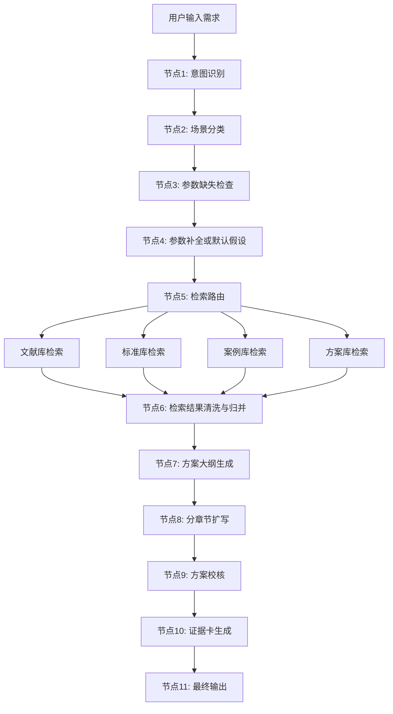

# 智能电网故障诊断Demo工作流设计稿

## 1. 场景定义

本 Demo 面向如下目标用户：

- 售前人员
- 方案经理
- AI 研发负责人
- 智慧电网业务负责人

目标能力：

用户输入一个故障诊断相关需求后，系统能自动完成：

1. 识别场景
2. 补齐关键参数
3. 检索知识
4. 生成方案
5. 提供证据
6. 输出实施建议

示例输入：

`给我提供一个智能电网故障诊断的解决方案`

## 2. 目标输出结构

建议输出以下固定结构：

1. 项目背景与业务痛点
2. 适用场景与建设目标
3. 总体技术架构
4. 数据采集与治理体系
5. 故障诊断算法设计
6. 知识库与智能体协同机制
7. 实施步骤与里程碑
8. KPI 与预期收益
9. 风险与落地建议

## 3. 工作流总览



## 4. 节点设计明细

## 4.1 节点1：意图识别

### 输入

- 用户原始问题

### 输出

- 一级意图：解决方案生成
- 二级意图：智能电网故障诊断

### 目标

将用户自然语言归并到平台定义好的业务标签，避免直接用原始问题检索。

### Prompt 要点

- 识别是否属于电力行业
- 识别是问答、方案、案例还是分析任务
- 输出标准化场景名

## 4.2 节点2：场景分类

### 输出字段建议

- `grid_environment`
- `business_domain`
- `scenario`
- `equipment_type`

### 示例

- `grid_environment = distribution_network`
- `business_domain = operation_maintenance`
- `scenario = fault_diagnosis`
- `equipment_type = comprehensive`

## 4.3 节点3：参数缺失检查

判断以下信息是否已明确：

- 电网类型
- 诊断对象
- 数据基础
- 建设目标

如果缺失：

- 对话式追问
- 或使用默认值

首期 Demo 为了更顺畅，建议默认值优先。

## 4.4 节点4：参数补全或默认假设

建议默认假设如下：

- 场景：配电网
- 对象：线路 + 变压器 + 开关综合诊断
- 数据：SCADA + 在线监测 + 历史工单
- 目标：故障预警 + 诊断 + 辅助定位

输出时必须显式标明：

`以下方案基于默认场景假设生成，可按实际项目参数进一步细化。`

## 4.5 节点5：检索路由

不同知识库负责不同内容：

- `文献库`: 技术路线、算法依据、前沿方法
- `标准库`: 合规边界、业务约束
- `案例库`: 已有项目经验、可迁移做法
- `方案库`: 产品能力、架构模板、实施方式

### 路由逻辑

如果场景为 `fault_diagnosis`，则优先召回：

1. 故障诊断案例
2. 故障诊断方案
3. 相关文献
4. 相关标准

## 4.6 节点6：检索结果清洗与归并

该节点建议使用代码节点或中间层服务完成。

处理内容：

- 去掉无关文段
- 提取关键证据
- 识别文献、标准、案例、方案来源
- 形成结构化上下文

建议输出结构：

```json
{
  "technical_basis": [],
  "case_basis": [],
  "standard_basis": [],
  "product_basis": [],
  "assumptions": []
}
```

## 4.7 节点7：方案大纲生成

不要直接一次性生成长文，先出大纲。

大纲建议固定为：

1. 建设背景
2. 痛点分析
3. 方案目标
4. 系统架构
5. 核心能力
6. 算法设计
7. 实施步骤
8. KPI

大纲生成时，要绑定检索证据，不允许完全脱离检索内容。

## 4.8 节点8：分章节扩写

每个章节单独扩写，输入包括：

- 本章节标题
- 大纲说明
- 对应检索证据
- 输出风格约束

这样做的好处：

- 更稳定
- 更易控制长度
- 更容易插入引用
- 更适合后续做章节级再生成

## 4.9 节点9：方案校核

校核器可分为两类：

### 规则校核

- 是否包含建设目标
- 是否包含数据来源
- 是否包含架构
- 是否包含实施路径
- 是否包含指标

### LLM 校核

- 内容是否符合电力行业场景
- 是否存在明显不合理术语
- 是否有自相矛盾
- 是否像“项目方案”而不是“论文综述”

## 4.10 节点10：证据卡生成

最终页面建议展示证据卡，而不是只在正文中隐含引用。

每张证据卡包含：

- 来源类型：文献 / 标准 / 案例 / 方案
- 标题
- 命中原因
- 用于支撑的章节

## 4.11 节点11：最终输出

建议输出三个层次：

### 正文版

适合阅读和继续编辑。

### 摘要版

适合聊天窗口快速浏览。

### 汇报版摘要

适合复制到 PPT 或 Word。

## 5. 前端交互建议

## 5.1 状态提示

建议状态文案比测试站更专业，使用：

- 正在识别业务场景
- 正在匹配故障诊断知识
- 正在归并案例与标准依据
- 正在生成方案大纲
- 正在扩写实施方案
- 正在校核内容质量

## 5.2 页面布局

建议采用双栏：

- 左侧：输入、参数、状态
- 右侧：方案正文、证据卡、摘要导出

## 5.3 可交互参数

前端可做 4 个选择框：

- 电网场景
- 设备对象
- 数据基础
- 目标能力

这一步对 Demo 效果提升非常明显。

## 6. 所需知识库准备

首期建议只整理与故障诊断有关的材料。

### 6.1 文献类

- 故障诊断
- 根因分析
- 数字孪生
- 智能运检
- 自愈控制

### 6.2 案例类

- 配电网故障识别案例
- 线路故障定位案例
- 设备异常预测案例
- 园区电网故障处置案例

### 6.3 标准类

- 设备运维标准
- 调度规程
- 故障处置规范

### 6.4 方案类

- 公司已有售前方案
- 架构能力说明
- 产品模块说明

## 7. 推荐实现方式

## 7.1 快速 Demo 路线

- 前端：Vue
- 编排：Dify Workflow
- 知识库：RAGFlow
- 模型：Qwen / DeepSeek

适合目标：

- 2~4 周出汇报版 Demo

## 7.2 中长期产品路线

- 前端：Vue/React
- 中间层：自建 Retrieval API
- 编排：LangGraph 或 Haystack
- 知识库：RAGFlow + 自建元数据中心

适合目标：

- 后续接多个电力 Agent
- 支撑正式平台建设

## 8. 最小可行版本范围

如果控制在 2 周内，建议只做以下能力：

1. 输入需求
2. 意图识别
3. 单场景知识检索
4. 固定模板生成
5. 证据卡展示

首期不要做：

- 太复杂的多轮澄清
- 图谱推理
- 多 Agent 协同
- 实时业务系统接入

## 9. 比测试站更好的关键点

只要做到下面 5 点，整体效果通常就会明显超过测试站：

1. 加参数化输入
2. 拆分知识库并做路由
3. 增加证据卡片
4. 增加方案校核器
5. 输出更像真实交付方案

## 10. 最终建议

这个 Demo 最适合做成一个“可演示、可汇报、可演进”的原型系统。

第一步不要追求全能，而是先把：

`智能电网故障诊断解决方案生成`

这个单场景打透。  
一旦这一条链路跑通，后面复制到：

- 新能源功率预测
- 配网规划
- 智慧能源调度
- 综合能源站运维

就会快很多。
