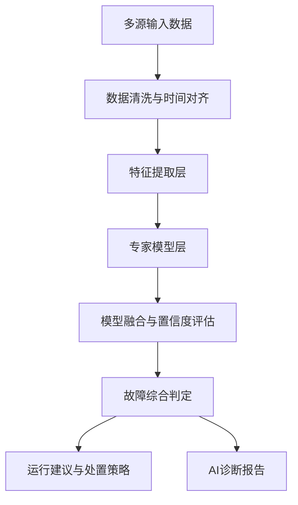

# Argri 专家模型群可能技术架构分析

## 1. 文档目的

本文档基于当前已掌握的 Argri 演示环境、产品界面、对外描述与电力故障诊断场景的一般工程实践，对“Argri 故障诊断系统中上百个专家模型”的可能技术架构、模型职责分层、实现方式与后续调研重点进行推测分析。

本文档不是源码级结论，而是用于：

- 帮助内部快速形成对 Argri 模型体系的技术认知
- 帮助区分“专家模型群”与“单一大模型”的差异
- 为后续和 Argri 产品负责人/技术负责人沟通提供问题框架
- 为后续评估 Argri 与平台集成方式提供基础判断

---

## 2. 核心判断

当前对 Argri “上百个专家模型”的最可能判断是：

**它不是“上百个大模型”，而是“围绕故障诊断各个步骤、各类故障、各类设备与工况，构建出来的专家模型群”。**

更可能的真实形态是：

- 专家规则模型
- 特征判别模型
- 传统机器学习分类模型
- 波形/时序识别小模型
- 电力仿真校核模型
- 诊断结果融合模型
- 运行建议与处置策略模型

这些模型共同构成一套：

**可解释、可分层、可扩展、适合电网故障场景的“模型群体系”。**

---

## 3. 为什么大概率不是“单一大模型”

从当前 Argri 已展示出的产品界面和能力形态看，它更强调：

- 多源数据融合
- 分阶段诊断流程
- 模型参与情况
- 模型权重
- 置信度
- 诊断依据
- 综合判定
- 运行建议

这与“单个端到端黑盒模型”并不匹配，反而非常符合“多专家模型 + 规则仲裁 + 结果融合”的典型工业架构。

如果系统是单一大模型，通常会更难天然具备：

- 清晰的参与模型列表
- 结构化权重展示
- 分步骤诊断轨迹
- 可追溯的诊断依据
- 稳定的工程可控性

因此，Argri 的“上百个专家模型”高概率是一个**工程化模型群**，而非“上百个 LLM”。

---

## 4. 模型群的可能总体分层

最可能的总体结构如下：

其中“上百个专家模型”最可能集中在：

- 特征提取后的故障识别层
- 仿真校核层
- 融合仲裁层
- 运行建议层

---

## 5. 这些专家模型最可能分成的 6 类

### 5.1 故障类型识别模型

这类模型最直接，对应具体故障类型的判断。

可能覆盖：

- 单相接地
- 相间短路
- 两相接地
- 三相短路
- 缺相
- 电缆故障
- 光伏反送电异常
- 台区异常
- 开关拒动/误动相关场景
- 其它异常

#### 可能输入

- 电气暂态量
- 电气稳态量
- 零序电流/电压
- 相电流、线电流、相电压
- 报文与保护动作记录
- 开关分合状态变化

#### 可能实现方式

- 专家规则判据
- 传统机器学习分类器
  - XGBoost
  - RandomForest
  - SVM
- 小型时序分类网络
- 规则 + 机器学习联合

#### 典型特点

- 每个模型职责非常专
- 通常只负责识别某一种故障或某一类特征模式

---

### 5.2 故障定位模型

定位模型负责判断：

- 故障大致位于哪一条馈线
- 位于哪一个区段
- 处于哪两个开关之间
- 靠近哪一段线路/杆塔/设备

#### 可能实现方式

- 基于拓扑的区段约束推理
- 阻抗估算模型
- 波形传播时差分析
- 仿真场景匹配
- 候选区段打分模型

#### 典型输出

- 候选故障区段列表
- 每个区段的评分或概率
- 最优区段推荐

这类模型大概率不会直接给一个“绝对位置”，而是：

- 多个候选
- 配合融合层做最终判定

---

### 5.3 数据质量与异常校验模型

这是工业系统里非常关键但经常被忽略的一层。

它们可能负责判断：

- 报文是否缺失
- 采样是否异常
- 时间戳是否对齐
- 多源数据是否冲突
- 当前诊断是否受坏数据影响

#### 可能实现方式

- 规则校验
- 统计异常检测
- 采样可信度评分
- 多源一致性检查

#### 作用

这类模型不一定直接产出故障类型，但会影响：

- 哪些模型可以参与
- 哪些模型结果权重降低
- 当前结论的可信度

---

### 5.4 仿真校核模型

根据现有描述，Argri 融合了电力系统仿真技术，这说明仿真很可能不是单独的外围工具，而是诊断链的一部分。

#### 它们可能负责

- 对候选故障类型进行仿真复现
- 对候选故障位置进行仿真校核
- 对不同运行方式下的故障响应做比对
- 反推更可能的故障解释

#### 可能实现方式

- 短路仿真
- 潮流仿真
- 保护动作仿真
- 参数化工况模板比对
- 仿真结果与真实观测匹配评分

#### 特点

这部分“模型”未必是 AI 模型，而可能是：

- 仿真引擎 + 匹配评分器
- 但在产品表述里仍会被纳入专家模型体系

---

### 5.5 模型融合与置信度评估模型

从已有 AI 诊断报告界面看，系统已经展示了：

- 参与模型
- 权重
- 结论
- 置信度
- 综合判定

这强烈说明 Argri 存在一层“融合层”。

#### 可能实现方式

- 多模型投票
- 加权评分
- 分层决策树
- 规则仲裁器
- 贝叶斯融合
- 元模型（meta model）

#### 典型作用

- 汇总不同模型结论
- 消除结论冲突
- 给出最终诊断结果
- 输出综合概率/置信度
- 生成可解释的模型参与说明

这层很可能是 Argri 专业感和可解释性的重要来源。

---

### 5.6 处置策略与运行建议模型

从运行建议界面看，Argri 不仅输出诊断结论，还会输出：

- 标准处置
- 分段管理故障
- 预测性维护
- 极端容灾
- 无人机精准定位
- 容灾恢复

这说明“专家模型群”里很可能还包含：

- 策略推荐模型
- 风险评估模型
- 约束校核模型
- 运行方式推演模型

#### 可能实现方式

- 专家规则库
- 风险评分模型
- 容量校核规则
- N-1/联络线可转供判断
- 分段操作策略模板
- 预测性维护触发规则

这里“规则引擎”的占比大概率会比较高。

---

## 6. 为什么数量会达到“上百个”

“上百个专家模型”这个说法，很可能不是按“算法类别”来数，而是按**业务模型单元**来数。

### 可能的拆分方式 1：按故障类型拆

- 单相接地相关模型若干
- 相间短路相关模型若干
- 两相接地相关模型若干
- 三相短路相关模型若干
- 缺相相关模型若干
- 电缆故障相关模型若干
- 光伏/储能/反送电异常相关模型若干

### 可能的拆分方式 2：按设备与对象拆

- 馈线模型
- 开关模型
- 电缆模型
- 保护装置模型
- 光伏支路模型
- 储能支路模型
- 台区模型
- 联络开关模型

### 可能的拆分方式 3：按诊断步骤拆

- 数据可信度模型
- 暂态特征提取模型
- 稳态特征提取模型
- 报文语义识别模型
- 仿真匹配模型
- 位置评分模型
- 融合判定模型
- 策略建议模型

把三种拆法叠加以后，到“上百个专家模型”是非常自然的。

---

## 7. 最可能的技术实现组合

### 7.1 最可能的组合

**规则引擎 + 特征工程 + 传统机器学习 + 仿真校核 + 融合仲裁**

这是目前最符合 Argri 已展示特征的技术路线。

#### 优点

- 可解释性强
- 与电力专家知识融合自然
- 对工程场景更稳
- 易于按故障类型逐步扩展
- 更适合报告化与依据展示

---

### 7.2 次可能的组合

**规则引擎 + 小型深度模型 + 仿真 + 融合仲裁**

在某些需要处理复杂波形或时序特征的环节，可能加入：

- 1D CNN
- LSTM
- 小型 Transformer
- 时序异常检测模型

但这些模型更可能是局部增强，而不是整个系统的主心骨。

---

### 7.3 较不可能的组合

**单一端到端深度模型直接完成诊断与处置建议**

从 Argri 已展示的：

- 参与模型
- 模型权重
- 诊断依据
- 综合判定

来看，它非常不像纯黑盒端到端系统。

---

## 8. 工程落地上这些模型可能以什么形式存在

从实现角度推测，Argri 的“专家模型”很可能不是全都以同一种形式存在，而是多种工程载体混合：

### 8.1 Python/规则模块

例如：

- `single_phase_ground_detector.py`
- `phase_loss_detector.py`
- `zero_sequence_rule_engine.py`
- `section_isolation_strategy.py`

### 8.2 传统模型文件

例如：

- `.pkl`
- `.joblib`
- `.json`
- `.bin`

可能来自：

- sklearn
- xgboost
- lightgbm

### 8.3 仿真脚本与任务模板

例如：

- 故障工况脚本
- 拓扑/运行方式输入模板
- 短路/潮流仿真批量任务

### 8.4 策略模板与规则配置表

例如：

- 哪类故障优先隔离
- 哪类线路允许转供
- 哪类联络开关风险过高不可合
- 哪类容灾策略受当前负载约束

### 8.5 融合器或仲裁器

这是最后一层，用于汇总：

- 各模型参与情况
- 各模型结论
- 各模型权重
- 各模型依据
- 最终综合判定

这也与当前 AI 诊断报告页面里的展示方式高度一致。

---

## 9. 结合界面可反推的能力成熟度

根据已看到的 Argri 界面，它至少已经体现出：

### 9.1 有模型参与机制

不是只跑一个模型，而是：

- 不同模型参与
- 不同模型给出候选结论

### 9.2 有权重/置信度机制

不是简单的 if/else，而是：

- 不同模型结果有不同权重
- 有综合置信度或概率

### 9.3 有故障结果融合机制

能够从多模型输出中形成：

- 最终故障类型
- 最终故障结果
- 综合概率

### 9.4 有策略生成层

运行建议页表明它已经能把：

- 诊断结果
- 当前拓扑与负载情况
- 风险约束

转化为：

- 关键操作
- 优势
- 风险
- 依据

这说明它不是纯诊断引擎，而是已经往“诊断 + 处置策略”方向延伸。

---

## 10. 对 Argri 模型群的总体技术判断

综合当前信息，Argri 的“上百个专家模型”最可能是：

**以专家知识为主干、以多源特征为输入、以仿真校核为强化、以融合仲裁为输出的工业级故障诊断模型群。**

它的真正价值不一定在“单个模型多先进”，而在于：

- 模型群足够丰富
- 覆盖故障类型足够多
- 多源数据结合得足够深
- 结果融合足够稳定
- 输出足够可解释
- 能直接转化为运行建议与处置动作

---

## 11. 后续沟通建议：最值得核对的技术问题

如果后续要和 Argri 技术负责人继续深入沟通，建议重点核对以下问题：

1. “上百个专家模型”中，规则模型、机器学习模型、仿真模型分别占多少比例？
2. 模型是按故障类型拆，还是按诊断步骤拆，还是两者结合？
3. 最终综合判定的融合器采用什么机制？
4. 模型权重是固定配置还是动态计算？
5. 仿真在诊断链里扮演的是筛选器、校核器还是最终仲裁器？
6. 这些模型大多是离线训练 + 在线推理，还是规则/在线计算为主？
7. 新增一种故障类型时，是新增模型、修改规则，还是统一重训？
8. AI 诊断报告中的“诊断依据”是模型输出的结构化字段，还是模板拼装？
9. 运行建议中的“优势/风险/依据”是规则库生成、仿真结果映射，还是模型生成？
10. 这些模型是否已形成统一的“模型注册 + 调度 + 融合”平台能力？

---

## 12. 对后续平台集成的启示

如果未来要把 Argri 接入现有智能体平台，这套专家模型群最可能的合理集成方式不是“直接拿全部模型重做一遍”，而是：

- 把 Argri 视为故障诊断能力底座
- 通过能力接口获得：
  - 故障结论
  - 模型参与情况
  - 诊断依据
  - 运行建议
  - 相关案例
- 在平台上补：
  - 权限与审计
  - 报告沉淀
  - 协同流转
  - 知识沉淀
  - 与其他智能体的联动

也就是说，平台更适合做：

**模型群之上的协同层、治理层与产品化增强层。**

---

## 13. 一句话总结

**Argri 的“上百个专家模型”高概率是一套分层、场景化、强可解释的专家模型群，核心实现方式应是“规则引擎 + 特征模型 + 仿真校核 + 融合决策”，而不是一个大模型通吃。**
