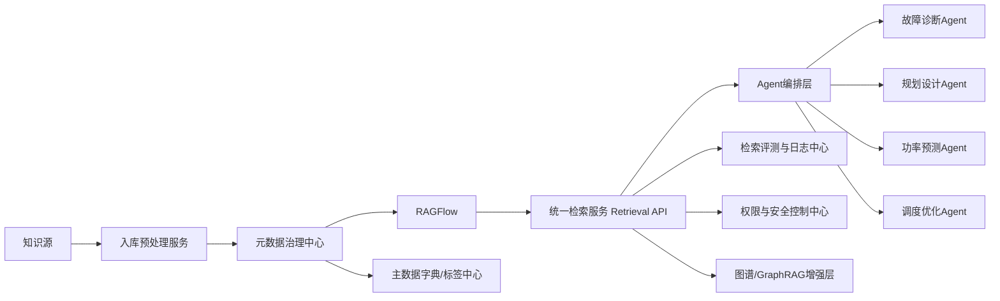

# 电力知识库中间层服务设计草案

## 1. 建设目标

在 `RAGFlow` 之上增加一层中间层服务，用于承接电力行业知识治理与 Agent 检索编排需求。

目标如下：

- 解耦 Agent 与底层知识库框架
- 统一接入多个知识库
- 统一元数据治理标准
- 统一权限、审计与安全控制
- 统一检索策略与评测机制
- 为未来 GraphRAG、图数据库和实时数据工具预留接口

一句话总结：

`中间层是电力行业知识底座真正的业务控制平面。`

---

## 2. 总体架构



---

## 3. 中间层的核心模块

建议至少拆成 6 个模块：

1. 入库预处理服务
2. 元数据治理中心
3. 统一检索服务 Retrieval API
4. 权限与安全中心
5. 评测与日志中心
6. 图谱增强接口层

---

## 4. 模块设计

### 4.1 入库预处理服务

职责：

- 接收原始文档
- 文档类型分类
- OCR与表格抽取增强
- 字段初步抽取
- 清洗与标准化
- 调用 RAGFlow 入库接口

输入：

- PDF
- Word
- PPT
- 图片扫描件
- 项目报告
- 工单记录

输出：

- 清洗后的文档
- 结构化元数据初稿
- 推荐入库模板

建议能力：

- 标题抽取
- 标准编号抽取
- 项目名称识别
- 地区识别
- 设备类型识别
- 电压等级识别
- 文档类型识别

---

### 4.2 元数据治理中心

职责：

- 管理字段字典
- 管理分类体系
- 管理枚举值
- 管理字段模板
- 管理审核状态
- 管理版本

建议存储：

- 独立元数据主数据表
- 标签字典表
- 审核记录表
- 模板配置表

核心功能：

- 字段校验
- 枚举标准化
- 模板分发
- 标签映射
- 文档元数据修订历史

---

### 4.3 统一检索服务 Retrieval API

职责：

- 接收来自 Agent 或应用的查询请求
- 判断应该查哪个知识库
- 生成检索过滤条件
- 调用 RAGFlow 检索
- 结合重排和证据组装后返回

建议它成为所有 Agent 唯一调用入口。

原因：

- 后续可以替换底层知识库框架
- 可以统一缓存、监控、权限和审计
- 可以统一做多路召回

---

### 4.4 权限与安全中心

职责：

- 控制知识库访问范围
- 控制文档级访问权限
- 控制项目级隔离
- 控制敏感资料可见性

建议能力：

- 用户角色控制
- Agent 角色控制
- 知识域白名单
- 文档安全级别过滤
- 查询审计日志

---

### 4.5 评测与日志中心

职责：

- 保存检索日志
- 评估检索效果
- 评估回答质量
- 支持持续迭代

建议能力：

- Recall@K 统计
- 引用命中率统计
- 结果点击反馈
- 专家人工标注反馈
- 热门问题与失败问题分析

---

### 4.6 图谱增强接口层

职责：

- 对接 GraphRAG
- 对接图数据库
- 支撑复杂案例关系检索

建议不要首期重投入，但要留标准接口。

适用场景：

- 故障链路分析
- 案例根因归纳
- 设备-故障-处置关系查询
- 多项目经验迁移

---

## 5. Retrieval API 建议接口

### 5.1 查询接口

建议统一成一个主查询接口。

示例：

`POST /api/retrieval/query`

请求体建议包含：

```json
{
  "query": "10kV配网单相接地故障在暴雨天气下的典型处置方式有哪些？",
  "agent_type": "fault_diagnosis_agent",
  "business_domain": "distribution_network",
  "scenario": ["fault_diagnosis"],
  "filters": {
    "voltage_level": ["10kV"],
    "review_status": ["approved"],
    "reliability_level": ["authoritative", "project_verified"]
  },
  "top_k": 10,
  "need_citations": true,
  "need_rerank": true
}
```

返回体建议包含：

```json
{
  "query_id": "Q-20260319-001",
  "route": {
    "knowledge_bases": ["fault_case", "standard", "case_report"],
    "strategy": "hybrid_retrieval"
  },
  "results": [
    {
      "doc_id": "DOC-0001",
      "title": "某地区配网故障复盘报告",
      "score": 0.91,
      "snippet": "......",
      "citations": [
        {
          "page": 12,
          "section": "故障处置过程"
        }
      ],
      "metadata": {
        "knowledge_type": "fault_case",
        "region": "广东",
        "voltage_level": ["10kV"]
      }
    }
  ]
}
```

---

## 6. 检索路由策略建议

### 6.1 按 Agent 类型路由

| Agent | 默认知识库优先级 |
|---|---|
| 故障诊断 Agent | 故障案例 > 项目案例 > 标准规范 |
| 规划设计 Agent | 解决方案 > 项目案例 > 标准规范 > 专家文献 |
| 功率预测 Agent | 专家文献 > 项目案例 > 运维记录 |
| 调度优化 Agent | 标准规范 > 专家文献 > 项目案例 |
| 源网荷储 Agent | 解决方案 > 项目案例 > 专家文献 |

### 6.2 按问题类型路由

建议先进行问题分类：

- 文献问答
- 方案生成
- 故障分析
- 案例比对
- 规程约束查询
- 多场景综合问答

然后再决定检索策略。

---

## 7. 中间层需要维护的核心数据表

建议至少有以下几类表：

### 7.1 元数据主表

- 文档ID
- 标题
- 知识类型
- 业务域
- 场景
- 电压等级
- 设备类型
- 项目名称
- 区域
- 来源级别
- 审核状态
- 安全级别
- 版本

### 7.2 字段字典表

- 字段名
- 中文名
- 类型
- 是否必填
- 适用范围
- 规则说明

### 7.3 枚举值字典表

- 字段名
- 编码值
- 显示名称
- 父级分类
- 是否启用

### 7.4 检索日志表

- query_id
- 查询内容
- 调用 Agent
- 检索知识库
- 过滤条件
- 返回文档列表
- 用户反馈
- 最终是否采纳

### 7.5 评测样本表

- 问题
- 标准答案
- 标准引用
- 正确文档集合
- 评测时间
- 评测结果

---

## 8. 与 RAGFlow 的集成边界

建议集成方式：

- 通过 API 调用 RAGFlow
- 不直接让上层 Agent 耦合 RAGFlow 内部实现
- 中间层负责封装对 RAGFlow 的调用细节

建议边界：

- RAGFlow：负责索引、检索、引用
- 中间层：负责策略、规则、治理

---

## 9. 首期实施建议

### 第一阶段

目标：先让知识能用。

动作：

- 搭建 RAGFlow
- 建设元数据字典 1.0
- 建设入库预处理脚本
- 建设 Retrieval API 1.0
- 首批接入故障诊断 Agent

### 第二阶段

目标：让知识可治理。

动作：

- 建审核流
- 建日志和评测
- 建权限控制
- 建多知识库路由

### 第三阶段

目标：让知识可扩展。

动作：

- 接入 GraphRAG
- 接入图数据库
- 增强复杂案例推理
- 接入更多电力 Agent

---

## 10. 最终建议

对当前项目来说，中间层不是可有可无，而是必要层。

如果没有中间层，会出现：

- Agent 与 RAGFlow 耦合过深
- 元数据标准难统一
- 权限与审核难实现
- 检索策略难以持续优化
- 后续很难平滑扩展到图谱、实时数据和多 Agent 协同

一句话总结：

`RAGFlow 是知识库引擎，中间层才是电力行业知识平台的业务大脑。`
