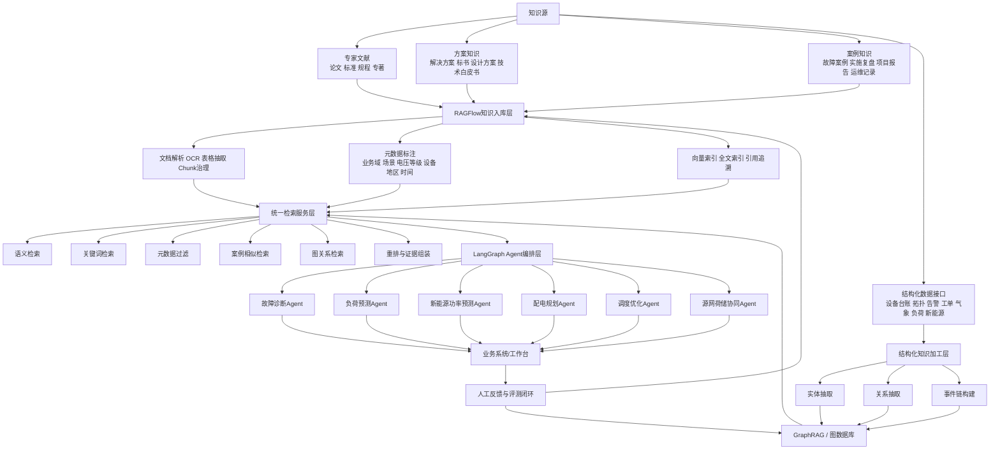

# 电力行业 Agent 知识底座架构与实施路线图

## 1. 建设目标

面向后续各类电力行业 Agent，建设统一的知识底座，支撑以下核心场景：

- 电力专家文献检索与问答
- 电网场景解决方案生成与复用
- 复杂电网环境案例检索、比对与归因
- 故障诊断、负荷预测、规划设计、源网荷储协同等 Agent 的底层 RAG 支撑
- 多 Agent 共用统一知识资产、统一检索接口、统一证据追溯能力

建议目标不是做一个“文档搜索系统”，而是建设一个可长期演进的“电力知识操作系统”。

---

## 2. 推荐总体方案

### 2.1 推荐组合

首选组合：

- 知识库平台层：`RAGFlow`
- Agent 编排层：`LangGraph`
- 复杂关系增强层：`GraphRAG + 图数据库（Neo4j / NebulaGraph）`
- 检索底层：`向量检索 + 全文检索 + 元数据过滤 + 重排`

### 2.2 为什么这样组合

`RAGFlow` 适合承担知识库平台层职责：

- 强文档解析
- 知识入库流程清晰
- 适合长文档、PDF、方案书、案例报告管理
- 支持可视化 chunk 调整、引用追溯、混合检索

`LangGraph` 适合承担 Agent 编排层职责：

- 控制 Agent 何时检索、检索几轮、是否追问、是否切换工具
- 更适合后续多 Agent 协同
- 更容易把知识库能力接入故障诊断 Agent、规划 Agent、预测 Agent

`GraphRAG + 图数据库` 适合承担复杂关系推理职责：

- 适合处理“设备 - 拓扑 - 故障 - 处置 - 结果”链路
- 适合复杂案例横向归纳和原因追踪
- 适合电网这种强关系、强上下游依赖场景

---

## 3. 推荐技术架构图

---

## 4. 知识库分层设计

不建议把所有资料放进一个混合库。建议至少拆成 4 个一级知识域。

### 4.1 标准规范与专家文献库

资料类型：

- 国家标准、行业标准、企业标准
- 调度规程、运维规程、安全规范
- 专家论文、专著、研究报告
- 电力系统分析、优化调度、负荷预测、新能源并网相关文献

适用 Agent：

- 调度优化 Agent
- 规划设计 Agent
- 专家问答 Agent

重点要求：

- 章节级切分
- 图表与公式引用定位
- 术语标准化
- 版本管理

### 4.2 解决方案与产品能力库

资料类型：

- 行业解决方案
- 技术方案书
- 招投标材料
- 产品说明书
- 功能清单、边界说明、接口说明

适用 Agent：

- 售前方案 Agent
- 规划设计 Agent
- 产品助手 Agent

重点要求：

- 场景标签化
- 产品能力映射
- 方案模板化
- 支持横向对比

### 4.3 案例实施与故障处置库

资料类型：

- 故障案例
- 项目实施报告
- 验收报告
- 复盘报告
- 工单、告警、处置记录

适用 Agent：

- 故障诊断 Agent
- 运维支撑 Agent
- 项目复盘 Agent

重点要求：

- 时间线建模
- 事件链抽取
- 相似案例召回
- 故障根因与处置结果关联

### 4.4 结构化设备与运行数据层

资料类型：

- 设备台账
- 电网拓扑
- GIS
- 负荷曲线
- 新能源功率
- 气象数据
- 告警数据
- 工单数据

适用 Agent：

- 故障诊断 Agent
- 功率预测 Agent
- 负荷预测 Agent
- 源网荷储协同 Agent

重点要求：

- 实时或准实时接入
- 不与静态文档混存
- 通过工具调用或数据接口接入 Agent

---

## 5. 元数据设计建议

知识库成败，很大程度取决于元数据，而不只是框架选型。

建议统一最小元数据集：

| 字段 | 示例 |
|---|---|
| `knowledge_domain` | 标准规范 / 文献 / 方案 / 案例 / 产品 / 工单 |
| `business_domain` | 调度 / 配网 / 输电 / 变电 / 规划 / 市场 / 新能源 / 运检 |
| `scenario` | 故障诊断 / 负荷预测 / 功率预测 / 配网规划 / 源网荷储 |
| `grid_environment` | 城市配网 / 园区微网 / 高比例新能源 / 山区线路 / 台区 |
| `voltage_level` | 10kV / 35kV / 110kV / 220kV |
| `equipment_type` | 变压器 / 开关 / 线路 / 逆变器 / 储能 / 终端 |
| `region` | 广东 / 华东 / 华南 / 某地市 |
| `time_range` | 2023Q4 / 2024-08 |
| `document_level` | 标准 / 论文 / 方案 / 报告 / 案例 |
| `reliability_level` | 官方标准 / 专家结论 / 项目复盘 / 一般经验 |
| `project_name` | 项目名称 |
| `source_system` | 文档系统 / 工单系统 / SCADA / GIS |

---

## 6. 不同框架在本项目中的定位建议

### 6.1 RAGFlow

适合承担：

- 文档入库
- 文档解析
- Chunk 管理
- 统一知识库运营
- 引用追溯
- 检索服务基础层

优势：

- 对文档型知识友好
- 更接近知识库产品而不是纯代码库
- 适合业务与研发共同参与知识治理

不足：

- 不建议独自承担复杂 Agent 全编排
- 强关系推理能力不是它的核心强项
- 对深度工程化评测和路由控制，代码框架更灵活

结论：

- 非常适合作为知识平台底座

### 6.2 LangGraph

适合承担：

- Agent 任务编排
- 多轮检索
- 工具调用决策
- 多 Agent 协作

优势：

- 对复杂流程控制更强
- 适合后续拓展到多电力 Agent 协同

不足：

- 本身不是知识库平台
- 入库治理、chunk 运营、文档解析需要配合其他系统

结论：

- 适合做 Agent 编排层，不建议单独做知识底座

### 6.3 Haystack

适合承担：

- 生产级 RAG Pipeline
- 检索、过滤、重排、评测
- 与企业后端深度集成

优势：

- 工程化强
- 组件化清晰
- 对评测和可维护性更友好

不足：

- 可视化知识库运营体验不如 RAGFlow 直接

结论：

- 如果团队偏 Python 工程化，Haystack 是长期很好的底层选择

### 6.4 LlamaIndex

适合承担：

- 多索引检索
- 文档与图谱混合索引
- 更复杂的数据接入方式

优势：

- 数据框架能力强
- 更容易针对复杂语料定制

不足：

- 偏开发框架，不是直接给业务人员用的知识库平台

结论：

- 适合技术团队自建深度定制平台

### 6.5 GraphRAG

适合承担：

- 跨案例实体关系挖掘
- 复杂问题的全局归纳
- 多事件链路推理

优势：

- 对复杂电网案例非常有价值

不足：

- 不适合作为全部知识的统一主引擎
- 成本较高，应优先用于高价值知识域

结论：

- 建议作为增强层，而不是唯一方案

---

## 7. 面向电力 Agent 的检索策略建议

### 7.1 单问题多策略检索

建议每次查询不要只做一次向量检索，而是走多路召回：

1. 问题分类
2. 判断属于文献问答、方案生成、案例匹配、故障分析哪一类
3. 并行调用：
   - 语义检索
   - BM25/关键词检索
   - 元数据过滤检索
   - 图关系检索
4. 重排
5. 证据组装
6. 返回 Agent

### 7.2 不同 Agent 的检索偏好

| Agent | 主要检索方式 | 辅助检索方式 |
|---|---|---|
| 故障诊断 Agent | 案例相似检索 + 图关系检索 | 规程检索 |
| 负荷预测 Agent | 方案/模型文档检索 + 时间标签过滤 | 历史案例检索 |
| 功率预测 Agent | 文档检索 + 结构化数据调用 | 天气与新能源案例检索 |
| 规划设计 Agent | 标准规范检索 + 方案库检索 | 历史项目案例检索 |
| 调度优化 Agent | 专家文献 + 规程 + 约束规则检索 | 历史运行案例检索 |
| 源网荷储协同 Agent | 方案库 + 案例库 + 实时数据接口 | 图关系检索 |

---

## 8. 实施路线图

### 阶段一：0-2个月，知识治理与试点建库

目标：先把知识资产变得“可入库、可管理、可检索”。

重点工作：

- 明确知识分类体系和元数据标准
- 选择首批试点资料
- 部署 RAGFlow
- 建立文档解析、清洗、标注流程
- 设计统一 chunk 规则
- 确定统一引用格式和证据回溯规则

首批建议入库范围：

- 故障诊断案例 100-300 份
- 新能源功率预测资料 50-100 份
- 配网规划方案与报告 50-100 份
- 标准规范与规程 50-100 份

阶段产出：

- 知识分类标准 1.0
- 元数据标准 1.0
- RAGFlow 知识库平台试点版
- 首批试点数据集

### 阶段二：2-4个月，统一检索服务建设

目标：把知识库从“能搜”升级为“能稳定给 Agent 用”。

重点工作：

- 建设统一 Retrieval API
- 建立混合检索能力
- 增加元数据过滤能力
- 建立重排策略
- 建立引用证据拼装逻辑
- 建立 RAG 评测集

评测指标建议：

- Recall@K
- 引用命中率
- 事实一致性
- 答案可追溯性
- 场景准确率
- 人工审核通过率

阶段产出：

- 检索服务 1.0
- RAG 评测集 1.0
- 统一检索接口文档

### 阶段三：4-8个月，接入首批 Agent

目标：支撑业务价值最明确的 3 类 Agent。

优先顺序建议：

1. 配电网故障诊断 Agent
2. 新能源功率预测 Agent
3. 配电网智能规划 Agent

重点工作：

- 用 LangGraph 编排 Agent 流程
- 设计检索路由策略
- 实现“检索 - 推理 - 引用 - 输出”闭环
- 建立人工反馈机制
- 形成可演示、可试点、可复用的业务版本

阶段产出：

- 3 个试点 Agent
- Agent 与知识库统一接口
- 初版业务反馈闭环

### 阶段四：8-12个月，复杂案例图谱化

目标：解决复杂电网案例、跨文档关系问题。

重点工作：

- 抽取设备、故障、保护动作、天气、负荷、处置动作等实体
- 建立案例图谱
- 建设 GraphRAG 检索能力
- 接入复杂故障复盘和案例归因场景

阶段产出：

- 电力案例图谱 1.0
- GraphRAG 增强检索 1.0
- 复杂案例推理试点

### 阶段五：12个月以后，平台化与多 Agent 协同

目标：从单点 Agent 走向统一智能平台。

重点工作：

- 故障、预测、规划、调度 Agent 协同
- 知识库权限分层
- 多租户与项目级知识域隔离
- 知识运营工作台
- 质量评测与自动优化机制

阶段产出：

- 电力 Agent 知识底座平台 2.0
- 多 Agent 协同框架
- 行业模板化复制能力

---

## 9. 推荐的最终落地路径

如果当前要尽快启动，建议按下面顺序实施：

### 路线 A：最快落地

- `RAGFlow` 做知识库平台
- `LangGraph` 做 Agent 编排
- 后续逐步叠加图谱能力

适合：

- 需要快速出样板
- 需要业务和研发共同管理知识库
- 需要尽快支撑 PPT 里规划的多个 Agent

### 路线 B：工程化优先

- `Haystack` 做底层检索服务
- `LangGraph` 做 Agent 编排
- 自建知识运营台或对接简单后台

适合：

- 团队研发能力较强
- 更重视可测试性、可维护性、长期演进

### 路线 C：复杂推理优先

- `RAGFlow / Haystack` 做基础知识库
- `GraphRAG + 图数据库` 做案例关系层
- `LangGraph` 做多路检索编排

适合：

- 复杂案例占比高
- 后续重点是故障归因、复杂环境案例复用、跨项目经验迁移

---

## 10. 最终建议

对当前电力行业知识底座项目，我建议采用以下决策：

- 知识库平台层：选 `RAGFlow`
- Agent 编排层：选 `LangGraph`
- 复杂案例增强层：预留 `GraphRAG + 图数据库`
- 前 6 个月先不追求全图谱化，先把高价值 Agent 跑起来
- 首批以“故障诊断、功率预测、规划设计”三个场景验证知识底座价值

一句话总结：

`RAGFlow 是合适的，但更适合做知识库平台层；如果目标是支撑未来多个电力场景 Agent，最优方案不是单选某个 RAG 框架，而是构建“RAGFlow + Agent编排 + 图增强”的组合式底座。`
