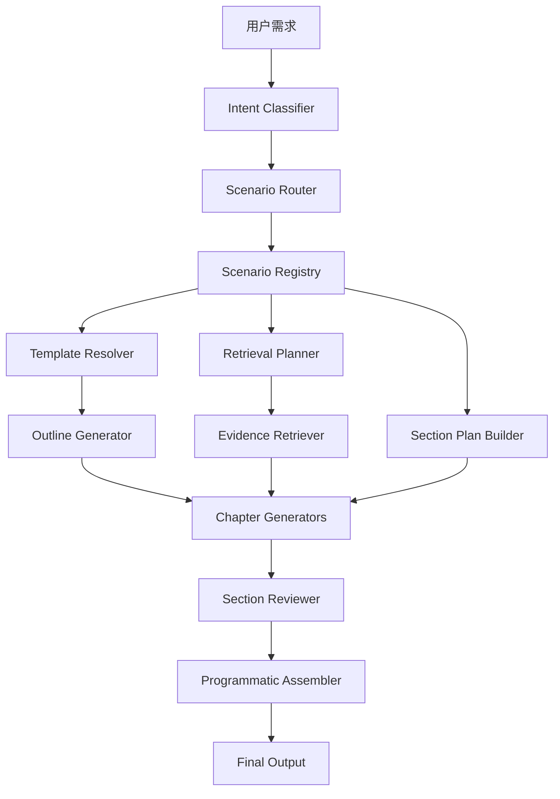

# 电力行业解决方案Agent_多场景技术设计稿

## 1. 设计目标

在现有 `Vue + Django + Agent Service + LangGraph + RAGFlow` 技术路线基础上，将解决方案生成 Agent 从“单场景模板驱动”升级为“多场景注册与路由驱动”的系统。

本设计稿聚焦：
- 多场景扩展能力
- 模板与知识的统一配置
- 工作流可配置化
- 长文方案稳定生成
- 未来接入 10+ 场景时的可维护性

## 2. 当前系统存在的限制

当前系统已经支持两个场景：
- `fault_diagnosis_solution`
- `storage_aggregation_solution`

但核心限制仍然存在：
- 场景信息还没有独立为统一注册表
- 模板、关键词、默认上下文、章节指导仍然部分散落在节点代码中
- 工作流虽然支持专用章节，但还没有抽象成“按场景配置的节点计划”
- 后续新增场景仍有演化成 if/else 的风险

## 3. 目标架构



## 4. 关键模块设计

### 4.1 Scenario Registry

职责：
- 管理所有正式支持场景
- 管理每个场景的模板、标题、关键词、默认上下文、知识优先级、章节指导、专用章节

建议位置：
- `backend/agent_service/app/services/scenario_registry.py`

### 4.2 Scenario Router

职责：
- 综合原始 query、LLM intent、显式参数，确定最终场景
- 对外输出 `scenario_id`

输入：
- `query`
- `normalized_intent`
- `params.scenario_profile`

输出：
- `scenario_id`

### 4.3 Template Resolver

职责：
- 根据 `scenario_id` 加载正式模板与参考样板
- 输出章节顺序和章节块

### 4.4 Retrieval Planner

职责：
- 根据 `scenario_id` 决定知识检索优先级
- 对接 RAGFlow dataset 分组

### 4.5 Section Plan Builder

职责：
- 根据 `scenario_id` 决定：
  - 哪些章节走通用节点
  - 哪些章节走专用节点

## 5. 数据结构建议

### 5.1 ScenarioConfig

建议统一结构如下：

```python
{
  "scenario_id": "storage_aggregation_solution",
  "document_title": "分布式储能聚合运营智能体解决方案",
  "template_path": "...",
  "source_path": "...",
  "keywords": [...],
  "default_context": {...},
  "retrieval_priority": ["solution", "case", "paper", "standard"],
  "section_guidance": {...},
  "specialized_sections": [...],
  "tags": [...],
}
```

### 5.2 AgentState 扩展

建议保留：
- `scenario_id`
- `normalized_intent`
- `normalized_context`
- `section_order`
- `section_contents`

## 6. 工作流改造建议

### 6.1 现阶段建议的工作流

1. `intent_identify`
2. `normalize_context`
3. `retrieve_documents`
4. `merge_evidence`
5. `generate_outline`
6. `generate_section:*`（通用章节）
7. `generate_case_section`
8. `generate_implementation_section`
9. `generate_kpi_section`
10. `generate_summary_section`
11. `assemble_solution`
12. `review_solution`

### 6.2 下一阶段建议

进一步抽象为：
- `build_generation_plan`
- `run_generation_plan`

即根据场景配置动态得到步骤计划，而不是在 `workflow.py` 里手写顺序。

## 7. 多场景检索策略设计

### 7.1 当前适合的策略
- 故障诊断：`solution -> case -> paper -> standard`
- 储能聚合运营：`solution -> case -> paper -> standard`

### 7.2 后续可扩展的策略
- 规划类：`standard -> case -> paper -> solution`
- 市场运营类：`solution -> policy -> case -> paper`

## 8. 模板与章节的关系

### 8.1 模板负责定义
- 章节顺序
- 章节风格
- 章节最小信息集合

### 8.2 节点负责保证
- 每章内容完整
- 特殊章节结构正确
- 长文不截断

## 9. 前后端协作建议

### 9.1 前端
后续前端可显示：
- 当前识别场景
- 当前模板名称
- 当前阶段提示

### 9.2 Django 平台层
可新增持久化字段：
- `scenario_id`
- `template_key`
- `knowledge_route`

用于后续统计：
- 哪类场景需求最多
- 哪类场景生成成功率最低
- 哪类场景需要补知识库

## 10. 测试与评估建议

### 10.1 必须建立场景路由测试集
至少为每个场景准备：
- 10 条典型 query
- 5 条易混淆 query
- 5 条低置信度 query

### 10.2 评估维度
- 场景识别准确率
- 模板匹配准确率
- 检索命中质量
- 专用章节完整率
- 方案整体可用性

## 11. 当前改造建议的价值

完成这次多场景抽象后，系统会具备三个明显优势：

1. `新增场景成本下降`
- 新增场景主要是加配置、模板和少量专用节点，而不是全链路改代码

2. `方案质量更稳定`
- 场景越准确，模板和知识越匹配，生成效果越接近正式方案

3. `后续平台化更自然`
- 未来无论做后台管理、版本发布还是场景统计，都有统一抽象可以依托

## 12. 当前阶段建议结论

当前系统已经具备：
- 两个可用场景
- 模板切换能力
- 专用章节节点
- 逐章节校核与程序化拼装

接下来最重要的不是继续堆 prompt，而是围绕 `Scenario Registry + Scenario Router` 继续平台化。
