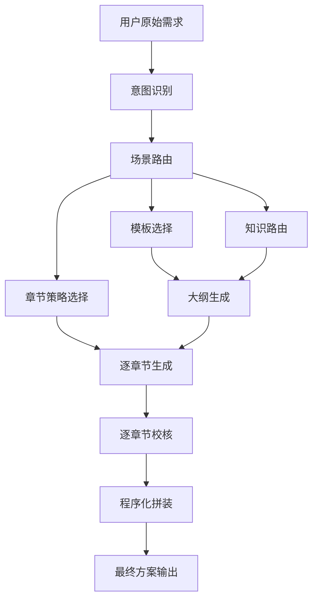

# 电力行业解决方案Agent场景路由与模板管理方案

## 1. 文档目标

本文档用于定义电力行业解决方案生成 Agent 的多场景路由、模板管理、知识路由与生成链治理规则。目标不是让系统只有一套“万能模板”，而是让系统能够根据用户原始需求，自动识别最适合的细分场景，并匹配对应的模板、知识来源和章节生成策略。

适用范围包括但不限于：
- 电网故障诊断智能体方案
- 分布式储能聚合运营智能体方案
- 配电网智能规划方案
- 新能源功率预测方案
- 虚拟电厂运营方案
- 源网荷储协同优化方案
- 园区综合能源运营方案

## 2. 为什么必须做场景路由

电力行业不同细分场景虽然都属于“智慧能源/电力 AI 解决方案”，但在方案结构、知识重点、实施路径和 KPI 体系上差异很大。

如果不做场景路由，会持续出现以下问题：
- 背景和行业术语能写对，但技术实施颗粒度不对。
- 套用了其他场景的章节结构，导致方案“像行业方案，但不像该场景的正式交付物”。
- 知识检索命中不聚焦，公共背景材料过多，案例、产品、实施内容不足。
- 后续场景越多，Prompt 和 if/else 越难维护。

因此，系统必须从“单模板解决方案生成器”升级为：

`场景识别系统 + 模板注册表 + 知识路由策略 + 章节生成策略 + 校核规则体系`

## 3. 总体设计原则

### 3.1 场景优先于模板
模板不是入口，场景才是入口。用户提出需求后，系统先识别场景，再选择模板。

### 3.2 模板只是配置，不是硬编码逻辑
模板、章节顺序、专用章节、知识优先级、默认上下文等，应统一进入“场景注册表”，而不是散落在节点代码中。

### 3.3 不同场景要允许不同的生成策略
有的场景重案例，有的重收益模型，有的重规划比选。系统不能假设所有场景都共享同一套章节生成方式。

### 3.4 长文方案必须按章节生成与拼装
对于万字级解决方案，必须采用：
- 按章节独立生成
- 按章节独立校核
- 程序化拼装
- 局部补写

不能依赖大模型在最后一步整篇重写。

## 4. 场景路由总体流程

## 5. 场景注册表设计

建议每个场景在注册表中至少维护以下字段：

| 字段 | 含义 | 说明 |
|---|---|---|
| `scenario_id` | 场景ID | 全局唯一，如 `fault_diagnosis_solution` |
| `document_title` | 文档标题 | 最终方案的默认标题 |
| `template_path` | 模板路径 | 对应 Markdown 模板文件 |
| `source_path` | 参考样板路径 | 高质量参考方案或参考内容 |
| `keywords` | 路由关键词 | 用于规则辅助识别 |
| `default_context` | 默认上下文 | 该场景下的默认参数 |
| `retrieval_priority` | 知识优先级 | 例如 `solution > case > paper > standard` |
| `section_guidance` | 章节指导 | 各章节的场景化要求 |
| `specialized_sections` | 专用章节 | 需要单独节点生成的章节 |
| `tags` | 标签 | 方便后台管理和未来统计 |

## 6. 当前建议优先支持的场景

### 6.1 第一批正式支持场景

| 场景ID | 场景名称 | 模板优先级 | 知识优先级 | 关键专用章节 |
|---|---|---|---|---|
| `fault_diagnosis_solution` | 电网故障诊断智能体方案 | 故障诊断模板 | `solution > case > paper > standard` | 成功案例介绍、技术实施方案、效益评估指标、总结 |
| `storage_aggregation_solution` | 分布式储能聚合运营智能体方案 | 储能聚合模板 | `solution > case > paper > standard` | 成功案例介绍、技术实施方案、效益评估指标、总结 |

### 6.2 第二批建议纳入的场景
- `grid_planning_solution`：配电网智能规划方案
- `power_forecast_solution`：新能源功率预测方案
- `virtual_power_plant_solution`：虚拟电厂运营方案
- `source_grid_load_storage_solution`：源网荷储协同优化方案
- `park_energy_solution`：园区综合能源智能运营方案

## 7. 场景识别规则

### 7.1 识别输入
场景识别应综合以下信息：
- 用户原始问题
- 用户补充参数
- 业务上下文
- 历史会话中已确认的场景标签

### 7.2 识别方法
建议采用：
- `LLM 场景分类` 为主
- `关键词/规则校验` 为辅
- `低置信度补问` 兜底

### 7.3 典型示例

| 用户提法 | 推荐路由场景 |
|---|---|
| “做一个智能电网故障诊断方案” | `fault_diagnosis_solution` |
| “做一个分布式储能聚合运营方案” | `storage_aggregation_solution` |
| “做一个虚拟电厂方案，重点是储能调度和套利” | `storage_aggregation_solution` 或 `virtual_power_plant_solution` |
| “做一个配网规划优化方案” | `grid_planning_solution` |

### 7.4 低置信度补问机制
当路由结果不稳定时，系统最多补问 1 到 2 个问题，例如：
- 更偏电网安全约束，还是偏市场收益优化？
- 方案主体是“储能聚合运营平台”还是“虚拟电厂运营平台”？

## 8. 模板管理策略

### 8.1 每个场景至少要有两份材料
- `正式模板`：用于章节结构和写作约束
- `参考样板`：用于风格、深度和展开方式参考

### 8.2 模板只定义结构，不承载所有逻辑
模板适合定义：
- 章节顺序
- 每章应出现的关键内容
- 风格和语气约束

不适合承担：
- 场景路由
- 知识优先级判断
- 复杂规则校核
- 章节修复策略

### 8.3 模板版本管理建议
每个模板应保留版本，例如：
- `v1.0`：初始模板
- `v1.1`：补强技术实施方案与 KPI
- `v1.2`：增强案例和收尾

并在后台或文档中记录：
- 修改日期
- 修改原因
- 生效场景

## 9. 知识路由策略

不同场景应有不同的知识优先级。

### 9.1 故障诊断场景
优先：
- 解决方案库
- 案例库
- 算法/文献库
- 标准库

### 9.2 储能聚合运营场景
优先：
- 解决方案库
- 案例库
- 市场/储能文献库
- 标准和政策库

### 9.3 规划类场景
优先：
- 标准规范库
- 案例库
- 规划方法库
- 解决方案库

## 10. 章节生成策略

### 10.1 通用章节
以下章节一般可走通用章节生成节点：
- 背景介绍
- 核心挑战识别
- 建设目标
- 总体技术架构
- 技术创新方向
- 效益分析

### 10.2 专用章节
以下章节建议根据场景走专用节点：
- 成功案例介绍
- 技术实施方案
- 效益评估指标
- 总结

### 10.3 为什么要专用节点
这些章节往往决定方案是不是“像正式交付物”，也是最容易在长文生成中失真的部分。

## 11. 校核与修复策略

### 11.1 校核方式
必须改成：
- 逐章节校核
- 程序化校核 + LLM 校核结合

### 11.2 重点校核项
- 标题是否规范
- 章节是否为空
- 是否有截断
- 是否有完整步骤
- KPI 是否有表格
- 案例数量是否充足
- 总结是否完整收束

### 11.3 修复方式
只修当前章节，不重写全文。

## 12. 推荐落地顺序

### 第一阶段
- 抽象场景注册表
- 将当前故障诊断和储能聚合运营接入注册表
- 完成模板、知识路由、章节策略统一配置化

### 第二阶段
- 接入配网规划、新能源功率预测、虚拟电厂场景
- 增加低置信度补问机制
- 增加场景路由评测集

### 第三阶段
- 建立后台管理能力
- 支持模板版本切换
- 支持场景灰度发布与 A/B 测试

## 13. 当前阶段的明确结论

对于电力行业解决方案 Agent，未来一定不是“一套模板走天下”。

必须建设的是：
- `场景路由层`
- `模板注册表`
- `知识路由策略`
- `章节专用生成链`
- `逐章节校核与程序化拼装`

这样系统才能从“能写方案”升级成“能写不同细分场景的正式方案”。
