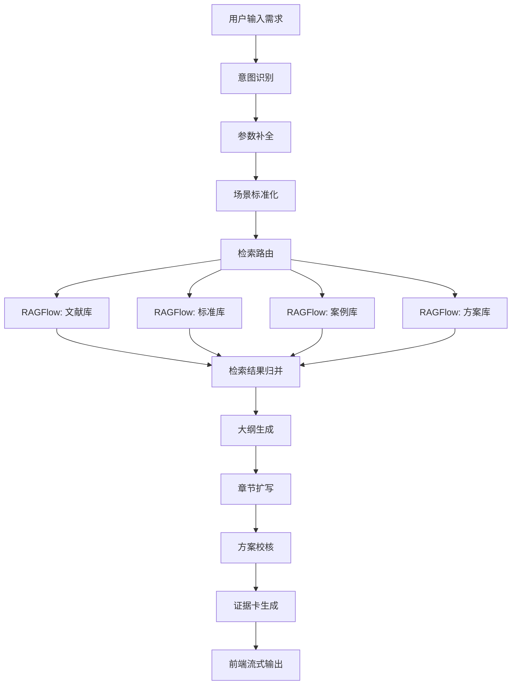

# 电力行业解决方案生成Agent PRD

## 1. 文档信息

- `文档名称`：电力行业解决方案生成Agent PRD
- `产品定位`：面向电力行业售前、方案经理与AI研发团队的方案生成 Demo / 原型系统
- `技术路线`：`RAGFlow + LangGraph + Vue`
- `文档版本`：v1.0
- `文档日期`：2026-03-20
- `适用阶段`：MVP / Demo 版

## 2. 产品背景

当前团队需要快速构建一个面向电力行业的智能体 Demo，用于展示 AI 在电网及智慧能源场景中的方案生成能力。目标不是做通用问答机器人，而是做一个能够结合行业知识库、案例库、标准库和公司已有解决方案能力，输出“接近真实项目交付材料”的行业解决方案生成系统。

已有外部测试站证明了“意图识别 + 知识检索 + 模板生成”的路线可行，但其短板也比较明显：

- 输出更像文献综述，不够项目化
- 缺少参数化输入
- 缺少证据展示
- 缺少方案校核
- 缺少面向后续产品化演进的架构边界

本产品希望在相同 Demo 周期内，做出一个更专业、更可信、更适合后续扩展的版本。

## 3. 产品目标

## 3.1 业务目标

构建一个可演示、可汇报、可扩展的 `电力行业解决方案生成 Agent`，支持用户输入一个电力场景需求后，自动完成：

1. 业务意图识别
2. 场景参数补全
3. 多知识库检索
4. 方案结构生成
5. 分章节扩写
6. 证据展示
7. 方案校核

## 3.2 MVP 目标

首期 MVP 聚焦单一高价值场景：

- `智能电网故障诊断解决方案生成`

并预留后续扩展到以下场景的能力：

- 新能源功率预测
- 配网规划优化
- 智慧园区能源管理
- 综合能源站运维

## 3.3 成功标准

MVP 达到以下标准即视为成功：

- 用户输入需求后，60 秒内可生成结构化方案
- 方案结构完整，包含架构、数据、算法、实施路径和 KPI
- 页面可展示证据来源
- 页面支持 ChatGPT 风格多会话历史列表
- 用户可加载历史会话并继续追问
- 输出内容明显优于“通用大模型直接回答”
- 支持二次扩展到其他电力场景

## 4. 目标用户

## 4.1 核心用户

### 1. 售前人员

需求：

- 快速生成方案初稿
- 用于客户交流或内部准备

### 2. 方案经理

需求：

- 根据具体场景得到较完整的方案结构
- 快速汇总技术路径和实施要点

### 3. AI 研发负责人 / 技术负责人

需求：

- 验证知识库 + Agent 的电力场景能力
- 用于领导汇报、路线展示、能力证明

## 4.2 非目标用户

MVP 不面向：

- 大规模外部客户直接使用
- 强权限隔离的正式生产环境
- 需要实时接入电网生产控制系统的业务

## 5. 产品定位

本产品是一个 `解决方案生成助手`，不是通用聊天助手。

输出必须尽量接近真实项目方案，具备以下特点：

- 行业化
- 结构化
- 有依据
- 可展示
- 可扩展

## 6. 范围定义

## 6.1 MVP 范围

包含：

- 单用户内部 Demo 使用
- 单一主场景：智能电网故障诊断
- ChatGPT 风格单页工作台
- 会话历史列表
- 历史消息加载
- 基于历史上下文继续生成
- 文献库、标准库、案例库、方案库的统一检索
- Vue 前端界面
- LangGraph 编排
- RAGFlow 检索接口接入
- 流式状态展示
- 证据卡片展示
- 方案导出为可复制文本

## 6.2 非 MVP 范围

暂不包含：

- 多租户
- 复杂权限体系
- 知识库后台管理页面
- 图谱推理
- 多 Agent 协同
- 上传文件后即时解析入库
- 实时对接 SCADA / PMU / DMS / EMS
- Word/PPT 自动生成

## 7. 产品方案概述

## 7.1 总体流程



## 7.2 架构分层

### 1. 前端层

- 技术：`Vue 3 + Vite + Element Plus`
- 职责：
  - 用户输入
  - 参数选择
  - 状态显示
  - 结果渲染
  - 证据卡展示

### 2. Agent 编排层

- 技术：`LangGraph`
- 职责：
  - 流程编排
  - 节点状态管理
  - 检索路由
  - 模型调用
  - 结果校核

### 3. 知识库层

- 技术：`RAGFlow`
- 职责：
  - 文档解析
  - 文档切片
  - 检索
  - 引用源追溯

### 4. 服务层

建议采用 `Django 平台层 + Agent Service` 双层服务架构。

其中：

- `Django 平台层`
  - 给前端提供统一业务接口
  - 负责会话、消息、用户、权限、配置、审计等平台能力
  - 负责统一鉴权、历史记录和后续管理后台能力

- `Agent Service`
  - 负责 LangGraph 工作流执行
  - 负责调用 RAGFlow、模型网关
  - 负责方案生成、流式状态和内容编排

平台层对前端暴露统一 API，Agent Service 对前端不可见。

## 8. 关键假设

为保证研发可以直接推进，当前做如下默认假设：

1. MVP 阶段可先关闭登录，但架构必须预留 Django 用户、认证和权限体系
2. 采用单组织知识库，不做租户隔离
3. RAGFlow 已可用，并已导入首批文档
4. Agent Service 由 Python 实现
5. 前端与 Django 平台层通过 HTTP / SSE 通信
6. Django 平台层与 Agent Service 通过内部 HTTP 通信
6. 首期仅做中文输出

如果后续业务要求变化，可在 v1.1 再补权限、上传和导出能力。

## 9. 页面与交互设计

## 9.1 页面列表

MVP 采用 `ChatGPT 风格单页工作台`，不拆独立历史页。

页面组成：

- `主工作台页`
- `知识来源详情抽屉`

## 9.2 主工作台布局

建议采用三段式布局：

### 左侧侧边栏

- 新建会话按钮
- 历史会话列表
- 会话分组
  - 今天
  - 最近 7 天
  - 更早

### 中间主内容区

- 欢迎态 / 会话消息流
- 用户消息
- Agent 消息
- 阶段状态条
- 方案摘要区
- 完整方案正文
- 证据卡片列表

### 底部输入区

- 多行输入框
- 参数折叠面板
- 发送按钮
- 停止生成按钮

## 9.3 会话侧边栏设计

侧边栏交互要求：

- 支持新建会话
- 支持点击历史会话加载
- 当前会话高亮
- 会话标题自动由首轮问题生成
- 生成中的会话显示运行状态

每条会话列表项建议展示：

- 会话标题
- 最近更新时间
- 最近一条问题摘要
- 是否生成中

## 9.4 输入区组件

### 1. 文本输入框

占位文案：

`请输入您的需求，例如：给我提供一个智能电网故障诊断的解决方案`

### 2. 参数选择项

首期 4 个下拉框：

- `电网场景`
  - 配电网
  - 输电网
  - 园区微网
  - 综合能源场景

- `诊断对象`
  - 线路
  - 变压器
  - 开关柜
  - 综合故障

- `数据基础`
  - SCADA
  - 在线监测
  - 历史工单
  - 图像巡检

- `目标能力`
  - 故障预警
  - 故障诊断
  - 根因分析
  - 辅助处置

默认值可预设，用户也可不修改。

### 3. 操作按钮

- `发送`
- `停止生成`
- `新建会话`
- `复制摘要`
- `复制全文`

## 9.5 历史记录与继续对话

系统需支持：

- 自动保存用户问题与 Agent 回复
- 按会话维度存储消息流
- 加载历史会话后恢复消息列表
- 在历史会话中继续发送新问题

继续对话时，Agent 应默认带入当前会话上下文，并保留结构化方案输出能力。

## 9.6 状态展示

页面需实时展示 Agent 状态，建议按时间线或步骤条显示：

1. 正在识别业务场景
2. 正在补全项目参数
3. 正在检索行业知识
4. 正在整理案例与标准依据
5. 正在生成方案结构
6. 正在扩写完整方案
7. 正在校核输出质量
8. 已完成

## 9.7 结果区展示规则

### 摘要区

显示 6~10 行简明摘要，包括：

- 适用场景
- 建设目标
- 核心能力
- 实施重点

### 正文区

按章节渲染 Markdown 内容。

### 证据卡区

每张卡片显示：

- 来源类型
- 标题
- 摘要
- 对应章节

## 10. 功能需求

## 10.1 功能模块总览

| 模块 | 功能 | 优先级 |
|---|---|---|
| 输入模块 | 输入需求和参数 | P0 |
| 编排模块 | LangGraph 工作流执行 | P0 |
| 检索模块 | 调用 RAGFlow 进行多库检索 | P0 |
| 生成模块 | 生成大纲和正文 | P0 |
| 校核模块 | 校验完整性与行业合理性 | P1 |
| 证据模块 | 生成证据卡片 | P0 |
| 会话模块 | 历史会话列表、加载与继续对话 | P0 |

## 10.2 输入模块

### 功能描述

用户可输入自然语言需求，并可选填场景参数。

### 输入校验

- 需求不能为空
- 需求长度建议 5~500 字
- 参数为空时允许提交

### 验收标准

- 用户在不填参数的情况下也能发起任务
- 用户修改参数后，任务能按参数执行
- 用户在历史会话中也能继续发送新消息

## 10.2A 会话模块

### 功能描述

系统采用会话制，前端展示历史会话列表，用户可以：

- 新建会话
- 查看会话列表
- 加载历史会话消息
- 在已有会话继续提问

### 会话标题规则

- 默认根据首轮问题自动生成
- 首轮消息保存后 1~2 秒内生成标题

### 验收标准

- 页面初始化时能加载历史会话列表
- 点击任一会话可加载消息
- 继续提问后消息正确追加到当前会话
- 切换会话时当前消息区域正确刷新

## 10.3 编排模块

### 功能描述

LangGraph 负责编排整条工作流。

### 节点建议

1. `intent_identify`
2. `normalize_context`
3. `retrieve_documents`
4. `merge_evidence`
5. `generate_outline`
6. `expand_sections`
7. `review_solution`
8. `build_evidence_cards`
9. `finalize_output`

### 验收标准

- 能输出每个阶段的状态
- 任一节点失败时能返回错误信息
- 能产出完整结构化结果对象

## 10.4 检索模块

### 功能描述

根据场景和参数，分别向 RAGFlow 的不同知识库发起检索请求。

### 知识库分类

- 文献库
- 标准库
- 案例库
- 方案库

### 检索策略

以 `智能电网故障诊断` 为例，优先级建议为：

1. 案例库
2. 方案库
3. 文献库
4. 标准库

### 检索输出格式

系统内部统一输出为：

```json
{
  "source_type": "case|paper|standard|solution",
  "title": "string",
  "snippet": "string",
  "score": 0.0,
  "metadata": {},
  "raw_reference": {}
}
```

### 验收标准

- 每次生成至少召回 6 条有效证据
- 证据结果可区分来源类型

## 10.5 生成模块

### 功能描述

分两阶段生成：

1. 生成大纲
2. 分章节扩写

### 方案结构固定要求

正文至少包含：

1. 项目背景
2. 痛点分析
3. 建设目标
4. 总体架构
5. 数据体系
6. 算法设计
7. 实施路径
8. KPI 与收益

### 验收标准

- 输出必须为结构化 Markdown
- 正文不少于 1500 字
- 内容不能只有综述，没有实施建议

## 10.6 校核模块

### 功能描述

对生成结果做规则校核和轻量 LLM 校核。

### 规则校核项

- 是否含建设目标
- 是否含系统架构
- 是否含数据来源
- 是否含算法能力
- 是否含实施步骤
- 是否含 KPI

### 失败处理

缺项则自动补写一次。

### 验收标准

- 输出结果缺项率小于 10%

## 10.7 证据模块

### 功能描述

生成与正文对应的证据卡片。

### 证据卡字段

- `id`
- `source_type`
- `title`
- `summary`
- `used_in_section`
- `metadata`

### 验收标准

- 每次结果至少展示 4 张证据卡
- 至少覆盖文献、案例或方案中的两类来源

## 11. LangGraph 工作流设计

## 11.1 State 设计

建议统一 State 如下：

```json
{
  "query": "",
  "params": {
    "grid_environment": "",
    "equipment_type": "",
    "data_basis": [],
    "target_capability": []
  },
  "normalized_intent": "",
  "retrieval_query": "",
  "documents": [],
  "evidence": {
    "papers": [],
    "standards": [],
    "cases": [],
    "solutions": []
  },
  "outline": "",
  "sections": [],
  "final_markdown": "",
  "summary": "",
  "evidence_cards": [],
  "status": "",
  "errors": []
}
```

## 11.2 节点说明

### `intent_identify`

输入：

- 用户 query
- 用户参数

输出：

- 标准化场景意图

### `normalize_context`

输入：

- 用户参数
- 缺省值配置

输出：

- 场景标准化上下文

### `retrieve_documents`

输入：

- 标准化场景

动作：

- 调用 RAGFlow 多知识库检索

### `merge_evidence`

动作：

- 清洗结果
- 去重
- 分类
- 选 TopN

### `generate_outline`

动作：

- 根据上下文和证据生成大纲

### `expand_sections`

动作：

- 按章节生成正文

### `review_solution`

动作：

- 校验缺项
- 必要时补写

### `build_evidence_cards`

动作：

- 产出前端展示用卡片

### `finalize_output`

动作：

- 生成最终返回对象

## 12. 后端接口设计

说明：接口命名可调整，但建议保持清晰。

## 12.1 创建任务

`POST /api/agent/solution/generate`

### 请求体

```json
{
  "query": "给我提供一个智能电网故障诊断的解决方案",
  "params": {
    "grid_environment": "distribution_network",
    "equipment_type": "comprehensive",
    "data_basis": ["scada", "online_monitoring", "historical_workorder"],
    "target_capability": ["fault_diagnosis", "root_cause_analysis"]
  }
}
```

### 返回

```json
{
  "task_id": "string",
  "status": "running"
}
```

## 12.2 订阅任务流

`GET /api/agent/solution/stream?task_id=xxx`

### 流式事件建议

- `status`
- `summary_chunk`
- `content_chunk`
- `evidence_cards`
- `completed`
- `error`

### 状态事件示例

```json
{
  "event": "status",
  "data": {
    "step": "retrieving",
    "message": "正在检索行业知识"
  }
}
```

## 12.3 获取任务结果

`GET /api/agent/solution/result?task_id=xxx`

### 返回结构

```json
{
  "task_id": "string",
  "status": "completed",
  "summary": "string",
  "final_markdown": "string",
  "assumptions": [],
  "evidence_cards": []
}
```

## 13. RAGFlow 对接要求

## 13.1 对接方式

通过服务端调用 RAGFlow 检索接口，不允许前端直连。

## 13.2 知识库命名建议

- `power_papers`
- `power_standards`
- `power_cases`
- `power_solutions`

## 13.3 入库要求

每条知识至少包含：

- 标题
- 类型
- 场景
- 来源等级
- 摘要

## 13.4 检索要求

- 支持关键词 + 语义混合
- 支持按知识库分类召回
- 支持返回引用信息

## 14. 非功能需求

## 14.1 性能

- 首次方案生成目标耗时：`<= 60 秒`
- 普通状态反馈间隔：`<= 3 秒`

## 14.2 可用性

- 任一节点失败时，前端可收到错误说明
- 失败不导致页面卡死

## 14.3 可扩展性

- 可扩展到多场景 Agent
- 可扩展到更多知识库
- 可扩展到导出功能

## 14.4 安全

MVP 阶段仅做基础安全要求：

- 前端不暴露内部服务密钥
- RAGFlow 和模型服务仅后端调用
- 错误信息不回传敏感配置

## 15. 数据埋点建议

建议记录以下埋点：

- 用户输入内容长度
- 参数选择情况
- 每个节点耗时
- 最终完成耗时
- 用户是否复制摘要
- 用户是否复制全文

用于后续优化：

- 检索效果
- 页面使用路径
- 方案结构质量

## 16. 验收标准

## 16.1 功能验收

- 可提交需求并生成结果
- 可新建会话
- 可查看会话列表
- 可加载历史会话
- 可在历史会话继续提问
- 可看到流式状态
- 可看到完整正文
- 可看到证据卡
- 可复制摘要和正文

## 16.2 内容验收

针对测试输入：

`给我提供一个智能电网故障诊断的解决方案`

结果必须满足：

- 输出结构完整
- 至少包含 8 个章节
- 具备明确建设目标
- 具备系统架构描述
- 具备数据与算法说明
- 具备实施路径和 KPI

## 16.3 工程验收

- 前端页面可独立运行
- 后端服务可独立运行
- LangGraph 流程可观测
- RAGFlow 检索调用可联调
- 会话与消息接口可联调

## 17. 研发拆分建议

## 17.1 前端

负责：

- 页面搭建
- 会话侧边栏
- 历史记录加载
- 参数交互
- SSE 状态流展示
- Markdown 渲染
- 证据卡展示

## 17.2 后端 / Agent

负责：

- Django 平台接口
- 会话、消息、任务管理
- Agent Service 编排
- 模型调用
- 任务状态管理
- SSE 输出

## 17.3 知识库 / 数据

负责：

- RAGFlow 知识库搭建
- 文档入库
- 元数据整理
- 检索效果验证

## 18. 里程碑建议

### M1：基础链路打通

- 前端能输入
- Django 平台层能接收会话消息
- Django 平台层能调用 Agent Service
- Agent Service 能调用 LangGraph
- LangGraph 能调用 RAGFlow

### M2：内容可用

- 能生成结构化方案
- 能展示状态流
- 能展示证据卡
- 能加载历史会话并继续对话

### M3：演示优化

- 优化输出质量
- 优化页面体验
- 准备演示脚本

## 19. 风险与应对

### 风险1：知识库质量不足

表现：

- 结果像空泛长文

应对：

- 首期优先导入高质量案例和方案

### 风险2：输出偏学术综述

表现：

- 不像可落地项目方案

应对：

- 加强模板约束
- 增加校核节点

### 风险3：响应时间过长

表现：

- 体验差

应对：

- 先出状态
- 先出摘要
- 后出全文

## 20. 最终结论

本 PRD 面向 MVP 研发，核心目标不是打造完整企业平台，而是以 `RAGFlow + LangGraph + Vue` 为技术底座，快速实现一个具备行业可信度、演示效果和后续演进空间的电力行业解决方案生成 Agent。

对于工程实现，优先级应始终保持一致：

1. 先打通链路
2. 再保证结构化输出
3. 再增强证据展示
4. 最后优化页面表现和生成质量

这样能最快产出一个真正可展示、可汇报、可继续迭代的 Demo。
