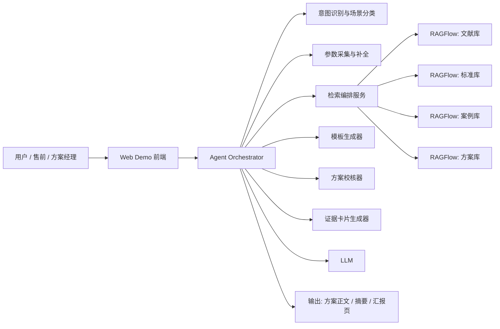

# 电力解决方案生成Agent Demo实施方案

## 1. 建设目标

建设一个面向电力行业售前、方案经理、AI研发团队的 `解决方案生成 Agent Demo`，让用户输入业务需求后，系统能够结合行业知识库、案例库、标准库和方案模板，快速生成一份具备工程表达能力的解决方案。

目标不是做通用问答，而是做一个具备以下特征的行业 Demo：

- 能识别电力业务意图
- 能调用行业知识库进行检索
- 能基于场景参数生成差异化方案
- 能给出引用依据、实施路径和关键指标
- 能体现后续产品化、平台化演进空间

## 2. 对标测试站的核心判断

通过对测试站的真实交互分析，其实现路径大概率为：

- `LLM 意图识别`
- `知识会话创建`
- `知识检索`
- `代码节点处理检索结果`
- `模板化方案生成`
- `流式展示中间状态`

这类方案的优点是演示感强、上线快，但也存在明显短板：

- 输出更像“文献综述 + 模板扩写”
- 缺少项目参数化
- 缺少证据卡片与可解释引用
- 缺少实施边界和KPI校核

因此，我们要做的不是简单复刻，而是做一个更像真实电力项目交付助手的 Demo。

## 3. Demo 2.0 建设原则

### 3.1 方案导向

输出结果必须更接近真实项目方案，而不是聊天回答。建议最终输出结构固定为：

1. 方案摘要
2. 业务痛点与建设目标
3. 适用场景与边界条件
4. 系统总体架构
5. 核心算法与知识能力
6. 实施路径与阶段规划
7. 关键KPI与预期收益
8. 风险与实施建议

### 3.2 场景导向

同一个“故障诊断”需求，必须能区分：

- 输电网
- 配电网
- 园区微网
- 新能源并网场景
- 多站点综合能源场景

### 3.3 证据导向

每个关键章节都应能追溯到：

- 文献依据
- 标准依据
- 案例依据
- 公司已有方案能力

### 3.4 平台化导向

Demo 首期可以轻量实现，但必须为后续正式系统预留：

- 多知识库管理
- 元数据治理
- 检索策略升级
- 多 Agent 协同
- 外部工具接入

## 4. 推荐总体架构

## 5. 技术选型建议

## 5.1 首期推荐组合

- `知识库平台`: RAGFlow
- `编排层`: Dify Workflow 或 LangGraph
- `前端`: Vue/React 任一轻前端
- `模型`: 先使用稳定商业模型，如 Qwen / DeepSeek / OpenAI 系列
- `存储`: 先走 RAGFlow 默认稳定路线

推荐理由：

- RAGFlow适合快速搭起文档入库、切片、引用追溯
- Dify Workflow 适合快速做可演示流程
- 如果后面偏工程化，可逐步迁移到 LangGraph 或 Haystack

## 5.2 二期演进组合

- `知识库平台`: RAGFlow
- `Agent 编排`: LangGraph 或 Haystack
- `底层向量库`: 视规模演进到 Milvus 等专用引擎
- `元数据中心`: 自建配置库
- `统一检索 API`: 自建中间层

## 6. 知识资产准备方案

首期只建议做 4 类知识库，避免范围失控。

### 6.1 专家文献库

内容：

- 电力人工智能论文
- 故障诊断研究文献
- 数字孪生、电网自愈、预测诊断方向综述

作用：

- 提供技术依据
- 支撑“为什么这么设计”

### 6.2 标准规程库

内容：

- 国标、行标、企标
- 运检规程、调度规程、设计规范

作用：

- 提供方案边界
- 降低生成内容不合规风险

### 6.3 项目案例库

内容：

- 已有项目方案
- 实施报告
- 试点案例
- 故障处置复盘

作用：

- 让生成内容更像真实实施方案

### 6.4 解决方案库

内容：

- 公司已有产品材料
- 售前方案
- 投标材料
- 架构说明

作用：

- 体现公司能力
- 避免输出和公司产品脱节

## 7. 元数据最小集合

首期建议统一这些字段：

- `knowledge_type`
- `business_domain`
- `scenario`
- `grid_environment`
- `voltage_level`
- `equipment_type`
- `source_level`
- `project_stage`
- `region`
- `review_status`

其中最关键的是：

- `scenario`
- `grid_environment`
- `equipment_type`
- `source_level`

这 4 个字段直接影响 Agent 是否能做场景化方案生成。

## 8. Demo 的核心工作流

### 8.1 输入层

用户输入：

`给我提供一个智能电网故障诊断的解决方案`

系统不直接生成全文，而是先做两步：

1. 意图识别
2. 参数补全

### 8.2 参数补全建议

首期建议补齐以下字段：

- 电网场景：输电 / 配电 / 园区 / 微网
- 诊断对象：线路 / 变压器 / 开关柜 / 综合故障
- 数据基础：SCADA / PMU / 在线监测 / 图像 / 工单
- 建设目标：预警 / 诊断 / 定位 / 辅助处置 / 自愈

如果用户不填写，系统使用默认值，但要在方案里明确假设条件。

### 8.3 检索层

按场景动态路由知识库：

- 技术原理 -> 文献库
- 合规边界 -> 标准库
- 实施经验 -> 案例库
- 产品能力 -> 方案库

### 8.4 生成层

采用“两阶段生成”：

1. 先生成方案大纲
2. 再逐章节扩写

这样比一次性长文生成更稳，且更便于后续插入证据和校核。

### 8.5 校核层

生成后增加一个 LLM 校核节点或规则校核节点，至少检查：

- 是否有建设目标
- 是否有数据来源
- 是否有系统架构
- 是否有算法模块
- 是否有实施路径
- 是否有 KPI
- 是否与电力场景一致

## 9. 前端展示设计

建议前端不要只做一个聊天框，而要做“方案助手”体验。

首期建议界面包括：

- 输入区
- 参数补全部分
- 实时状态区
- 方案正文区
- 证据卡片区
- 方案摘要导出区

推荐状态展示：

- 意图识别中
- 场景匹配中
- 知识检索中
- 方案结构生成中
- 章节扩写中
- 证据整理中
- 校核与优化中

这会比测试站的状态展示更专业。

## 10. 评测标准

首期至少准备 20 个问题，覆盖：

- 故障诊断
- 配网规划
- 新能源预测
- 智慧园区能源管理

评测指标建议包括：

- 场景识别正确率
- 检索命中文档相关性
- 方案结构完整度
- 电力业务合理性
- 证据引用质量
- 输出可汇报性

## 11. 4周实施计划

### 第1周

- 部署 RAGFlow
- 建立 4 类知识库
- 制定元数据 1.0
- 入库首批 100~300 份文档

### 第2周

- 完成 Demo 工作流搭建
- 完成意图识别、参数补全、知识库路由
- 打通流式状态反馈

### 第3周

- 接入方案模板
- 做证据卡片
- 增加校核器
- 形成 2~3 个样板场景

### 第4周

- 打磨前端体验
- 做领导汇报版输出
- 进行评测和优化
- 形成正式演示脚本

## 12. 我对首期落地的建议

不要一开始就做“万能电力 Agent”，而是先用一个高价值场景把链路跑通。

首期最佳主题建议就是：

`智能电网故障诊断解决方案生成`

原因：

- 场景明确
- 知识资产容易收集
- 演示价值高
- 能体现 AI + 电网融合
- 后续可平滑扩展到运检、规划、新能源等场景

## 13. 最终判断

对比测试站，想做出一个更好的 Demo，最关键的不是把文章写得更长，而是做到：

- 更懂电力场景
- 更有证据支撑
- 更像真实项目方案
- 更有工程边界
- 更方便以后做成正式产品

这套实施方案的目标，就是先把“行业可信度”和“项目表达力”做出来。
