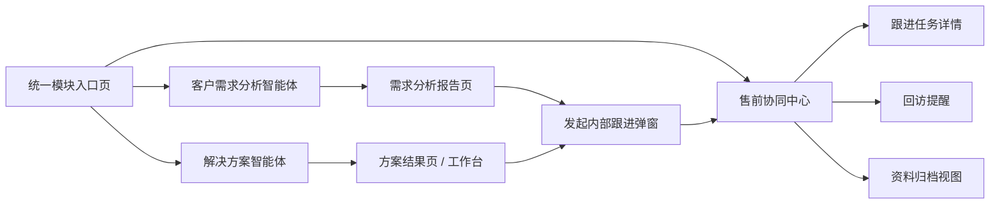

# 售前闭环智能体平台 前端页面原型说明

## 1. 文档目标

本文档用于定义“售前闭环智能体平台”在飞书优先接入阶段的前端页面结构、主要交互和页面边界，供产品、前端、全栈与测试协同使用。

本文档重点回答：

1. 哪些页面需要新增
2. 哪些现有页面需要扩展
3. 智能体结果如何发起内部跟进
4. 飞书流转确认、跟进任务、资料归档如何在界面中呈现
5. 本期如何避免一步做成完整 CRM

## 2. 页面定位

本次改造不是新增一个独立聊天页，而是在现有统一模块入口平台内，新增一条“售前闭环执行链”。

一句话定位：

`售前闭环前端 = 智能体结果的协同执行层与售前动作控制台`

## 3. 页面范围

本期建议由以下页面构成：

1. `模块入口页`
2. `客户需求分析报告页（扩展）`
3. `解决方案结果页/工作台（扩展）`
4. `售前协同中心（新增）`
5. `飞书流转确认弹窗（新增复用组件）`
6. `资料归档侧栏/抽屉（新增复用组件）`
7. `飞书个人任务授权提示条（新增）`

## 4. 页面结构总览



## 5. 模块入口页改动

## 5.1 新增模块卡片

统一模块入口页中建议新增：

- `售前协同中心`

卡片信息建议：

- 名称：`售前协同中心`
- 说明：统一查看跟进任务、回访提醒、飞书发送记录和资料归档状态
- 按钮：`进入模块`

## 5.2 权限显示

只有具备 `presales_handoff.access` 的用户可见。

## 6. 客户需求分析报告页改动

## 6.1 页面保留

现有报告页保留：

- 报告标题
- 报告正文
- 需求挖掘建议
- 推荐追问问题
- 知识来源
- 导出能力
- 转入方案生成

## 6.2 新增动作区

在报告页顶部或右侧操作区新增：

- `发起内部跟进`
- `发送到飞书`
- `查看归档状态`

### 交互要求

1. `发起内部跟进`
   - 打开飞书流转确认弹窗
2. `发送到飞书`
   - 可作为“快速发送摘要”入口
   - 若未确认任务信息，也可先走确认弹窗
3. `查看归档状态`
   - 打开资料归档抽屉

## 6.3 页面线框图

```text
+----------------------------------------------------------------------------------+
| 返回 | 报告标题                                               导出 | 发起内部跟进 |
|----------------------------------------------------------------------------------|
| 报告摘要 / 元信息                                                                 |
|----------------------------------------------------------------------------------|
| 左：正式需求分析报告正文                                                          |
|----------------------------------------------------------------------------------|
| 右：                                                                             |
|   [需求挖掘建议]                                                                  |
|   [推荐追问问题]                                                                  |
|   [知识来源]                                                                      |
|   [归档状态]                                                                      |
+----------------------------------------------------------------------------------+
```

## 7. 解决方案结果页 / 工作台改动

## 7.1 保留现有能力

保留：

- 会话
- 参数配置
- 方案生成
- 证据卡
- 阶段状态

## 7.2 新增动作

当方案成功生成后，在当前 assistant 结果卡或结果区新增：

- `发起方案跟进`
- `发送到飞书`
- `归档到客户资料`

### 交互要求

1. 不在生成中显示这些动作
2. 只在有完整结果时显示
3. 按权限显隐

## 8. 飞书流转确认弹窗

## 8.1 定位

该弹窗是本期最关键的新增交互，用于：

- 人工确认智能体给出的后续动作
- 编辑发送内容
- 选择负责人
- 选择发送对象
- 设置回访时间

## 8.2 建议字段

### 基础信息

- 客户名称
- 关联会话标题
- 来源类型
  - 需求分析报告
  - 解决方案结果

### 建议任务清单

- 任务标题
- 任务描述
- 建议负责人
- 建议截止时间

### 发送配置

- 成员树状勾选
  - 按部门展开
  - 勾选部门成员
- 群聊多选
- 附加说明
- 是否附带报告链接
- 是否附带方案链接
- 是否附带附件清单

### 跟进设置

- 回访时间
- 提醒时间
- 备注

补充交互要求：

- 不再采用“成员 / 群聊”二选一
- 允许多成员和多群聊在一次发送中同时选择
- 同一飞书账号若属于多个部门，可在各部门下分别展示和勾选

## 8.3 弹窗底部动作

- `取消`
- `仅创建平台任务`
- `确认并发送到飞书`

## 9. 售前协同中心（新增页面）

## 9.1 页面定位

统一查看：

- 跟进任务
- 回访提醒
- 飞书发送记录
- 资料归档状态

一句话定位：

`售前协同中心 = 智能体输出后的执行与追踪控制台`

## 9.2 页面布局建议

采用三栏或双层结构：

1. 顶部筛选区
2. 中部任务列表
3. 右侧详情抽屉

## 9.3 顶部筛选项

- 客户名称
- 来源类型
- 任务状态
- 负责人
- 是否已发送到飞书
- 回访时间范围

页面顶部还应显示飞书个人任务授权状态：

- 已授权：绿色提示，显示最近授权时间
- 未授权：黄色提示，并提供 `立即完成飞书个人任务授权`

## 9.4 列表区建议字段

- 任务标题
- 客户名称
- 来源对象
- 当前负责人
- 截止时间
- 回访时间
- 状态
- 飞书状态

## 9.5 详情抽屉建议

打开一条任务后，展示：

- 任务正文
- 关联需求分析报告
- 关联方案
- 飞书发送记录
- 归档附件
- 操作历史

## 9.6 发送飞书弹窗原型补充

```text
+-------------------------------------------------------------+
| 发送飞书                                                     |
|-------------------------------------------------------------|
| 左：成员树                                                   |
|   销售部                                                     |
|     [ ] 霸天（飞书名：尤磊）                                 |
|   技术支持部                                                 |
|     [ ] 霸天（飞书名：尤磊）                                 |
|-------------------------------------------------------------|
| 右：群聊多选                                                 |
|   [ ] ERP-Meeting                                            |
|-------------------------------------------------------------|
| 附加说明                                                     |
| [.........................................................] |
|-------------------------------------------------------------|
| 取消                                     确认发送           |
+-------------------------------------------------------------+
```

## 10. 资料归档抽屉

## 10.1 抽屉作用

用于查看与某次售前活动相关的资料资产是否完整。

## 10.2 建议展示内容

- 沟通录音
- 沟通分段导出
- 阶段整理
- 正式需求分析报告
- 方案输出结果
- 上传附件
- 归档状态

## 10.3 交互动作

- 下载
- 复制链接
- 标记已归档
- 查看归档位置

## 11. 典型流程示意

## 11.1 需求分析结果发起内部跟进

```text
需求分析报告页
  -> 点击“发起内部跟进”
  -> 弹出飞书流转确认弹窗
  -> 用户调整负责人/任务/回访时间
  -> 确认发送
  -> 平台创建任务
  -> 飞书同步通知
  -> 售前协同中心可查看状态
```

## 11.2 解决方案结果发起内部跟进

```text
方案结果页
  -> 点击“发起方案跟进”
  -> 弹出飞书流转确认弹窗
  -> 用户确认后发送
  -> 生成任务与飞书记录
```

## 12. 页面边界

### 本期不做

1. 完整 CRM 客户主档页
2. 商机漏斗可视化
3. 飞书深度嵌入式页面
4. 外部客户门户
5. 自动无确认推送

## 13. 一句话总结

本期前端页面设计的核心，不是把飞书做成一个外部跳转按钮，而是把它变成：

**智能体结果 -> 人工确认 -> 任务流转 -> 飞书协同 -> 归档追踪**

的可见执行链。
