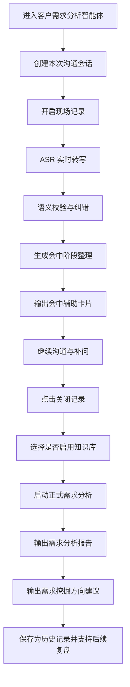
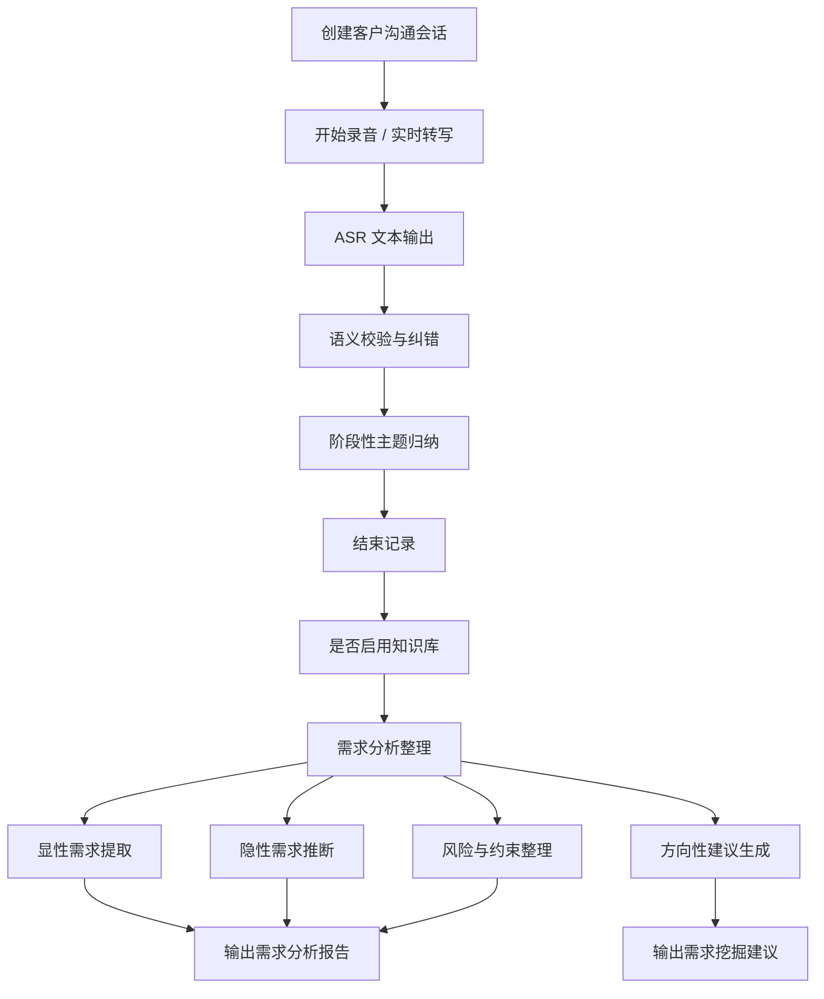

# 客户需求分析智能体 PRD

## 1. 产品概述

### 1.1 产品名称

客户需求分析智能体

### 1.2 产品定位

客户需求分析智能体用于支持销售、售前、技术支持等内部员工，在客户现场沟通、需求调研、方案交流、问题澄清等环节中，实时记录沟通内容，自动完成文字整理、语义校验、需求归纳与方向性建议生成，提升需求挖掘效率与后续内部协同效率。

该智能体不替代人工沟通，而是作为“现场需求记录者 + 会后需求分析助理 + 需求挖掘辅助顾问”存在。

当前版本口径：

- `客户需求分析智能体 0.1.0-mvp`

### 1.3 产品要解决的问题

当前客户需求沟通存在以下典型问题：

1. 沟通内容高度口语化、碎片化，事后整理成本高
2. 现场记录依赖个人，信息遗漏概率高
3. 客户需求往往并不完整，需要多轮整理和内部讨论
4. 沟通结束后，销售、售前、技术支持之间难以快速形成统一理解
5. 从现场沟通到形成需求分析结论，时效性较差
6. 后续还需要再次联系客户澄清需求，沟通成本高

本产品希望通过实时转写、语义整理和智能分析，缩短“客户沟通 -> 内部理解 -> 明确需求 -> 发现挖掘方向”的周期。

---

## 2. 目标用户

### 2.1 核心用户

1. 销售员工
2. 售前顾问 / 售前经理
3. 技术支持工程师
4. 项目经理

### 2.2 次级用户

1. 解决方案经理
2. 产品经理
3. 部门负责人

---

## 3. 典型使用场景

### 3.1 客户首次需求沟通

销售或售前首次与客户沟通时，开启客户需求分析智能体进行现场录音转写，沟通结束后快速形成客户需求初步分析报告。

### 3.2 技术澄清会议

在客户已经提出模糊诉求，但尚未明确功能边界、预算边界、实施路径时，智能体辅助识别显性需求、隐性需求和待确认问题。

### 3.3 多方联合会议

销售、售前、技术支持与客户多角色共同交流时，智能体帮助识别不同角色的关注点和冲突点。

### 3.4 内部复盘与需求补挖

现场沟通结束后，内部团队利用智能体生成的需求报告进行复盘，并基于“方向性建议”准备下一轮客户沟通问题清单。

---

## 4. 产品目标

### 4.1 业务目标

1. 降低现场沟通信息遗漏
2. 提升需求分析输出效率
3. 提高内部团队对客户需求的统一理解程度
4. 增强需求挖掘与补充提问能力
5. 为后续解决方案生成、报价、PoC、项目立项提供高质量输入
6. 为解决方案生成智能体提供可直接使用的高质量输入草稿

### 4.2 产品目标

1. 支持实时录音转写
2. 支持 ASR 语义校验与上下文修正
3. 支持阶段性需求分析整理
4. 支持会中辅助卡片输出
5. 支持输出结构化需求分析报告
6. 支持输出需求挖掘方向性建议
7. 支持勾选是否启用知识库参与分析
8. 支持将需求分析结果一键转入解决方案生成工作台
9. 支持自动带入方案场景与参数，并允许人工调整

---

## 5. 产品范围

### 5.1 MVP 范围

1. 会议现场开启 / 关闭记录
2. 实时 ASR 转写文本流
3. 实时语义校验与纠错
4. 会中阶段整理与提示卡输出
5. 输出方向性建议
6. 会后正式需求分析报告
7. 可选知识库参与分析
8. 会话保存与历史回看
9. 独立报告页查看与导出
10. 从报告页转入解决方案生成工作台

### 5.2 暂不纳入 MVP 的范围

1. 会议录音文件长久归档
2. 多语言同声翻译
3. 客户关系管理系统双向打通
4. 实时说话人高精度声纹识别
5. 自动生成正式合同/报价单
6. 全自动客户画像库

---

## 6. 核心产品流程

## 6.1 主流程

## 6.2 操作流程说明

### 步骤 1：创建沟通会话

用户进入系统后，创建一条“客户沟通会话”，填写最小必要信息：

1. 客户名称
2. 会话主题
3. 所属行业
4. 所属区域
5. 参与角色（可选）
6. 是否启用知识库

### 步骤 2：开启现场记录

用户点击“开始记录”，系统开始：

1. 采集音频流
2. 实时转写文字
3. 分段保存文本
4. 基于上下文进行语义纠错

### 步骤 3：会中阶段整理

在沟通过程中，系统应优先形成会中辅助信息，而不是直接给出长篇正式报告，例如：

1. 当前讨论主题
2. 已明确需求
3. 当前待确认问题
4. 建议追问方向
5. 风险与约束提示

### 步骤 4：关闭记录

沟通阶段结束后，用户点击“结束记录”。

### 步骤 5：正式分析整理

用户点击“开始需求分析整理”，系统基于本次文本内容进行：

1. 内容去重与归并
2. 需求主题聚类
3. 显性需求提取
4. 隐性需求推断
5. 风险与待确认项提取
6. 方向性建议生成

### 步骤 6：输出报告

最终生成：

1. 本次沟通需求分析报告
2. 需求挖掘建议
3. 下一轮建议提问清单

### 步骤 7：转入解决方案生成

在正式需求分析报告生成后，用户可点击“转入方案生成”，系统将：

1. 自动抽取报告中的当前问题、明确需求、隐性诉求、约束与待确认项
2. 自动判断最可能匹配的解决方案场景
3. 自动加载相匹配的方案参数
4. 先弹出人工确认界面，允许用户继续编辑文本与参数
5. 将确认后的草稿带入解决方案生成工作台
6. 由用户主动发送生成，避免系统直接代替人工提交

---

## 7. 核心功能设计

## 7.1 沟通会话管理

### 功能说明

用于创建和管理客户沟通记录会话。

### 主要字段

1. 客户名称
2. 会话标题
3. 行业标签
4. 地区
5. 客户类型
6. 参与人
7. 记录开始时间
8. 记录结束时间
9. 是否启用知识库

### 设计要求

1. 支持新建会话
2. 支持查看历史会话
3. 支持继续补充分析
4. 支持导出分析报告
5. 支持跳转到正式需求分析报告页
6. 支持删除沟通会话

---

## 7.2 实时语音转写

### 功能说明

会议过程中将现场音频持续转成文本。

### 设计要求

1. 支持实时转写
2. 支持短延迟刷新
3. 支持分段显示
4. 支持临时结果与最终结果区分
5. 支持断点续传 / 异常提示
6. MVP 阶段统一使用“参会人员”标签，不区分具体说话角色

### 输出形态

1. 原始转写文本流
2. 校验后的正式文本流

---

## 7.3 语义校验与上下文修正

### 功能说明

对 ASR 输出的文本做上下文相关性判断，减少误识别导致的无关内容。

### 设计目标

1. 修正明显错词
2. 过滤和上下文无关的噪声词
3. 保留不确定片段供人工确认
4. 对行业术语进行上下文纠正

### 典型场景

1. 客户口音导致的误转写
2. 电力或行业专有名词识别偏差
3. 现场噪声引入的无关词
4. 口语停顿和重复表达

### 建议机制

1. ASR 原文保留
2. 语义校验版作为默认阅读文本
3. 可切换查看“原始转写 / 校验文本”
4. 低置信度片段标记为“待确认”

---

## 7.4 阶段性需求整理

### 功能说明

沟通过程中，系统可动态形成阶段性整理，不必等会议彻底结束后再从零分析。

### 输出内容

1. 当前谈到的主题
2. 已确认诉求
3. 待确认问题
4. 风险点
5. 潜在方向

### 价值

1. 减少会后完全重头整理
2. 让用户在现场就发现遗漏问题
3. 有助于下一段沟通继续深挖

---

## 7.5 需求分析报告生成

### 功能说明

对本次沟通内容形成较为正式的需求分析报告。

### 建议报告结构

1. 沟通背景与上下文
2. 客户当前问题概述
3. 已明确需求
4. 隐性需求与潜在诉求
5. 约束条件与风险点
6. 待确认问题清单
7. 建议下一步动作

### 输出要求

1. 语言尽量清晰、专业
2. 不等于逐字转录
3. 强调需求理解，而不是机械摘要

---

## 7.6 需求挖掘方向性建议

### 功能说明

基于本次沟通内容，提示用户还可以往哪些方向继续深挖客户需求。

### 输出内容建议

1. 还需进一步确认的业务问题
2. 可能被忽略的技术条件
3. 项目边界和实施边界建议补问
4. 预算、周期、部署方式、数据条件建议补问
5. 可能的增量机会点

### 目标

不是直接输出最终方案，而是帮助销售和售前“更会问问题”。

---

## 7.7 知识库开关

### 功能说明

用户可以勾选：

1. 启用知识库
2. 不启用知识库

### 使用场景

1. 若客户需求属于电力行业相关场景，可启用知识库辅助分析
2. 若客户需求是跨行业或新行业，不一定适合现有知识库，则关闭知识库，避免错误关联

### 设计原则

1. 知识库为可选增强，不是强依赖
2. 不启用时仍应能完成完整分析流程

---

## 8. 页面设计建议

## 8.1 主工作台页面

建议页面结构：

1. 左侧：历史沟通会话
2. 中间：聊天窗式实时沟通记录区
3. 底部：开始 / 结束记录按钮、阶段整理按钮、分析按钮
4. 右侧：会中辅助卡片（当前主题、已明确需求、待确认问题、建议追问、风险与约束）
5. 正式需求分析报告使用独立页面展示，不再挤在会中工作台右侧小卡片中

## 8.2 关键页面模块

### 模块 A：会话头部信息

1. 客户名称
2. 会话主题
3. 行业
4. 是否启用知识库

### 模块 B：实时转写区

1. 聊天窗式实时沟通记录
2. 临时实时气泡
3. 正式落库后的沟通分段
4. 自动滚动到底部 / 回到最新记录

### 模块 C：阶段性整理区

1. 当前已识别需求
2. 待确认点
3. 潜在方向

### 模块 D：最终输出区

1. 独立需求分析报告页
2. 需求挖掘建议
3. 下一轮提问建议
4. 转入解决方案生成

---

## 9. 后端能力需求

## 9.1 服务能力

1. 会话管理服务
2. ASR 接入服务
3. 语义校验服务
4. 分析报告生成服务
5. 知识库检索增强服务（可选）
6. 结果保存与导出服务

## 9.2 数据对象建议

1. 沟通会话
2. 转写分段
3. 校验文本分段
4. 阶段整理结果
5. 最终需求分析报告
6. 需求挖掘建议

---

## 10. 智能体工作流建议

---

## 11. 关键非功能要求

## 11.1 时效性

1. 实时转写延迟尽量低
2. 语义校验不能明显拖慢阅读体验
3. 沟通结束后应尽快生成需求报告

## 11.2 准确性

1. 允许保留不确定内容
2. 不可为追求流畅性而过度篡改原意
3. 需求报告应与原始沟通内容可追溯

## 11.3 隐私与安全

1. 客户沟通内容属于敏感信息
2. 会话应有明确归属权限
3. 应支持内部员工按权限查看
4. 导出与分享要有边界控制

---

## 12. MVP 验收标准

### 12.1 功能验收

1. 可以创建客户沟通会话
2. 可以开启和关闭记录
3. 可以实时看到转写结果
4. 可以看到校验后的文本
5. 可以在会后生成需求分析报告
6. 可以生成需求挖掘方向建议
7. 可以选择是否启用知识库
8. 可以将正式需求分析报告人工确认后带入解决方案生成工作台

### 12.2 体验验收

1. 页面操作简单，适合现场使用
2. 文本阅读与回看清晰
3. 报告输出结构稳定
4. 需求建议具有一定启发性
5. 会中工作台与会后正式报告页职责清晰

---

## 13. 后续扩展方向

1. 多角色说话人识别
2. 与 CRM / 项目管理系统打通
3. 自动生成客户拜访纪要
4. 自动生成下一轮客户沟通提纲
5. 自动识别行业领域并切换知识库策略
6. 自动沉淀客户画像与需求演进轨迹

---

## 14. 当前建议的产品边界

客户需求分析智能体的首要目标不是“直接输出方案”，而是：

1. 把客户沟通内容高质量记录下来
2. 把碎片化交流整理成结构化需求理解
3. 帮助销售和售前更快形成一致判断
4. 帮助下一轮沟通更有针对性

也就是说，它更像是电力行业解决方案生成智能体的“前置智能体”，为后续解决方案生成提供更高质量、更接近真实客户需求的输入。
