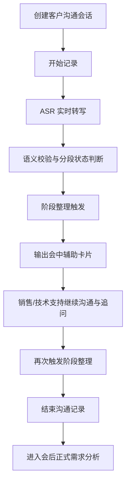

# 客户需求分析智能体_会中辅助模式产品方案

## 1. 方案定位

客户需求分析智能体的“会中辅助模式”用于支持销售、售前、技术支持人员在客户现场沟通时，边交流、边记录、边整理、边辅助提问。

它不是一个只在会后生成纪要的工具，而是一个：

1. 现场实时记录者
2. 需求明确辅助者
3. 需求挖掘提示者
4. 会后正式分析的前置输入器

一句话定位：

`帮销售和技术支持在客户沟通现场，更快把需求问清楚、记完整、挖深入。`

---

## 2. 为什么需要会中辅助模式

当前客户沟通的痛点，不只在“会后整理慢”，更在“现场没问全、没问深、没抓住重点”。

典型问题包括：

1. 客户表达口语化、跳跃式，现场难以快速抓主线
2. 销售和技术支持要一边沟通一边记要点，容易遗漏
3. 客户经常只说现象，不说真实目标，隐性需求难以及时识别
4. 现场没有及时提醒，导致关键约束条件漏问
5. 会后再复盘时，才发现问题没问清，又要二次联系客户

因此，会中模式的目标不是替代沟通，而是给一位“需求分析副驾”。

---

## 3. 产品目标

## 3.1 业务目标

1. 提升客户需求明确效率
2. 降低现场信息遗漏和偏题风险
3. 提升售前和技术支持现场追问质量
4. 降低会后二次澄清成本
5. 为会后正式需求分析报告提供更干净、更结构化的输入

## 3.2 产品目标

1. 支持实时转写和实时分段保存
2. 支持会中阶段整理
3. 支持会中需求明确提示
4. 支持会中需求挖掘建议
5. 支持偏题/异主题提醒
6. 支持待确认问题实时累积
7. 支持会中模式与会后正式分析模式无缝衔接

---

## 4. 产品边界

## 4.1 会中辅助模式负责什么

1. 实时 ASR 转写
2. 语义校验与分段状态判断
3. 阶段性整理
4. 已明确需求提炼
5. 待确认问题提醒
6. 推荐追问建议
7. 风险与约束提示

## 4.2 会中辅助模式不负责什么

1. 在客户现场输出正式结论
2. 自动替代销售或技术支持做决策
3. 生成正式解决方案
4. 对所有内容自动做最终定案

会中模式输出的应是：

- 提示
- 草稿
- 建议
- 结构化阶段结果

而不是：

- 最终方案
- 最终报价
- 最终需求冻结版

---

## 5. 核心使用场景

## 5.1 客户首次需求接触

客户只表达现象和痛点，销售需要快速判断：

1. 客户真正的问题是什么
2. 客户目标是降本、增效、合规还是智能化
3. 哪些问题已经明确
4. 哪些问题必须继续追问

## 5.2 技术澄清场景

售前或技术支持与客户讨论时，系统帮助识别：

1. 当前问题属于业务问题还是技术问题
2. 是否已经说清数据基础和系统边界
3. 是否还缺实施条件、预算、周期、接口现状等关键约束

## 5.3 多主题混合沟通场景

当客户在同一轮沟通里同时聊到多个主题时，系统要帮助：

1. 识别当前主线主题
2. 标记可能偏题的内容
3. 提醒是否拆分成多条需求线

## 5.4 会中辅助追问场景

用户看到系统提示：

1. “当前已明确需求”
2. “仍待确认问题”
3. “建议追问方向”

从而现场继续补问，而不是等会后再发现遗漏。

---

## 6. 核心流程

---

## 7. 会中辅助的产品形态

## 7.1 页面布局建议

建议采用三栏工作台：

1. 左侧：历史沟通会话
2. 中间：实时转写流
3. 右侧：会中辅助面板

其中右侧会中辅助面板是本模式的核心。

## 7.2 会中辅助面板的核心区域

### 1. 当前讨论主题

显示当前系统认为本轮沟通的核心主题，例如：

- 园区光储协同优化
- 风电功率预测
- 配网故障诊断

### 2. 已明确需求

用 3-5 条短句提炼目前已经说清楚的需求。

### 3. 待确认问题

用 3-5 条短句提醒当前还没有问清的关键问题。

### 4. 建议追问

给销售和技术支持提供下一步最值得问的 2-4 个问题。

### 5. 风险与约束

提示：

1. 数据基础不足
2. 预算边界不清
3. 系统接口现状未明确
4. 客户目标不够量化

### 6. 语义复核提醒

当系统判断某些分段：

1. 与主线主题不符
2. 置信度低
3. 存在 ASR 识别异常

应提示人工复核，而不是直接进入阶段整理。

---

## 8. 会中辅助的触发机制

## 8.1 MVP 推荐方式

MVP 建议采用：

`手动触发为主，轻量自动建议为辅`

也就是：

1. 默认实时转写持续进行
2. 用户点击“阶段整理”时，生成当前整理结果
3. 系统可在合适时机提示“建议整理一次”，但不强制自动弹出

原因：

1. 避免过度打扰现场沟通
2. 降低用户对错误整理结果的抵触
3. 让用户保留节奏控制权

## 8.2 二期增强方式

二期可增加：

1. 每隔 3-5 分钟自动建议整理一次
2. 当话题明显切换时自动提醒
3. 当连续出现多个待确认项时自动提示补问

---

## 9. 会中辅助输出格式

会中辅助输出必须短、小、清楚，不能像会后报告那样长。

推荐控制为：

### 当前讨论主题

1-2 条

### 已明确需求

3-5 条

### 待确认问题

3-5 条

### 建议追问

2-4 条

### 风险与约束

2-4 条

每条都应控制在一到两句话内。

---

## 10. 会中辅助和会后模式的关系

## 10.1 会中模式

目标：

1. 辅助现场沟通
2. 帮助问清需求
3. 帮助减少遗漏

输出：

1. 阶段整理
2. 需求明确提示
3. 建议追问
4. 风险提示

## 10.2 会后模式

目标：

1. 输出正式需求分析结果
2. 形成内部协同依据
3. 作为解决方案生成的输入

输出：

1. 正式需求分析报告
2. 需求挖掘建议
3. 推荐下一轮沟通问题
4. 可衔接解决方案生成智能体

## 10.3 两者关系

会中模式是：

`需求明确与挖掘的过程辅助`

会后模式是：

`需求分析与内部协同的结果输出`

---

## 11. 用户体验原则

## 11.1 不抢会场注意力

会中辅助不能频繁弹大块内容，应该：

1. 安静显示
2. 支持折叠
3. 支持手动触发
4. 支持快速看重点

## 11.2 提示要短，不要写长文

现场用户关注的是：

1. 我现在该问什么
2. 哪些已经明确
3. 哪些还没问清

所以输出必须短、准、可直接行动。

## 11.3 对错误保持谦逊

系统应更多使用：

- 可能需要确认
- 建议继续补问
- 疑似偏题内容

而不是：

- 已确定
- 必然如此

---

## 12. 关键能力要求

## 12.1 ASR 实时能力

1. 支持连续分段上传
2. 支持实时/准实时转写
3. 支持基础语义清洗

## 12.2 语义校验能力

1. 识别偏题内容
2. 识别低置信分段
3. 支持人工保留 / 丢弃

## 12.3 会中整理能力

1. 从多段沟通内容中抽取主线
2. 提炼结构化需求要点
3. 不直接复述大段原话

## 12.4 需求挖掘能力

1. 找出还没问清的问题
2. 给出合理追问建议
3. 标记风险与约束

---

## 13. MVP 功能范围

MVP 建议先做以下能力：

1. 创建客户沟通会话
2. 开始/暂停/结束记录
3. 实时转写与分段落库
4. 语义校验与人工复核
5. 手动触发阶段整理
6. 会中辅助卡片展示
7. 会后正式需求分析报告
8. 是否启用知识库的开关

MVP 暂不做：

1. 多说话人高精度区分
2. 实时自动连续阶段整理
3. 多轮主题聚类自动拆分
4. 与 CRM 的双向打通

---

## 14. 成功指标

## 14.1 产品指标

1. 用户平均每次客户沟通至少触发 1 次阶段整理
2. 阶段整理结果被用户实际阅读/采纳
3. 会后报告生成率提升
4. 推荐追问被使用的比例提升

## 14.2 业务指标

1. 客户沟通后二次补问次数下降
2. 内部对客户需求理解一致性提升
3. 从沟通到形成需求分析报告的时间缩短
4. 进入解决方案生成环节的输入质量提升

---

## 15. 差异化价值

与通用会议纪要工具相比，会中辅助模式的差异化不在于“记录会议”，而在于：

1. 帮助现场把需求问清楚
2. 帮助识别隐性诉求
3. 帮助减少漏问和跑偏
4. 帮助把客户沟通结果更快转成解决方案输入

一句话总结：

`不是只帮你记住客户说了什么，而是帮你在现场看懂客户真正需要什么。`
