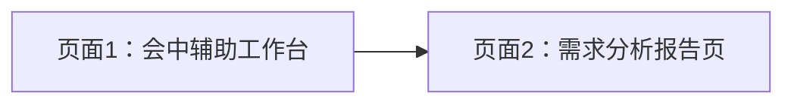

# 客户需求分析智能体 前端页面原型说明

## 1. 文档目的

本文档用于定义“客户需求分析智能体”前端页面的整体布局、核心交互、页面结构与关键组件，供产品、前端、后端、设计共同对齐。

本版设计重点服务两个目标：

1. 会中辅助模式优先满足“提示、建议、待确认项、风险提醒”等现场所需信息
2. 最终需求分析报告放到单独页面完整展示，不再挤在主工作台右侧小卡片中

目标是让前端工程师能够基于本文档快速开始页面实现，并与现有 PowerAgent 工作台风格保持统一。

---

## 2. 设计原则

### 2.1 核心原则

1. 适合现场使用
2. 信息展示清晰
3. 操作路径尽量短
4. 适合边沟通边看内容
5. 会中和会后信息分层展示
6. 与现有 PowerAgent 工作台视觉统一

### 2.2 体验原则

1. 实时转写区优先保证可读性
2. 会中界面优先服务当前沟通决策
3. 不把正式长报告塞进主工作台
4. 右侧区域优先展示可行动信息
5. 支持会后回看和继续整理

---

## 3. 页面总体结构

建议采用“会中工作台 + 会后报告页”的双页面结构。



### 3.1 页面 1：会中辅助工作台

用于支持客户现场沟通时的实时辅助。

结构建议：

1. 左侧：历史沟通会话
2. 中间：实时转写与记录控制
3. 右侧：会中辅助面板

### 3.2 页面 2：需求分析报告页

用于展示会后长内容结果。

结构建议：

1. 报告头部信息
2. 正式需求分析报告正文
3. 需求挖掘建议
4. 推荐追问问题
5. 导出与流转动作

---

## 4. 页面结构详细说明

## 4.1 页面 1：客户需求分析会中辅助工作台

### 页面定位

这是主页面，承担客户现场沟通时的绝大多数操作。

### 页面结构

#### A. 顶部栏

建议展示：

1. 当前页面标题：`客户需求分析智能体`
2. 当前模式标识：`会中辅助模式`
3. 当前用户信息
4. 返回主工作台入口
5. 可选帮助入口

#### B. 左侧会话栏

建议模块：

1. 新建会话按钮
2. 搜索框
3. 会话列表
4. 收起 / 展开按钮

每条会话卡片展示：

1. 客户名称
2. 会话标题
3. 状态
4. 最近更新时间
5. 是否启用知识库

### 左侧会话栏交互要求

1. 支持手动收起 / 展开
2. 收起后保留窄栏入口，不完全消失
3. 收起时尽量为中间实时转写区和右侧会中辅助区释放空间
4. 默认在桌面端展开，在空间不足或用户主动切换后收起

#### C. 中间实时记录区

分为三个区域：

1. 会话信息头部
2. 实时转写流
3. 底部记录控制区

#### D. 右侧会中辅助区

建议用 Tabs 或分块卡片展示以下内容：

1. `当前主题`
2. `已明确需求`
3. `待确认问题`
4. `建议追问`
5. `风险与约束`
6. `语义复核提醒`

说明：

1. 会中工作台不默认展示完整最终报告
2. 最终报告生成完成后，只提供“打开报告页”入口
3. 会中界面始终优先服务当前沟通动作
4. 报告页应提供“转入方案生成”入口

---

## 5. 主页面线框说明

```text
┌────────────────────────────────────────────────────────────────────────────┐
│ 顶部导航：客户需求分析智能体（会中辅助模式）             用户信息 / 返回工作台 │
├───────────────┬──────────────────────────────────────┬─────────────────────┤
│ 左侧会话栏     │ 中间实时记录区                         │ 右侧会中辅助区         │
│               │                                      │                     │
│ + 新建会话     │ 客户名称 / 标题 / 行业 / 地区         │ [当前主题] [已明确]    │
│ 搜索框         │ 是否启用知识库                         │ [待确认] [追问建议]    │
│               │                                      │ [风险] [语义复核]      │
│ 会话1          │ 聊天窗式沟通记录                        │                     │
│ 会话2          │                                      │ 当前阶段整理内容       │
│ 会话3          │ 临时实时气泡 + 正式记录                │                     │
│               │                                      │ 当前待确认问题         │
│               │                                      │                     │
│               │                                      │ 建议追问与风险提醒     │
│               │                                      │                     │
│               │ [开始记录] [暂停] [结束记录] [阶段整理] │ [查看正式报告]         │
└───────────────┴──────────────────────────────────────┴─────────────────────┘
```

说明：

1. 右侧不直接展示完整需求分析报告
2. “查看正式报告”会跳到单独的报告页
3. 左侧会话栏应支持收起，释放更多内容展示空间
4. 报告页支持将需求分析结果转入解决方案生成工作台

---

## 6. 核心页面模块说明

## 6.1 会话信息头部

### 展示字段

1. 客户名称
2. 会话标题
3. 行业
4. 地区
5. 主题
6. 知识库开关
7. 当前状态
8. 会话栏收起 / 展开状态

### 交互建议

1. 支持编辑标题
2. 支持切换知识库开关
3. 支持查看会话元信息

---

## 6.2 实时转写区

### 展示模式

当前实现建议采用：

1. 主视图使用聊天窗式实时沟通记录
2. 正式记录优先显示语义校验后的可读文本
3. 原始转写不作为主阅读视图默认展示

### 单条分段展示建议

每条分段建议显示：

1. 时间顺序
2. 说话人统一显示为 `参会人员`
3. 文本内容
4. 低置信度标记
5. 语义状态标记

### 交互建议

1. 自动滚动到底部
2. 用户手动上翻时不强制跳回
3. 支持回到底部按钮
4. 支持人工保留 / 人工丢弃
5. 不应把本地实时草稿和正式已落库分段混进同一条历史流

---

## 6.3 记录控制区

### 核心按钮

1. `开始记录`
2. `暂停记录`
3. `结束记录`
4. `生成阶段整理`
5. `开始需求分析`

### 状态提示

建议展示：

1. 当前是否正在记录
2. 当前麦克风状态
3. 当前分段数
4. 最近一次阶段整理时间
5. 最终报告是否已生成
6. 自动阶段整理是否正在执行

### 交互约束

1. 未开始记录时，不显示暂停/结束
2. 未形成有效沟通内容前，不允许生成阶段整理
3. 未结束记录前，不建议直接生成最终正式报告

---

## 6.4 会中辅助区

### 作用

在客户现场优先展示“现在最该关注什么”。

### 核心模块

#### 1. 当前讨论主题

显示当前系统识别的主线主题。

要求：

1. 控制在 1-2 条
2. 用短句表达

#### 2. 已明确需求

显示已经问清楚的需求点。

要求：

1. 默认显示 3-5 条
2. 每条控制在 1-2 句

#### 3. 待确认问题

显示当前最值得继续追问的问题。

#### 4. 建议追问

给销售和技术支持提供可直接使用的下一句提问建议。

#### 5. 风险与约束

提示当前识别到的数据、预算、边界、接口、周期等风险。

#### 6. 语义复核提醒

对偏题、低置信或疑似错误分段给出提醒，并支持人工复核。

### 交互建议

1. 默认展示最新阶段整理
2. 支持“重新整理”
3. 支持折叠次要模块
4. 支持在会中状态下保持内容短而可行动
5. 卡片文案要更像提醒卡 / 行动卡，而不是长段分析文字

---

## 6.5 页面 2：会后需求分析报告页

### 作用

展示最终形成的正式需求分析报告，不再放在主工作台右侧的小卡片中挤压显示。

### 打开方式

1. 会中工作台中点击“查看正式报告”
2. 从历史会话详情直接进入
3. 会后分析完成后自动出现入口按钮

### 页面结构建议

1. 报告头部
2. 正文阅读区
3. 侧边目录
4. 需求挖掘建议区
5. 推荐追问问题区
6. 导出与流转操作区

### 报告头部字段

1. 客户名称
2. 会话标题
3. 行业 / 区域
4. 分析时间
5. 是否使用知识库
6. 版本号

### 正文结构

1. 沟通背景与上下文
2. 当前问题概述
3. 已明确需求
4. 隐性需求与潜在诉求
5. 约束条件与风险点
6. 待确认问题清单
7. 建议下一步动作

### 附加区域

1. 需求挖掘建议
2. 推荐追问问题
3. 语义复核提醒

### 导出能力

建议支持：

1. 导出 Markdown
2. 导出 PDF
3. 一键复制
4. 一键发送至解决方案生成智能体

### 转入方案生成交互要求

1. 点击后先打开确认弹窗
2. 自动填充方案请求草稿
3. 自动加载推荐场景与参数
4. 用户可以手动修改文本与参数
5. 确认后仅带入方案工作台，不自动触发生成

---

## 7. 页面状态设计

### 7.1 空会话状态

显示：

1. 新建会话引导
2. 使用说明
3. 建议操作步骤

### 7.2 记录中状态

显示：

1. 正在录音
2. 分段滚动更新
3. 当前分段状态

### 7.3 会中整理中

需要展示：

1. 阶段整理进度
2. 当前整理步骤
3. 让用户知道系统正在生成会中辅助内容

### 7.4 生成正式报告中

需要展示：

1. 正式报告生成进度
2. 当前分析步骤
3. 可返回工作台继续查看会中内容

### 7.5 空结果状态

例如：

1. 暂无阶段整理
2. 暂无最终报告
3. 暂无建议追问

---

## 8. 组件拆分建议

建议拆分为：

1. `DemandSessionSidebar`
2. `DemandSessionHeader`
3. `RealtimeTranscriptPanel`
4. `TranscriptSegmentItem`
5. `RecordingControlBar`
6. `InMeetingAssistPanel`
7. `CurrentTopicsCard`
8. `ConfirmedNeedsCard`
9. `PendingQuestionsCard`
10. `FollowupSuggestionsCard`
11. `RiskReminderCard`
12. `SemanticReviewCard`
13. `DemandReportView`
14. `DemandReportHeader`
15. `DemandReportContent`
16. `ExportActions`

---

## 9. 页面流转建议

建议前端页面路由拆成：

1. `/customer-demand`
   - 会中辅助工作台
2. `/customer-demand/:sessionId/report`
   - 会后正式报告页

这样好处是：

1. 会中页面更轻、更聚焦
2. 报告页可完整阅读和导出
3. 后续可单独做打印/评审版

---

## 10. 未来增强建议

1. 支持实时多说话人颜色区分
2. 支持“建议补问”一键插入销售提示卡
3. 支持对阶段整理做人工编辑
4. 支持会中自动提示“建议整理一次”
5. 支持与解决方案生成智能体联动
