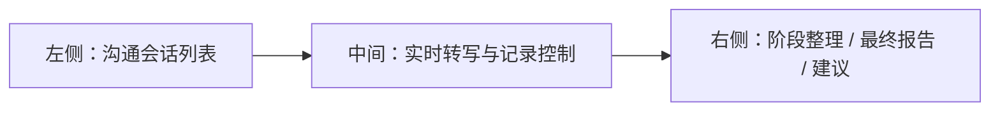

# 客户需求分析智能体 前端页面原型说明

## 1. 文档目的

本文档用于定义“客户需求分析智能体”前端页面的整体布局、核心交互、页面结构与关键组件，供产品、前端、后端、设计共同对齐。

目标是让前端工程师能够基于本文档快速开始页面实现，并与现有 PowerAgent 工作台风格保持统一。

---

## 2. 设计原则

### 2.1 核心原则

1. 适合现场使用
2. 信息展示清晰
3. 操作路径尽量短
4. 适合“边沟通边看内容”
5. 与现有 Chat 工作台视觉统一

### 2.2 体验原则

1. 实时转写区优先保证可读性
2. 不把复杂控制堆到主视区
3. 阶段整理和最终报告分层展示
4. 支持会后回看和继续整理

---

## 3. 页面总体结构

建议采用“三栏式主工作台”。



### 3.1 左侧栏：历史会话列表

用于：

1. 查看历史客户沟通会话
2. 新建会话
3. 切换会话
4. 搜索会话

### 3.2 中间主区：实时记录工作区

用于：

1. 展示原始转写和校验文本
2. 控制开始 / 暂停 / 结束记录
3. 显示当前记录状态

### 3.3 右侧栏：整理与分析区

用于：

1. 查看阶段性整理
2. 启动最终分析
3. 查看需求分析报告
4. 查看方向性建议

---

## 4. 页面结构详细说明

## 4.1 页面 1：客户需求分析工作台

### 页面定位

这是主页面，承担绝大多数操作。

### 页面结构

#### A. 顶部栏

建议展示：

1. 当前页面标题：`客户需求分析智能体`
2. 当前用户信息
3. 返回主工作台入口
4. 可选帮助入口

#### B. 左侧会话栏

建议模块：

1. 新建会话按钮
2. 搜索框
3. 会话列表

每条会话卡片展示：

1. 客户名称
2. 会话标题
3. 状态
4. 最近更新时间
5. 是否启用知识库

#### C. 中间实时记录区

分为两个纵向区域：

1. 会话信息头部
2. 实时转写内容区
3. 底部控制区

#### D. 右侧结果区

建议用 Tabs：

1. `阶段整理`
2. `需求分析报告`
3. `挖掘建议`
4. `建议补问`

---

## 5. 主页面线框说明

```text
┌────────────────────────────────────────────────────────────────────────────┐
│ 顶部导航：客户需求分析智能体                           用户信息 / 返回工作台 │
├───────────────┬──────────────────────────────────────┬─────────────────────┤
│ 左侧会话栏     │ 中间实时记录区                         │ 右侧分析区            │
│               │                                      │                     │
│ + 新建会话     │ 客户名称 / 标题 / 行业 / 地区         │ [阶段整理] [报告]     │
│ 搜索框         │ 是否启用知识库                         │ [建议] [补问]         │
│               │                                      │                     │
│ 会话1          │ 原始转写 / 校验文本切换                │ 当前阶段整理内容       │
│ 会话2          │                                      │                     │
│ 会话3          │ 实时文本流                            │ 或最终报告内容         │
│               │                                      │                     │
│               │                                      │                     │
│               │                                      │                     │
│               │                                      │                     │
│               │                                      │                     │
│               │ [开始记录] [暂停] [结束记录] [开始分析] │                     │
└───────────────┴──────────────────────────────────────┴─────────────────────┘
```

---

## 6. 核心页面模块说明

## 6.1 会话信息头部

### 展示字段

1. 客户名称
2. 会话标题
3. 行业
4. 地区
5. 主题
6. 知识库开关
7. 当前状态

### 交互建议

1. 支持编辑标题
2. 支持切换知识库开关
3. 支持查看会话元信息

---

## 6.2 实时转写区

### 展示模式

建议支持两个视图：

1. `校验文本`
2. `原始转写`

默认显示：

1. `校验文本`

### 单条分段展示建议

每条分段建议显示：

1. 时间顺序
2. 说话人（若有）
3. 文本内容
4. 低置信度标记

### 交互建议

1. 自动滚动到底部
2. 用户手动上翻时不强制跳回
3. 支持回到底部按钮

---

## 6.3 记录控制区

### 核心按钮

1. `开始记录`
2. `暂停记录`
3. `结束记录`
4. `开始需求分析整理`

### 状态提示

建议展示：

1. 当前是否正在记录
2. 当前麦克风状态
3. 当前分段数
4. 最后更新时间

### 交互约束

1. 未开始记录时，不显示暂停/结束
2. 未结束记录前，不允许执行最终分析

---

## 6.4 阶段整理页签

### 作用

展示沟通过程中的阶段性提炼结果。

### 内容结构建议

1. 当前讨论主题
2. 已明确需求
3. 待确认问题
4. 潜在方向
5. 风险点

### 交互建议

1. 支持显示多个阶段版本
2. 默认展示最新版本
3. 支持手动触发“重新整理”

---

## 6.5 需求分析报告页签

### 作用

展示最终形成的需求分析报告。

### 建议结构

1. 沟通背景
2. 当前问题
3. 显性需求
4. 隐性需求
5. 风险与约束
6. 待确认问题
7. 下一步建议

### 交互建议

1. 支持复制
2. 支持导出 PDF / Markdown
3. 支持一键发送到解决方案生成智能体

---

## 6.6 需求挖掘建议页签

### 作用

帮助销售和售前理解“下一轮还应该问什么”。

### 内容建议

1. 建议继续追问的方向
2. 建议确认的业务边界
3. 建议确认的技术边界
4. 潜在增量机会点

---

## 6.7 建议补问页签

### 作用

直接输出“下一轮沟通建议问题清单”。

### 形式建议

1. 问题列表
2. 支持复制
3. 支持一键生成客户拜访提纲

---

## 7. 页面状态设计

## 7.1 空状态

当没有任何会话时：

1. 中间展示欢迎态
2. 引导创建第一条沟通会话
3. 简单说明使用流程

## 7.2 记录中状态

需要突出：

1. 正在记录
2. 实时文本流正在刷新
3. 当前说话内容正在转写

## 7.3 分析中状态

建议展示阶段状态：

1. 文本归并中
2. 需求提取中
3. 风险识别中
4. 报告生成中

## 7.4 完成状态

完成后：

1. 默认切到报告页签
2. 保留建议页签和补问页签
3. 顶部显示“分析完成”

---

## 8. 弹窗与辅助页面

## 8.1 新建会话弹窗

字段建议：

1. 客户名称
2. 会话标题
3. 行业
4. 地区
5. 主题
6. 是否启用知识库

## 8.2 导出弹窗

选项建议：

1. 导出 Markdown
2. 导出 PDF
3. 导出仅报告
4. 导出报告 + 补问建议

## 8.3 删除确认弹窗

删除会话前，明确提示：

1. 是否同时删除分段与分析结果
2. 是否仅归档

---

## 9. 前端组件建议

建议新增页面与组件：

### 页面

1. `CustomerDemandWorkspaceView.vue`

### 组件

1. `DemandSessionSidebar.vue`
2. `DemandSessionHeader.vue`
3. `TranscriptStreamPanel.vue`
4. `SegmentCard.vue`
5. `RecordingControlBar.vue`
6. `DemandAnalysisPanel.vue`
7. `StageSummaryTab.vue`
8. `DemandReportTab.vue`
9. `DiggingSuggestionsTab.vue`
10. `RecommendedQuestionsTab.vue`

---

## 10. 状态管理建议

建议新增 Pinia store：

### `customerDemandStore`

职责：

1. 会话列表
2. 当前会话
3. 分段列表
4. 阶段整理
5. 最终报告
6. 当前任务状态
7. 录音状态

---

## 11. 视觉与交互建议

### 风格建议

1. 保持与现有工作台一致的专业感
2. 实时记录状态要醒目但不刺眼
3. 阶段整理与最终报告的层级要清晰

### 建议视觉重点

1. 正在记录时，顶部显示轻量红点或录音提示
2. 实时文本区用更高可读性的排版
3. 右侧分析区保持文档型阅读体验

---

## 12. 移动端与未来扩展

### 当前建议

MVP 优先桌面端。

### 后续扩展

可逐步支持：

1. 平板端
2. 移动端轻量查看
3. 现场快速录音模式

---

## 13. 与现有工作台的关系建议

建议将“客户需求分析智能体”作为现有 PowerAgent 平台中的一个独立业务入口，而不是混在当前解决方案生成工作台里。

推荐入口方式：

1. 工作台主页新增“客户需求分析智能体”
2. 左侧侧边栏新增独立导航

这样有利于：

1. 避免工作台语义混乱
2. 保持解决方案生成与客户需求分析两个智能体定位清晰

---

## 14. 结论

客户需求分析智能体前端页面应重点体现三件事：

1. 现场记录的实时性
2. 需求整理的结构化
3. 会后分析的高可读性

MVP 阶段最重要的是把：

- 会话
- 转写
- 校验
- 分析
- 导出

这条主线做顺，而不是一开始追求过多复杂交互。
