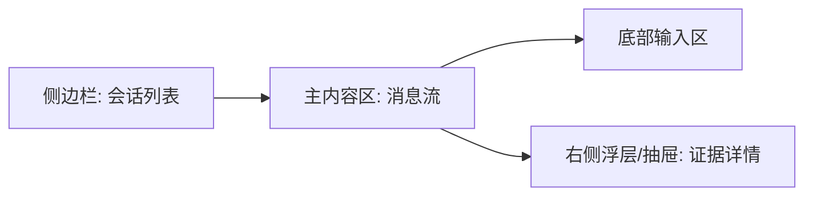

# 电力行业解决方案生成Agent 前端页面详细原型说明

## 1. 文档目标

本文档面向前端工程师、全栈工程师和产品协作人员，定义一个 `ChatGPT 风格` 的电力行业解决方案生成 Agent 页面原型。

页面目标：

- 保留 ChatGPT 式的低学习成本交互
- 支持历史会话列表
- 支持历史会话加载
- 支持在历史会话中继续提问
- 兼顾电力行业方案生成场景所需的参数配置、状态展示和证据卡片

## 2. 产品风格定位

参考方向：

- 交互习惯接近 ChatGPT
- 视觉风格更偏“能源 / 电网 / 工业智能”
- 信息层级清晰，不做花哨装饰
- 保持内容可读性和专业感

设计原则：

- 左侧管理会话
- 中间展示消息流
- 底部进行输入
- 需要时展开参数和证据

## 3. 页面结构总览



## 4. 主工作台布局

### 4.1 桌面端布局

建议宽度：

- 侧边栏：`280px`
- 主内容区：自适应
- 证据抽屉：`420px`

### 4.2 桌面端线框图

```text
+---------------------------------------------------------------+
| Sidebar                 | Main Chat Workspace                |
|-------------------------|------------------------------------|
| + 新建会话              | 顶部标题栏                         |
| 搜索会话                | 当前会话标题                       |
|-------------------------|------------------------------------|
| 今天                    | 欢迎语 / 消息流                    |
| - 智能电网故障诊断方案  | [用户消息]                         |
| - 配网规划优化建议      | [助手状态消息]                     |
|-------------------------| [助手方案摘要卡]                   |
| 最近7天                 | [助手正文 Markdown]                |
| - 新能源预测方案        | [证据卡列表]                       |
| - 园区能源管理方案      |                                    |
|-------------------------|------------------------------------|
| 底部设置区              | 参数折叠面板                       |
|                         | 输入框 + 发送按钮 + 停止按钮      |
+---------------------------------------------------------------+
```

### 4.3 移动端布局

移动端建议：

- 默认隐藏侧边栏
- 顶部左上角为菜单按钮
- 输入框固定底部
- 证据区采用全屏抽屉

## 5. 页面区域说明

## 5.1 左侧侧边栏

### 功能目标

承担 ChatGPT 类产品中的“会话管理器”角色。

### 组件清单

- `新建会话按钮`
- `会话搜索框`
- `会话分组标题`
- `会话列表`
- `底部设置区`

### 交互规则

- 点击 `新建会话`：
  - 创建空会话
  - 清空主区域消息流
  - 输入框获得焦点

- 点击历史会话：
  - 加载该会话消息
  - 恢复最近一次生成结果
  - 可继续输入新问题

- 当前会话：
  - 背景高亮
  - 标题加粗

### 会话列表项字段

- 标题
- 更新时间
- 最近一条用户消息摘要
- 状态标识

### 状态标识建议

- `生成中`
- `已完成`
- `失败`

## 5.2 顶部标题栏

### 目的

帮助用户明确当前上下文。

### 展示内容

- 当前会话标题
- 当前场景标签
- 最近更新时间

### 右侧操作

- 复制摘要
- 复制全文
- 查看证据

## 5.3 消息流区域

### 消息类型

- 欢迎消息
- 用户消息
- 助手状态消息
- 助手正文消息

### 消息呈现规则

#### 用户消息

- 右侧对齐
- 气泡式展示
- 文本不宜过宽

#### 助手消息

- 左侧对齐
- 非纯气泡，建议采用内容卡片式
- 支持 Markdown 渲染

#### 状态消息

建议在助手消息上方或中间插入轻量状态条：

- 正在识别业务场景
- 正在检索行业知识
- 正在整理案例与标准依据
- 正在生成方案结构
- 正在扩写完整方案
- 正在校核输出质量

### 欢迎态

当没有任何消息时，主区域展示：

- 产品名称
- 一句简介
- 3 个示例问题快捷卡片

示例：

- 给我提供一个智能电网故障诊断的解决方案
- 帮我生成一个新能源功率预测方案
- 请输出一个配网规划智能体设计方案

## 5.4 方案摘要卡

在助手完成初步生成后，优先展示摘要卡。

### 摘要卡内容

- 适用场景
- 建设目标
- 核心能力
- 实施重点
- 默认假设

### 目的

让用户不必先看长文，也能快速获得结论。

## 5.5 正文区域

### 展示方式

- Markdown 渲染
- 保持章节目录层级清晰
- 标题、列表、表格、引用要可读

### 内容结构建议

1. 项目背景与痛点
2. 建设目标
3. 总体架构
4. 数据体系
5. 算法设计
6. 实施路径
7. KPI 与收益
8. 风险与建议

### 交互增强

- 支持复制某一段
- 支持展开/折叠章节

## 5.6 参数折叠面板

### 打开方式

- 位于输入框上方
- 默认折叠
- 点击“参数配置”展开

### 参数项

- 方案场景
- 电网环境
- 对象 / 设备
- 资源类型
- 数据基础
- 目标能力
- 市场 / 政策关注
- 规划目标
- 预测目标
- 协同范围
- 生命周期目标

### 产品要求

- 不影响普通聊天体验
- 需要时可快速配置
- 参数改变仅对当前发送消息生效
- 支持 5 个预设场景与 `其他场景` 兜底
- 当从客户需求分析报告页转入时，参数应支持自动带入并允许人工调整

### 报告导入交互

- 支持从“客户需求分析报告页”点击“转入方案生成”
- 打开确认弹窗
- 自动填充方案请求草稿
- 自动加载推荐场景与参数
- 用户确认后带入工作台，但不自动发送

## 5.7 底部输入区

### 组件

- 多行输入框
- 参数按钮
- 发送按钮
- 停止按钮

### 交互规则

- `Enter` 发送
- `Shift + Enter` 换行
- 生成中可点击 `停止`
- 空输入禁用发送

### 输入框占位文案

`请输入您的需求，例如：给我提供一个智能电网故障诊断的解决方案`

## 5.8 证据抽屉

### 打开方式

- 点击正文中的“查看证据”
- 点击证据卡片
- 点击顶部工具按钮

### 展示字段

- 来源类型
- 标题
- 摘要
- 支撑章节
- 元数据

### 抽屉定位

- 桌面端右侧滑出
- 移动端全屏弹层

## 6. 页面状态设计

## 6.1 空态

显示：

- 欢迎标题
- 示例问题
- 简短说明

## 6.2 生成中

显示：

- 用户已发送消息
- 助手状态条
- 已生成摘要或正文的增量内容

## 6.3 已完成

显示：

- 完整正文
- 摘要卡
- 证据卡

## 6.4 加载历史会话

显示：

- 会话骨架屏
- 已完成消息先展示
- 长内容按区域渐进加载

## 6.5 错误态

显示：

- 错误提示
- 重试按钮
- 保留原输入内容

## 7. 页面数据结构建议

## 7.1 会话对象

```json
{
  "conversation_id": "conv_001",
  "title": "智能电网故障诊断解决方案",
  "last_user_message": "给我提供一个智能电网故障诊断的解决方案",
  "last_message_at": "2026-03-20T10:12:30+08:00",
  "status": "idle"
}
```

## 7.2 消息对象

```json
{
  "message_id": "msg_assistant_001",
  "role": "assistant",
  "status": "completed",
  "summary": "本方案面向配电网故障诊断场景...",
  "content": "# 智能电网故障诊断解决方案\n...",
  "assumptions": [],
  "evidence_cards": []
}
```

## 7.3 前端 Store 建议

推荐拆分为：

- `conversationStore`
  - 会话列表
  - 当前会话 ID
  - 会话加载状态

- `messageStore`
  - 当前消息列表
  - 当前生成中的消息
  - 历史消息分页

- `composerStore`
  - 输入内容
  - 参数配置
  - 发送状态

## 8. 页面交互流程

## 8.1 新建会话流程

1. 用户点击 `新建会话`
2. 前端请求创建会话
3. 设置当前会话
4. 清空消息区域
5. 输入框聚焦

## 8.2 首次提问流程

1. 用户输入问题
2. 用户点击发送
3. 前端追加一条用户消息
4. 前端创建 assistant 占位消息
5. 前端订阅 SSE
6. 流式更新状态与正文
7. 完成后刷新会话标题与更新时间

## 8.3 加载历史会话流程

1. 用户点击左侧历史会话
2. 前端请求会话详情
3. 前端请求历史消息
4. 渲染消息列表
5. 恢复到该会话上下文

## 8.4 继续对话流程

1. 用户在已存在会话中输入新需求
2. 前端调用发送消息接口
3. 新用户消息追加到底部
4. 助手消息继续流式生成
5. 会话更新时间刷新到顶部

## 9. 视觉样式建议

## 9.1 风格方向

不建议纯复制 ChatGPT 的黑白灰，应保留行业风格。

建议方向：

- 主色：深海军蓝 / 电力蓝
- 辅色：青蓝 / 冷灰
- 点缀：高亮电流蓝

## 9.2 组件风格

- 侧边栏背景偏深
- 主内容区背景较浅
- 助手正文卡片采用白底或浅灰底
- 状态条采用细线式进度反馈

## 9.3 字体和排版

- 标题使用稳重无衬线字体
- 正文注意长文阅读体验
- Markdown 一级二级标题需清晰

## 10. 动效建议

仅做轻量动效：

- 侧边栏 hover
- 状态点跳动
- 抽屉滑出
- 内容流式淡入

避免花哨动效影响专业感。

## 11. 前端组件拆分建议

推荐组件树：

```text
WorkspaceView
  ConversationSidebar
    NewConversationButton
    ConversationSearch
    ConversationGroup
    ConversationItem
  ChatWorkspace
    WorkspaceHeader
    ChatMessageList
      UserMessageBubble
      AssistantMessageCard
      StatusMessageBar
    SolutionSummaryCard
    EvidenceCardList
    MessageComposer
      ParamConfigToggle
      ParamConfigPanel
      ComposerTextarea
      SendButton
      StopButton
  EvidenceDrawer
```

## 12. 验收标准

页面原型实现后，至少满足：

1. 有 ChatGPT 风格主工作台
2. 有左侧历史会话列表
3. 可新建会话
4. 可加载历史会话
5. 可在历史会话中继续发送消息
6. 可看到流式状态
7. 可看到方案摘要和正文
8. 可查看证据卡与证据抽屉

## 13. 最终建议

这次前端不要做成“表单页 + 结果页”的传统 Demo，而要做成一个真正可连续使用的会话工作台。

只要把这三个体验做对，整体质感会明显提升：

1. `像 ChatGPT 一样自然对话`
2. `像业务工具一样可看历史`
3. `像专业方案助手一样输出结构化结果`
