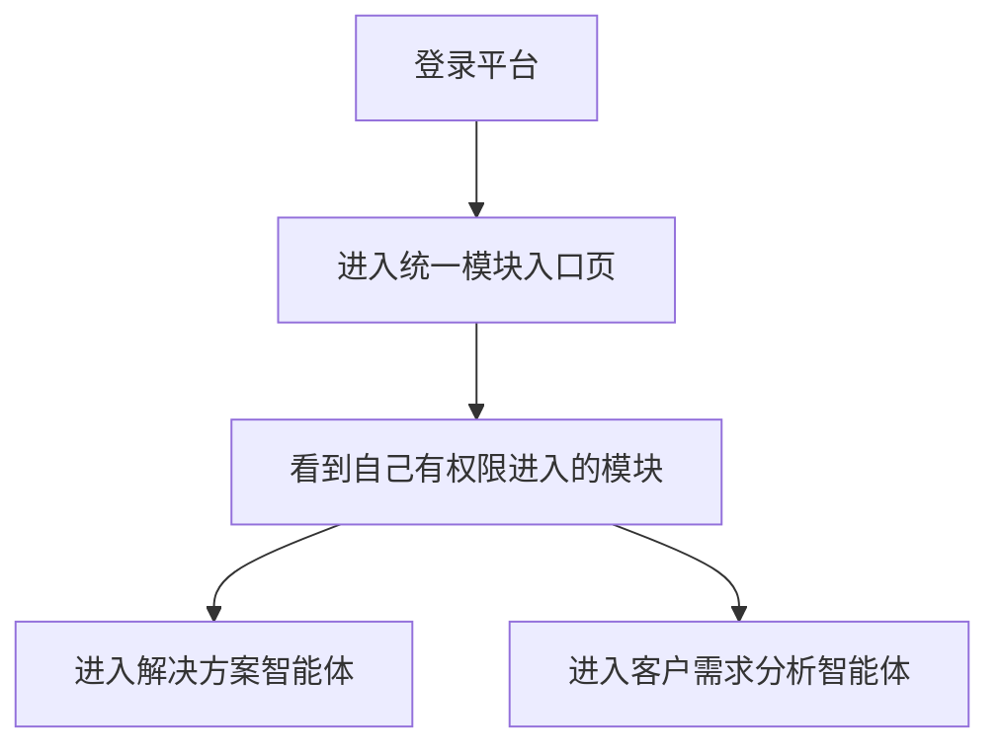
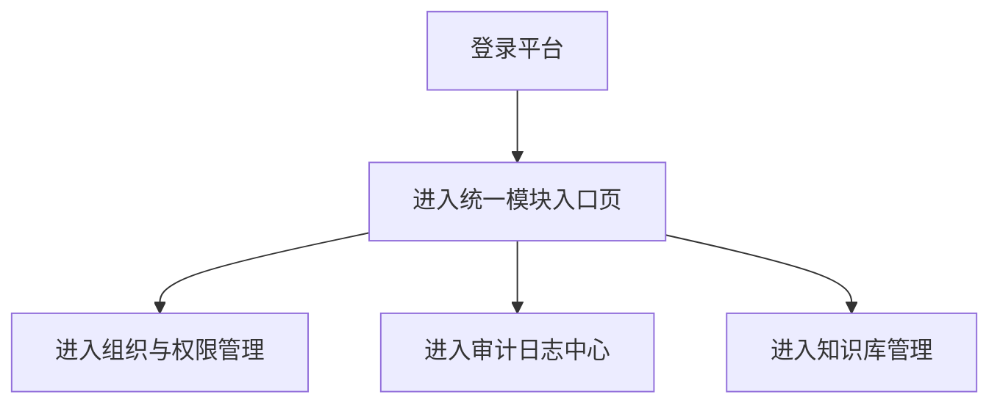
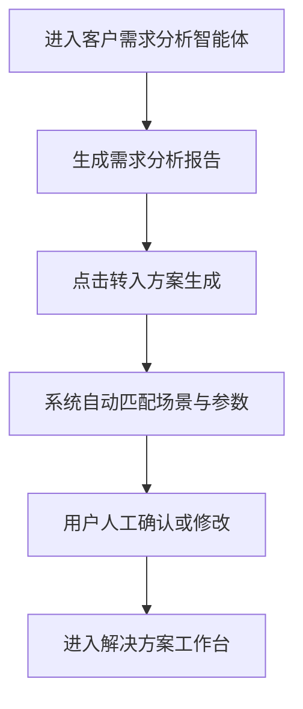

# 统一模块入口平台改造 PRD

## 1. 文档信息

- `文档名称`：统一模块入口平台改造 PRD
- `适用产品`：PowerAgent 平台
- `文档版本`：v1.0
- `文档日期`：2026-03-23
- `适用阶段`：MVP 平台化改造
- `关联智能体版本`
  - `解决方案智能体`：`0.1.0-mvp`
  - `客户需求分析智能体`：`0.1.0-mvp`

## 2. 改造背景

当前项目已经从单一 Demo 功能，演进为包含多个模块的内部业务平台：

1. `解决方案智能体`
2. `客户需求分析智能体`
3. `组织与权限管理`
4. `审计日志中心`
5. `RAGFlow 知识库管理`

但当前导航方式仍然带有明显的“功能拼接”特征：

1. 用户登录后直接进入某一个具体工作台，而不是进入统一平台首页
2. 不同页面内部仍存在跨模块入口，用户需要在某个模块里“绕去”另一个模块
3. `RAGFlow` 知识库管理缺乏正式模块入口，用户往往需要记忆或寻找链接
4. 权限体系虽然已经建立，但模块入口并没有统一按权限进行显式展示和收敛

这会带来几个问题：

1. 平台感不足，像多个页面的集合，而不是一个统一系统
2. 导航路径绕，用户不知道“我当前应该从哪里进入哪个能力”
3. 权限边界不直观，哪些模块当前用户有权进入，用户无法一眼判断
4. 后续如果继续新增模块，页面内互相跳转会越来越混乱

因此需要增加一个登录后的统一模块入口页，将系统正式收敛为“平台首页 -> 模块工作台”的导航结构。

## 3. 改造目标

## 3.1 业务目标

1. 建立登录后的统一平台入口
2. 根据账户权限展示当前可进入的功能模块
3. 收口现有页面内部的跨模块导航，避免模块之间相互嵌套
4. 将 `RAGFlow` 知识库管理纳入平台正式入口
5. 保留“客户需求分析 -> 解决方案生成”的业务联动能力

## 3.2 产品目标

1. 用户登录后默认进入统一模块入口页
2. 统一模块入口页按权限动态展示模块卡片
3. 用户只能看到自己有权进入的模块
4. 模块内部尽量只保留本模块相关操作，不再承担平台级导航职责
5. 需求分析报告页中的“转入方案生成”入口保留，但必须受权限控制

## 3.3 成功标准

满足以下条件即视为本次平台化改造成功：

1. 登录后默认进入统一模块入口页，而不是直接进入具体智能体工作台
2. 普通用户只能看到自己有权限进入的模块
3. `组织与权限管理`、`审计日志`、`知识库管理` 不再需要依赖其他模块页面作为入口
4. 解决方案智能体页面内不再出现“进入组织与权限管理”“进入客户需求分析”等跨模块入口
5. 客户需求分析报告中的“转入方案生成”仍可用，并在用户无权限时正确隐藏或禁用

## 4. 目标用户

## 4.1 直接用户

1. 销售员工
2. 售前顾问 / 售前经理
3. 技术支持工程师
4. 项目经理
5. 平台管理员
6. 超级管理员

## 4.2 非直接用户

1. 外部客户
2. 未登录访客

## 5. 核心设计原则

## 5.1 平台优先

先进入平台首页，再进入具体模块，而不是先进入某个模块再去寻找其他能力。

## 5.2 权限可见

用户应当一登录就能看到：

1. 自己可以进入哪些模块
2. 哪些模块当前不可见
3. 哪些模块不属于自己的权限范围

## 5.3 模块解耦

每个模块内部尽量只保留：

1. 本模块工作流
2. 本模块相关动作
3. 必要的业务联动入口

避免保留大量“跨模块导航按钮”。

## 5.4 联动保留

虽然要收口跨模块导航，但涉及业务闭环的关键联动必须保留。

当前明确保留：

1. `客户需求分析报告 -> 转入方案生成`

这是业务链路的一部分，不视为普通导航入口。

## 6. 模块规划

## 6.1 MVP 纳入统一入口的模块

### 1. 解决方案智能体

- 模块标识：`solution_workspace`
- 入口说明：基于场景、参数、知识库与模板生成行业解决方案

### 2. 客户需求分析智能体

- 模块标识：`customer_demand_workspace`
- 入口说明：记录客户沟通过程，生成阶段整理、需求分析报告与建议追问

### 3. 知识库管理

- 模块标识：`knowledge_base_admin`
- 入口说明：进入 `RAGFlow` 知识库管理平台
- MVP 方案：平台统一入口控制 + 新标签页打开 `RAGFlow`

### 4. 组织与权限管理

- 模块标识：`access_admin`
- 入口说明：管理用户、角色、部门与权限

### 5. 审计日志中心

- 模块标识：`audit_center`
- 入口说明：查看关键操作、用户活动和系统审计信息

## 6.2 后续可扩展模块

1. 模板管理中心
2. 数据与资料中心
3. 任务中心
4. 平台配置中心
5. 模型接入管理

## 7. 权限设计建议

建议将“模块可见权限”和“模块内操作权限”分开设计。

## 7.1 模块入口权限

- `solution.access`
- `customer_demand.access`
- `knowledge.access`
- `platform.manage`
- `audit.view`

## 7.2 模块可见逻辑建议

### 1. 普通业务用户

通常可见：

- `解决方案智能体`
- `客户需求分析智能体`

### 2. 知识库维护人员

在业务模块基础上增加：

- `知识库管理`

### 3. 平台管理员

在以上基础上增加：

- `组织与权限管理`
- `审计日志中心`

### 4. 超级管理员

可见全部模块。

## 8. 页面结构设计

## 8.1 登录后默认入口

登录成功后默认进入：

- `统一模块入口页`

而不是：

- 解决方案智能体工作台
- 客户需求分析工作台

## 8.2 统一模块入口页信息结构

页面建议由以下区域组成：

### 1. 顶部区域

- 平台名称
- 当前登录用户
- 部门 / 角色信息
- 退出登录

### 2. 模块卡片区域

每个模块卡片建议展示：

- 模块名称
- 模块图标
- 一句话说明
- 当前是否可进入
- 进入按钮

### 3. 平台说明区域

可选展示：

- 当前版本信息
- 平台公告
- 最近更新

## 8.3 模块卡片状态

### 1. 可进入

- 显示正常按钮：`进入模块`

### 2. 无权限

- 不显示卡片，或显示但置灰
- MVP 推荐：直接不显示，提高界面清爽度

## 9. 现有页面导航收口规则

## 9.1 需要移除的入口

以下入口应从现有页面中取消：

### 1. 解决方案智能体页面内

取消：

- 进入组织与权限管理
- 进入客户需求分析
- 其他平台级模块入口

### 2. 客户需求分析页面内

取消：

- 面向平台级模块的普通导航入口

### 3. 其他页面内

原则上不再保留“作为平台导航使用”的跨模块入口。

## 9.2 需要保留的入口

### 客户需求分析报告 -> 转入方案生成

该入口保留，原因如下：

1. 它不是普通导航
2. 它属于业务链路闭环
3. 它承接“需求分析 -> 解决方案生成”的真实业务动作

保留规则：

1. 若当前用户具备 `solution.access`，正常显示
2. 若当前用户不具备 `solution.access`，则隐藏或禁用，并提示无权限

## 10. RAGFlow 纳入平台入口的设计建议

## 10.1 MVP 阶段

MVP 阶段建议采用：

1. 在统一模块入口页中显示“知识库管理”模块卡片
2. 点击后由平台统一进行权限校验
3. 通过新标签页打开 `RAGFlow`

这样可以先解决：

1. 用户找不到入口
2. 平台内部权限不可控

## 10.2 账号打通的可行性判断

`RAGFlow` 与 `Django` 账户完全打通，在方向上可研究，但不建议直接作为本次改造的 MVP 范围。

原因：

1. `RAGFlow` 属于独立系统
2. 认证模型未必和 Django 平台一致
3. 若要真正做到单点登录，通常需要额外评估：
   - 是否支持 SSO / OAuth / OIDC
   - 是否支持外部身份提供方
   - 是否需要修改源码或增加代理层

## 10.3 当前建议

本次改造先实现：

1. `平台统一入口`
2. `平台权限控制`
3. `正式知识库管理模块入口`

将“账户完全打通 / 单点登录”单独作为二阶段课题评估。

## 11. 用户流程

## 11.1 普通用户流程

## 11.2 平台管理员流程

## 11.3 需求分析联动流程

## 12. MVP 范围

包含：

1. 登录后统一模块入口页
2. 基于权限动态显示模块卡片
3. 解决方案智能体、客户需求分析、知识库管理、组织与权限管理、审计日志的统一入口
4. 现有页面跨模块入口收口
5. 报告页“转入方案生成”权限控制
6. `RAGFlow` 平台入口正式化

不包含：

1. `RAGFlow` 与 Django 账户单点登录
2. `RAGFlow` 深度页面内嵌
3. 多租户模块首页
4. 模块访问统计看板

## 13. 验收标准

1. 用户登录后默认进入统一模块入口页
2. 不同权限账户看到的模块集合不同，且符合权限定义
3. 解决方案智能体页面中不再出现“进入组织与权限管理”“进入客户需求分析”等平台级入口
4. 客户需求分析页面中不再承担平台导航职责
5. `RAGFlow` 在统一模块入口页中具备正式入口
6. 需求分析报告中的“转入方案生成”在有权限时正常显示、可编辑、可跳转
7. 无 `solution.access` 权限的用户无法通过需求分析报告页进入方案工作台

## 14. 推荐实施顺序

### 第 1 阶段

1. 增加统一模块入口页
2. 登录后默认跳转统一模块入口页
3. 模块按权限显示

### 第 2 阶段

1. 收口解决方案智能体、客户需求分析智能体中的跨模块入口
2. 保留并权限化“需求分析报告 -> 转入方案生成”

### 第 3 阶段

1. 将 `RAGFlow` 纳入正式模块入口
2. 评估账号打通可行性

## 15. 一句话定位

本次改造的目标不是“增加一个首页”，而是把当前系统从“多个功能页面的集合”，正式收敛为：

`一个有统一入口、统一权限、统一模块管理能力的内部智能体平台。`
