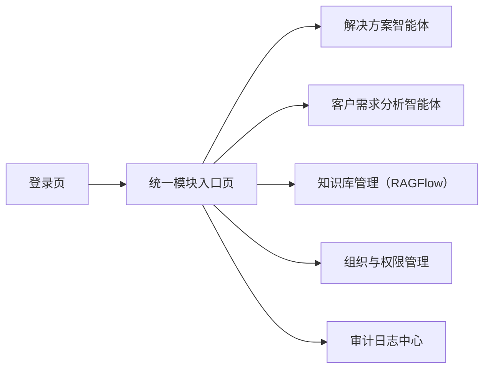

# 统一模块入口平台改造 前端页面原型说明

## 1. 文档目标

本文档用于定义 PowerAgent 在“登录后统一模块入口”改造中的前端页面结构、导航规则与交互方式，供产品、前端、全栈与测试人员协同使用。

本文档重点回答：

1. 登录后用户首先看到什么页面
2. 如何按权限展示功能模块
3. 现有页面中的跨模块入口如何收口
4. `RAGFlow` 如何以正式模块入口形式纳入平台
5. “需求分析报告 -> 转入方案生成”如何作为业务联动保留

## 2. 页面定位

统一模块入口页不是一个普通首页，而是平台化导航中枢。

它的作用是：

1. 展示当前用户可进入的功能模块
2. 体现平台而不是单个工具的产品形态
3. 让权限边界在界面层面可见
4. 收口当前模块间互相嵌套的入口

一句话定位：

`统一模块入口页 = 登录后的平台工作台首页`

## 3. 设计原则

## 3.1 平台优先

登录后优先进入统一模块入口页，而不是直接进入某个智能体工作台。

## 3.2 权限即导航

页面上只展示当前用户有权进入的模块，避免用户看到自己无权进入的能力。

## 3.3 模块解耦

各工作台内部不再承担平台导航职责。

## 3.4 业务链路保留

“需求分析报告 -> 转入方案生成”属于业务闭环动作，保留并做权限控制，不视为普通跨模块导航。

## 4. 页面结构总览



## 5. 登录后默认流转

## 5.1 默认跳转规则

登录成功后默认进入：

- `/modules`

而不是：

- `/`
- `/customer-demand`
- `/admin/access`

## 5.2 已登录回跳规则

若用户已登录，访问登录页时自动跳转到：

- 统一模块入口页

## 6. 统一模块入口页原型

## 6.1 页面布局

建议采用三段式结构：

1. 顶部平台栏
2. 中部模块卡片区
3. 底部辅助信息区（可选）

## 6.2 桌面端线框图

```text
+----------------------------------------------------------------------------------+
| PowerAgent 平台首页                         用户信息 / 角色 / 退出登录           |
|----------------------------------------------------------------------------------|
| 平台说明：按权限进入不同模块                                                     |
|----------------------------------------------------------------------------------|
| [解决方案智能体]   [客户需求分析智能体]   [知识库管理]                           |
| 一句话说明           一句话说明              一句话说明                           |
| 进入模块             进入模块                打开知识库                           |
|----------------------------------------------------------------------------------|
| [组织与权限管理]   [审计日志中心]                                               |
| 一句话说明           一句话说明                                                  |
| 进入模块             进入模块                                                    |
|----------------------------------------------------------------------------------|
| 底部：版本号 / 平台说明 / 最近更新（可选）                                       |
+----------------------------------------------------------------------------------+
```

## 6.3 移动端布局

移动端建议：

1. 模块卡片单列排列
2. 顶部保留平台标题与用户菜单
3. 知识库管理入口仍可保留，但建议新标签或新页面打开

## 7. 页面区域说明

## 7.1 顶部平台栏

### 展示内容

1. 平台名称
2. 页面标题：`模块入口`
3. 当前用户姓名 / 用户名
4. 部门 / 角色摘要
5. 退出登录按钮

### 交互要求

1. 点击用户区域可打开用户菜单
2. 支持退出登录
3. 不在顶部再放置其他模块的快速入口

## 7.2 模块卡片区

### 每张卡片建议包含

1. 模块图标
2. 模块名称
3. 简短说明
4. 权限状态
5. 进入按钮

### 模块卡片示例

#### 解决方案智能体

- 名称：`解决方案智能体`
- 说明：基于场景、参数、知识库与模板生成行业解决方案
- 按钮：`进入模块`

#### 客户需求分析智能体

- 名称：`客户需求分析智能体`
- 说明：记录客户沟通、生成阶段整理、需求分析报告与建议追问
- 按钮：`进入模块`

#### 知识库管理

- 名称：`知识库管理`
- 说明：进入 RAGFlow 知识库平台，进行数据查看与维护
- 按钮：`打开知识库`

#### 组织与权限管理

- 名称：`组织与权限管理`
- 说明：管理用户、角色、部门与权限
- 按钮：`进入模块`

#### 审计日志中心

- 名称：`审计日志中心`
- 说明：查看平台关键操作、访问和任务审计日志
- 按钮：`进入模块`

## 7.3 模块可见策略

### MVP 推荐

采用：

- `无权限模块默认不显示`

原因：

1. 页面更清爽
2. 降低普通用户认知负担
3. 避免“看得到但进不去”的挫败感

### 预留策略

后续可扩展为：

- 显示置灰卡片
- 配合权限申请入口

## 8. 模块跳转规则

## 8.1 解决方案智能体

入口页点击后进入：

- `/`

或未来统一改造成：

- `/solution`

当前 MVP 不强制重命名路由，但前端展示上统一称为：

- `解决方案智能体`

## 8.2 客户需求分析智能体

入口页点击后进入：

- `/customer-demand`

## 8.3 知识库管理

入口页点击后：

1. 平台先校验当前用户权限
2. 以新标签页打开 `RAGFlow`

MVP 建议不做 iframe 深度嵌入。

## 8.4 组织与权限管理

入口页点击后进入：

- `/admin/access`

## 8.5 审计日志中心

入口页点击后进入：

- `/admin/audit`

## 9. 现有页面导航改造说明

## 9.1 解决方案智能体工作台

当前页面中应移除：

1. 进入客户需求分析的入口
2. 进入组织与权限管理的入口
3. 其他平台级入口

保留：

1. 本模块会话管理
2. 方案参数配置
3. 证据查看
4. 本模块相关操作

## 9.2 客户需求分析智能体工作台

当前页面中应移除：

1. 面向平台级模块的普通入口

保留：

1. 会中辅助工作流
2. 阶段整理
3. 正式需求分析报告
4. 报告页业务联动

## 9.3 需求分析报告页

保留：

1. `转入方案生成`

原因：

1. 这不是普通导航
2. 这属于业务闭环动作

交互要求：

1. 若用户具备 `solution.access`，显示按钮
2. 若无权限，则隐藏或禁用，并提示无权限进入方案工作台
3. 点击后先弹确认界面
4. 用户可编辑草稿内容与方案参数
5. 跳转到方案工作台后不自动发送

## 10. 页面状态设计

## 10.1 入口页加载中

显示：

1. 平台骨架屏
2. 模块卡片占位

## 10.2 无模块权限

若当前用户登录成功但没有任何模块权限，展示空状态：

1. 提示当前暂无可访问模块
2. 建议联系平台管理员开通权限

## 10.3 模块跳转失败

若点击模块时跳转失败，应给出明确提示：

1. 权限不足
2. 系统暂不可用
3. 外部知识库平台暂不可访问

## 11. RAGFlow 模块入口体验建议

由于 `RAGFlow` 当前仍是独立系统，前端体验建议如下：

1. 卡片上明确标记：`外部平台`
2. 点击按钮文案为：`打开知识库`
3. 可在按钮下补一句说明：
   - `将在新标签页打开`

这样可以减少用户对“为什么样式不一样”的困惑。

## 12. 推荐视觉风格

建议延续当前平台的工业智能 / 电网科技风格，但入口页更偏“平台首页”，而不是聊天页：

1. 卡片式布局
2. 信息层级清晰
3. 模块图标和说明一目了然
4. 不做复杂大屏化设计
5. 保持专业、克制、内部平台感

## 13. 验收标准

1. 登录后默认进入统一模块入口页
2. 用户只能看到自己有权限进入的模块卡片
3. `RAGFlow` 在入口页中具备正式卡片入口
4. 现有工作台页面不再承担平台级导航职责
5. 需求分析报告页中的“转入方案生成”入口仍然存在，并符合权限控制要求
6. 普通用户不再需要从某个工作台里绕行进入其他模块

## 14. 一句话总结

这次前端改造的目标不是“增加一个首页”，而是把产品导航从：

`单页工作台互相跳转`

改造成：

`登录 -> 平台模块入口 -> 按权限进入对应工作台`

让 PowerAgent 从“多个功能页面”变成“一个真正的平台”。
