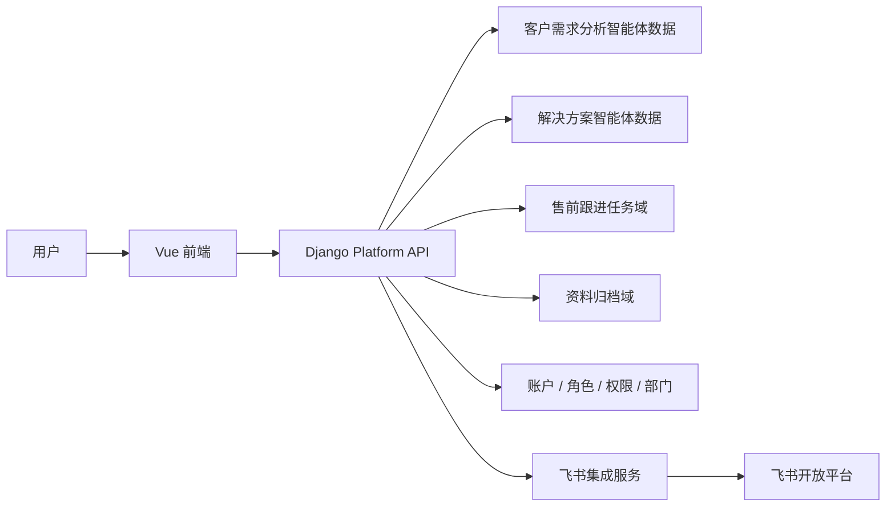

# 售前闭环智能体平台 技术设计稿

## 1. 文档目的

本文档用于将“售前闭环智能体平台_飞书接入PRD”转化为可落地的技术设计方案，供前端、后端、测试和平台研发协同使用。

本文档重点回答：

1. 如何在现有平台中接入飞书协同能力
2. 如何承接需求分析与解决方案结果的任务流转
3. 平台内部应新增哪些对象和接口
4. 飞书身份与平台权限如何共存
5. 如何为后续 CRM 与客户画像能力预留扩展点

## 2. 技术目标

## 2.1 功能目标

1. 需求分析报告支持发起内部跟进
2. 解决方案结果支持发起内部跟进
3. 平台内可创建和管理售前跟进任务
4. 支持飞书发送、回访提醒、资料归档状态跟踪
5. 支持飞书身份映射与部门同步预留

## 2.2 非功能目标

1. 不破坏现有两大智能体主链路
2. 不强依赖飞书单点登录
3. 飞书发送失败不影响平台内部任务落库
4. 所有关键动作可审计

## 3. 总体架构

## 4. 改造范围

## 4.1 本次纳入范围

1. 飞书发送能力封装
2. 售前跟进任务模型
3. 回访提醒模型
4. 飞书发送记录模型
5. 资料归档状态模型
6. 智能体结果发起跟进接口
7. 售前协同中心接口
8. 飞书身份映射与部门同步字段预留

## 4.2 暂不纳入范围

1. 飞书单点登录
2. 企业微信 / 钉钉并行接入
3. 完整 CRM 模块
4. 客户画像评分引擎
5. 自动写入外部 CRM

## 5. 业务对象设计

## 5.1 PresalesTask（售前跟进任务）

建议字段：

- `id`
- `task_title`
- `task_type`
- `task_description`
- `source_type`
  - `customer_demand_report`
  - `solution_result`
- `source_id`
- `customer_name`
- `owner_user_id`
- `owner_department_id`
- `assignee_user_id`
- `due_at`
- `followup_at`
- `status`
- `priority`
- `feishu_delivery_status`
- `feishu_delivery_id`
- `payload_json`
- `created_by`
- `created_at`
- `updated_at`

## 5.2 PresalesTaskActivity（任务活动记录）

用于记录：

- 创建
- 修改
- 指派
- 发送飞书
- 完成
- 延期
- 回访

## 5.3 PresalesArchiveRecord（资料归档记录）

建议字段：

- `id`
- `archive_type`
- `source_type`
- `source_id`
- `source_title`
- `storage_provider`
- `storage_path`
- `archive_status`
- `metadata_json`
- `created_by`
- `created_at`

## 5.4 FeishuDeliveryRecord（飞书发送记录）

建议字段：

- `id`
- `business_type`
- `business_id`
- `target_type`
  - `user`
  - `group`
- `target_id`
- `message_type`
- `request_payload`
- `response_payload`
- `delivery_status`
- `error_message`
- `created_by`
- `created_at`

## 5.5 FeishuUserMapping / FeishuDepartmentMapping

不一定必须拆成独立表，但至少要在现有用户和部门体系上预留：

- `feishu_user_id`
- `feishu_open_id`
- `feishu_union_id`
- `feishu_department_id`
- `sync_status`
- `last_sync_at`

## 6. 与现有智能体的集成点

## 6.1 客户需求分析智能体

新增集成点：

1. 从报告页发起内部跟进
2. 报告对象挂接到 PresalesTask
3. 报告、录音、阶段整理可形成归档条目

## 6.2 解决方案生成智能体

新增集成点：

1. 从方案结果发起内部跟进
2. 方案摘要、参数、证据卡可作为任务上下文
3. 方案输出结果可形成归档条目

## 7. 飞书集成层设计

## 7.1 推荐设计

平台内部新增独立的 Feishu Integration Service，统一负责：

1. 用户映射
2. 部门同步
3. 飞书消息发送
4. 飞书群/用户目标解析
5. 飞书发送日志记录

## 7.2 不建议的做法

不建议在：

- 需求分析 app
- 解决方案 app
- 前端页面

里直接拼飞书接口调用。

应统一下沉为平台服务层。

## 7.3 能力分层

### A. 业务层

- 创建任务
- 创建归档记录
- 生成飞书发送内容

### B. 集成层

- 调用飞书 API
- 解析目标人/群
- 记录返回结果

### C. 同步层

- 用户同步
- 部门同步
- 状态更新

## 8. 接口设计建议

## 8.1 智能体结果发起跟进

### `POST /api/v1/presales/tasks/from-demand-report`

作用：

- 从需求分析报告创建建议任务

### `POST /api/v1/presales/tasks/from-solution`

作用：

- 从方案结果创建建议任务

## 8.2 任务管理

### `GET /api/v1/presales/tasks`

支持筛选：

- 客户
- 来源类型
- 状态
- 负责人
- 飞书发送状态
- 回访时间范围

### `GET /api/v1/presales/tasks/{id}`

### `PATCH /api/v1/presales/tasks/{id}`

### `POST /api/v1/presales/tasks/{id}/complete`

### `POST /api/v1/presales/tasks/{id}/send-feishu`

## 8.3 归档

### `GET /api/v1/presales/archive`

### `POST /api/v1/presales/archive`

## 8.4 飞书同步

### `POST /api/v1/integrations/feishu/sync-users`

### `POST /api/v1/integrations/feishu/sync-departments`

### `GET /api/v1/integrations/feishu/mappings`

## 9. 权限设计

## 9.1 模块权限

建议新增：

- `presales_handoff.access`
- `presales_handoff.manage`

## 9.2 页面动作权限

建议新增：

- `presales_task.create`
- `presales_task.assign`
- `presales_task.complete`
- `presales_task.send_feishu`
- `presales_archive.view`
- `presales_archive.manage`

## 9.3 身份同步管理权限

建议新增：

- `feishu_sync.manage`

## 10. 飞书身份与部门同步设计

## 10.1 原则

采用：

**飞书同步身份与部门，平台继续维护角色与权限。**

## 10.2 同步方式

### 初期

- 手动触发 + 后台任务同步

### 后续

- 定时增量同步

## 10.3 离职员工处置

同步发现员工离职后：

1. 平台账号标记为停用
2. 清理 token
3. 保留历史数据
4. 未完成任务进入待转派状态
5. 飞书发送动作不再允许继续指派给该账号

## 11. 资料归档设计

## 11.1 归档对象范围

本期建议支持：

- 客户沟通录音
- 沟通分段文本
- 阶段整理
- 正式需求分析报告
- 解决方案结果
- 上传附件

## 11.2 存储策略

### 本地

仍保留本地存储路径和平台内索引。

### 云端 / 飞书

本期先记录目标归档位置和状态，不强行承诺自动全量云同步。

## 12. 前端联动要求

## 12.1 需求分析报告页

需要支持：

- 发起内部跟进
- 发送到飞书
- 查看归档状态

## 12.2 解决方案结果页

需要支持：

- 发起方案跟进
- 发送到飞书
- 归档资料

## 12.3 售前协同中心

需要支持：

- 任务列表
- 任务详情
- 飞书发送记录
- 回访提醒
- 归档状态

## 13. MVP 实施顺序建议

### 第一步

- 新建 PresalesTask 数据模型与基础接口
- 从需求分析/方案结果页发起任务

### 第二步

- 新建 Feishu Integration Service
- 支持基础发送与发送记录

### 第三步

- 新建售前协同中心页面
- 支持任务查看与回访提醒

### 第四步

- 补用户与部门映射
- 加离职用户停用与待转派逻辑

## 14. 风险提示

1. 如果飞书身份与平台账户映射不清，会导致任务发错人。
2. 如果离职处置不提前设计，会形成僵尸账户和无主任务。
3. 如果直接做自动发送而缺少确认，会带来误发风险。
4. 如果把飞书当成主业务库，后续平台治理会变得困难。

## 15. 一句话总结

本次技术设计的关键，不是单独接一套飞书消息接口，而是建立：

**智能体结果 -> 平台任务 -> 飞书协同 -> 状态回写 -> 资料归档**

的稳定技术骨架，并以“飞书同步身份与部门、平台维护角色与权限”为长期边界。
