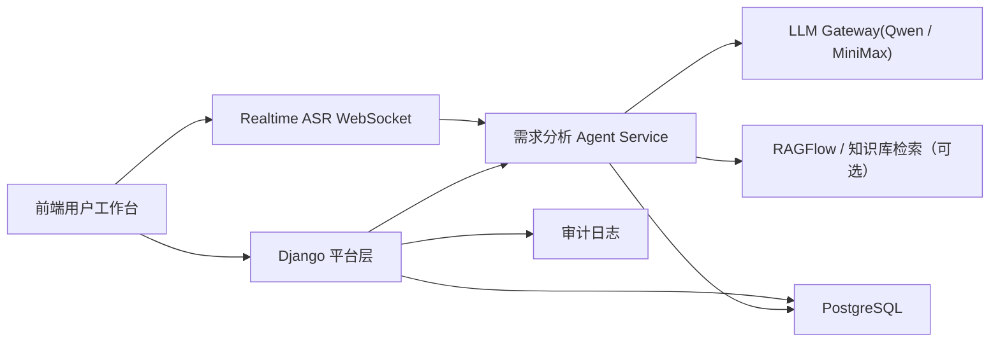
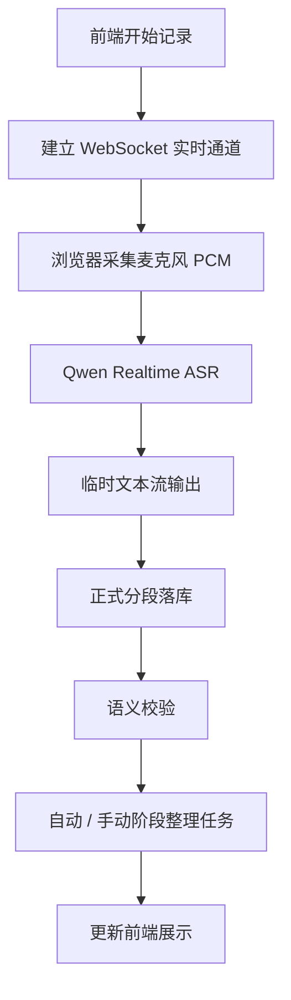
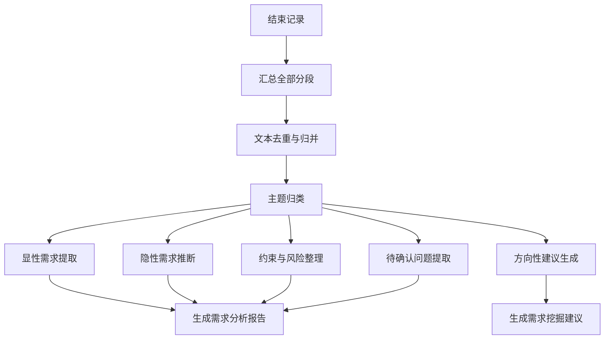

# 客户需求分析智能体 技术设计稿

## 1. 文档目的

本文档用于将“客户需求分析智能体”的产品需求转化为可落地的技术设计方案，供后端、前端、算法、Agent、测试等研发角色直接参考。

本文档重点回答：

1. 系统如何采集和保存客户沟通内容
2. ASR 如何接入，如何做语义校验
3. 如何将碎片化沟通整理成结构化需求分析结果
4. 如何通过知识库开关控制是否启用检索增强
5. 如何与现有 PowerAgent 平台、账户权限体系和前端工作台集成
6. 如何把需求分析结果安全地带入解决方案生成智能体

---

## 2. 技术目标

### 2.1 功能目标

1. 支持创建客户沟通会话
2. 支持实时音频转写
3. 支持语义校验后的文本流输出
4. 支持阶段性需求整理
5. 支持生成需求分析报告
6. 支持生成需求挖掘建议
7. 支持勾选是否使用知识库
8. 支持会话历史、分析结果、导出与回看
9. 支持将正式需求分析报告转入解决方案生成工作台

### 2.2 非功能目标

1. 实时转写链路稳定
2. 阶段性整理具备较低延迟
3. 结果可追溯、可审计
4. 数据权限遵循现有用户体系
5. 设计上支持后续接入移动端或会议场景扩展

---

## 3. 总体架构



### 3.1 分层职责

#### 前端

负责：

1. 会话创建
2. 录音控制
3. 实时转写展示
4. 语义校验文本展示
5. 会中辅助卡片展示
6. 触发“生成阶段整理”
7. 触发“开始需求分析整理”
8. 跳转并展示正式需求分析报告页
9. 将正式报告转入解决方案生成工作台

#### Django 平台层

负责：

1. 会话、分段文本、分析结果、导出记录管理
2. 用户、角色、权限与可见性控制
3. 接收前端控制请求
4. 管理 Agent 异步任务与状态
5. 审计日志
6. 管理“需求分析结果 -> 方案生成草稿”的受控交接

#### ASR 流式接入层

负责：

1. 接收前端音频流
2. 实时返回临时转写
3. 对接第三方 ASR 服务
4. 将分段结果送入需求分析 Agent

#### ASR Adapter 抽象层

建议在 Django 平台层内部增加一层 `ASR Adapter` 抽象，用于隔离不同语音识别提供方。

建议结构：

1. `BaseAsrAdapter`
2. `QwenAsrAdapter`
3. `FunAsrAdapter`
4. `get_asr_adapter(provider)`
5. `transcribe_audio_chunk(...)`

这样可以保证：

1. 业务接口不感知底层厂商差异
2. MVP 可先接 `Qwen`
3. 二期可切换或并存 `FunASR`
4. 本地联调可走 `mock_text`

#### Agent Service

负责：

1. 文本归并
2. 语义校验
3. 阶段性整理
4. 最终需求分析报告生成
5. 需求挖掘建议生成
6. 知识库开关控制下的检索增强

---

## 4. 与现有系统的集成关系

## 4.1 与 PowerAgent 平台层的关系

客户需求分析智能体不单独做一套账户系统，而是复用当前平台层：

1. 登录态
2. 用户归属
3. 会话归属
4. 权限控制
5. 审计能力

### 建议集成方式

新增一个新的业务域，例如：

- `customer_demand_sessions`
- `customer_demand_segments`
- `customer_demand_reports`

在现有 Django 平台层中作为新的 app 或新的业务模块接入。

## 4.2 与解决方案生成智能体的关系

客户需求分析智能体是“前置智能体”，可为后续解决方案生成提供高质量输入。

### 当前建议联动能力

1. 将正式需求分析报告一键带入解决方案生成工作台
2. 自动抽取当前问题、明确需求、隐性诉求、约束与待确认项
3. 自动推断最适合的解决方案场景
4. 自动加载推荐参数，并允许人工修改
5. 将“待确认问题”转化为下一轮沟通提纲

---

## 5. 核心技术流程

## 5.1 实时记录流程



### 5.1.1 输入

1. 浏览器麦克风音频流
2. 当前会话上下文
3. 行业标签
4. 知识库开关状态

### 5.1.2 输出

1. 原始转写分段
2. 校验后文本分段
3. 分段置信度
4. 阶段性整理结果

## 5.2 会后需求分析流程



---

## 6. 模块设计

## 6.1 会话管理模块

### 职责

管理一次客户沟通的完整生命周期。

### 数据对象

1. 会话基本信息
2. 行业、地区、主题
3. 是否启用知识库
4. 会话状态
5. 开始/结束时间

### 状态建议

- `draft`
- `recording`
- `paused`
- `closed`
- `analyzing`
- `completed`
- `failed`

---

## 6.2 音频接入与 ASR 模块

### 设计方式

建议独立为一个流式能力模块，不直接嵌在 Django request 中。

### 推荐链路

1. 前端通过 WebSocket 持续发送麦克风 PCM 音频流
2. `Agent Service` 接入 `Qwen3-ASR-Flash-Realtime`
3. 实时临时文本先用于前端会中展示
4. 稳定句子或兜底长块识别结果回写 Django
5. Django 平台层继续完成分段落库、语义校验与阶段整理任务调度

### 技术建议

#### 当前 MVP 方案

1. 浏览器采集麦克风音频并下采样为 `16k / mono / PCM16`
2. 前端通过 WebSocket 发送到 `Agent Service`
3. `Agent Service` 内部调用 `Qwen3-ASR-Flash-Realtime`
4. 前端先显示临时实时气泡
5. 稳定句子或兜底长块识别结果回写 Django
6. Django 平台层继续完成分段落库、语义校验、自动阶段整理与正式报告生成

#### 后续增强

1. 实时流式 ASR
2. 说话人分离
3. 断线重连
4. 本地缓存补传
5. 动态切换 `Qwen / FunASR`

### 6.2.1 ASR 双实现路线

#### 路线 A：Qwen ASR（MVP 当前优先 `qwen3-asr-flash-realtime`）

适合：

1. 快速落地
2. 接入成本低
3. MVP 先跑通体验

当前实现建议：

1. 会中实时录音优先使用 `Qwen3-ASR-Flash-Realtime`
2. 必要时保留短音频分片识别作为兜底链路
3. 通过统一 `ASR Adapter` 保证前端不感知底层差异

#### 路线 B：FunASR

适合：

1. 私有化
2. 行业热词定制
3. 长期可控演进

### 6.2.2 推荐策略

第一阶段：

1. 默认 `Qwen`
2. `FunASR` 预留配置和适配器实现

第二阶段：

1. 支持按环境变量切换
2. 对同一上传接口保持不变

---

## 6.3 语义校验模块

### 目标

对 ASR 文本进行上下文一致性修正，而不是无条件相信 ASR 原文。

### 输入

1. 当前新转写分段
2. 最近若干条上下文分段
3. 会话主题
4. 行业标签

### 输出

1. `raw_text`
2. `normalized_text`
3. `confidence_score`
4. `review_flag`
5. `issues`

### 处理逻辑建议

#### 第 1 层：规则校验

1. 去除明显噪音片段
2. 合并重复词
3. 处理明显口头禅和停顿

#### 第 2 层：LLM 语义校验

目标：

1. 判断新文本是否与上下文相关
2. 修正术语误识别
3. 输出更适合阅读的校验文本

#### 第 3 层：低置信度标记

对于不确定片段：

1. 不直接硬改
2. 打上“待确认”标记
3. 保留原文和校验文两套文本

---

## 6.4 阶段性整理模块

### 目标

在会话未结束时，持续提炼当前已讨论出的关键需求。

### 输入

1. 最近一段校验后文本
2. 当前阶段的历史摘要

### 输出

1. 当前主题
2. 已明确需求
3. 待确认问题
4. 潜在方向
5. 风险提示
6. 建议追问

### 触发方式建议

1. 每累计 N 条分段触发一次
2. 每隔固定时间触发一次
3. 用户手动点击“阶段整理”

### 当前推荐策略

MVP 阶段建议采用：

1. 按“新增有效分段数 / 内容量阈值”自动触发
2. 保留人工手动触发
3. 前端明确展示当前整理任务状态

避免过于频繁调用大模型，同时保证会中辅助卡片能及时刷新。

---

## 6.5 最终需求分析模块

### 输入

1. 全部校验后文本
2. 阶段性整理结果
3. 知识库开关状态
4. 行业标签 / 主题信息

### 输出

1. 需求分析报告
2. 需求挖掘方向建议
3. 下一轮沟通建议问题

### 结构化输出建议

建议 LLM 首先输出结构化 JSON，再由程序格式化成 Markdown：

```json
{
  "summary": "",
  "current_problem": [],
  "explicit_requirements": [],
  "implicit_requirements": [],
  "constraints_and_risks": [],
  "pending_questions": [],
  "next_actions": [],
  "digging_directions": [],
  "recommended_questions": []
}
```

## 6.6 需求分析结果转方案草稿模块

### 目标

将正式需求分析报告安全、可控地带入解决方案生成智能体，而不是直接替用户自动发起生成。

### 当前实现建议

1. 在正式报告页点击“转入方案生成”
2. 前端根据报告结构化字段自动生成方案请求草稿
3. 前端根据报告内容自动推断场景与参数
4. 弹出人工确认对话框
5. 用户修改完成后，将草稿带入解决方案工作台
6. 用户再次确认后主动发送

### 设计原则

1. 自动推荐，不自动代替人工提交
2. 参数自动带入，但始终允许修改
3. 与方案工作台共用一套参数配置定义
4. 导入动作应有明确提示，避免用户误以为已经开始生成

这样更利于：

1. 前端展示
2. 二次编辑
3. 导出
4. 与后续解决方案智能体联动

---

## 6.6 知识库增强模块

### 目标

当且仅当用户勾选“启用知识库”时，才在需求分析过程中引入检索增强。

### 设计原则

1. 知识库为可选增强
2. 不能因为知识库无关而污染分析结果
3. 若检索结果相关性低，应允许自动降权或不使用

### 建议流程

1. 根据会话主题做轻量检索意图识别
2. 检索知识库
3. 评估相关性
4. 若相关性高，作为辅助证据
5. 若相关性低，则忽略

### 适配逻辑

#### 电力行业场景

可启用：

1. 行业术语校验
2. 需求主题补充
3. 常见解决思路提示

#### 非电力行业场景

建议默认关闭或允许用户显式关闭。

---

## 7. 数据模型设计建议

## 7.1 customer_demand_session

### 字段建议

1. `id`
2. `owner_id`
3. `customer_name`
4. `session_title`
5. `industry`
6. `region`
7. `topic`
8. `knowledge_enabled`
9. `status`
10. `started_at`
11. `ended_at`
12. `created_at`
13. `updated_at`

## 7.2 customer_demand_segment

### 字段建议

1. `id`
2. `session_id`
3. `sequence_no`
4. `speaker_label`
5. `raw_text`
6. `normalized_text`
7. `confidence_score`
8. `review_flag`
9. `issues_json`
10. `started_at`
11. `ended_at`
12. `created_at`

## 7.3 customer_demand_stage_summary

### 字段建议

1. `id`
2. `session_id`
3. `summary_version`
4. `summary_markdown`
5. `structured_payload`
6. `created_at`

## 7.4 customer_demand_report

### 字段建议

1. `id`
2. `session_id`
3. `report_markdown`
4. `report_payload`
5. `digging_suggestions`
6. `recommended_questions`
7. `created_at`
8. `updated_at`

---

## 8. API 设计建议

## 8.1 会话管理

### 创建会话

`POST /api/v1/customer-demand/sessions`

### 获取会话列表

`GET /api/v1/customer-demand/sessions`

### 获取会话详情

`GET /api/v1/customer-demand/sessions/{session_id}`

### 更新会话信息

`PATCH /api/v1/customer-demand/sessions/{session_id}`

---

## 8.2 记录控制

### 开始记录

`POST /api/v1/customer-demand/sessions/{session_id}/start`

### 暂停记录

`POST /api/v1/customer-demand/sessions/{session_id}/pause`

### 结束记录

`POST /api/v1/customer-demand/sessions/{session_id}/stop`

---

## 8.3 分段与流式

### 上传音频分段

`POST /api/v1/customer-demand/sessions/{session_id}/segments/audio`

### 获取文本分段

`GET /api/v1/customer-demand/sessions/{session_id}/segments`

### 订阅流式事件

`GET /api/v1/customer-demand/sessions/{session_id}/stream`

---

## 8.4 阶段整理与分析

### 触发阶段整理

`POST /api/v1/customer-demand/sessions/{session_id}/stage-summary`

### 启动最终需求分析

`POST /api/v1/customer-demand/sessions/{session_id}/analyze`

### 获取最终分析结果

`GET /api/v1/customer-demand/sessions/{session_id}/report`

---

## 9. 前端设计建议

## 9.1 页面结构

建议采用“双页面结构”：

1. 会中辅助工作台
2. 正式需求分析报告页

### 页面 1：会中辅助工作台

1. 左侧：历史客户沟通会话
2. 中间：实时转写区 / 校验文本区
3. 右侧：会中辅助卡片
4. 底部：开始记录、暂停记录、结束记录、阶段整理、开始分析

补充要求：

1. 左侧会话栏必须支持收起 / 展开
2. 收起后保留窄栏入口按钮
3. 在桌面端优先保证中间实时转写区和右侧辅助区的展示空间

### 页面 2：正式需求分析报告页

1. 报告头部信息
2. 正文阅读区
3. 需求挖掘建议
4. 推荐追问问题
5. 导出与流转动作

## 9.2 核心组件

1. `SessionSidebar`
2. `LiveTranscriptPanel`
3. `SemanticReviewPanel`
4. `InMeetingAssistPanel`
5. `StageSummaryPanel`
6. `DemandReportPage`
7. `KnowledgeToggle`
8. `RecordingController`
9. `SidebarCollapseToggle`

---

## 10. 权限设计建议

### 默认规则

1. 用户只能看到自己的客户沟通会话
2. 超级管理员可看全部
3. 后续可扩展到按部门共享

### 建议权限码

1. `customer_demand.view`
2. `customer_demand.create`
3. `customer_demand.manage`
4. `customer_demand.export`

---

## 11. 审计与日志

建议记录以下关键行为：

1. 创建会话
2. 开始记录
3. 结束记录
4. 触发阶段整理
5. 启动需求分析
6. 导出报告
7. 开启/关闭知识库

这样后续可以在审计中心回溯需求分析过程。

---

## 12. 与 LLM / ASR 的调用建议

## 12.1 ASR

MVP 可先对接稳定的外部 ASR 服务，不强求完全自研。

### 要求

1. 支持流式或准流式返回
2. 支持中文口语识别
3. 支持基础标点恢复

### 推荐接入策略

1. `Qwen` 作为默认 ASR 提供方
2. MVP 优先使用 `qwen3-asr-flash` 完成短音频分片识别
3. 需要实时连续流时，再升级到 `Qwen3-ASR-Flash-Realtime`
4. `FunASR` 作为预留可替换实现
5. 通过 `ASR Adapter` 抽象层屏蔽底层差异

## 12.2 LLM

建议延续现有统一网关能力：

1. `Qwen` 作为主模型
2. `MiniMax` 作为备份或快速模型

### 模型分工建议

#### 快速阶段整理

使用：

1. 中速 / 快速模型

#### 最终需求分析报告

使用：

1. 更强模型

#### 语义校验

建议使用：

1. 成本较低、延迟更低的模型

---

## 13. 推荐的 Agent 工作流

### 13.1 实时阶段

1. 音频转写
2. 文本分段
3. 语义校验
4. 阶段性归纳
5. 更新前端

### 13.2 会后分析阶段

1. 汇总全部文本
2. 去重与归并
3. 主题分类
4. 显性需求提取
5. 隐性需求推断
6. 约束与风险提取
7. 方向性建议生成
8. 最终报告格式化

---

## 14. 研发实施建议

## 第一阶段

目标：

1. 打通会话创建
2. 打通录音控制
3. 打通 ASR 分段接入
4. 打通会后需求分析

## 第二阶段

目标：

1. 增加语义校验
2. 增加阶段整理
3. 增加知识库开关

## 第三阶段

目标：

1. 增加导出
2. 增加下一轮沟通建议
3. 增加与解决方案生成智能体联动

---

## 15. 当前推荐的落地边界

MVP 阶段建议优先保证：

1. 记录稳定
2. 整理有效
3. 分析结果可用
4. 权限安全

不建议一开始就追求：

1. 高复杂说话人识别
2. 超长会议低延迟全自动结构化
3. 全行业自适应知识库

先把“客户沟通 -> 需求分析报告”这条最核心链跑通，是最划算的路径。
