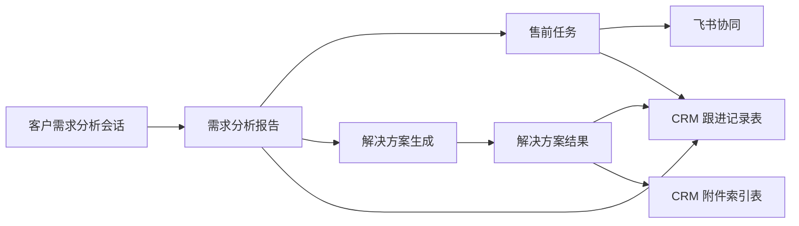

# 平台对象与飞书 CRM 记录映射清单

## 1. 文档目的

本文档用于定义当前平台内主要业务对象与飞书多维表格 CRM 记录之间的映射关系，指导后续：

1. 字段设计
2. API 设计
3. 写回策略
4. 人工确认流程
5. 数据治理

## 2. 映射设计原则

1. 飞书 CRM 作为当前阶段客户与商机主数据来源
2. 平台业务对象不复制完整 CRM，只保存必要快照与外键引用
3. 平台输出优先写入 CRM 的 `跟进记录表`，而不是直接覆盖主档
4. 所有自动写回动作都建议保留人工确认环节
5. 平台统一保留：
   - `crm_provider`
   - `crm_base_id`
   - `crm_table_id`
   - `crm_record_id`

## 3. 统一映射字段建议

每个需要联通飞书 CRM 的平台对象，建议统一补以下字段：

| 字段名 | 说明 |
|---|---|
| `crm_provider` | 当前固定为 `feishu_bitable` |
| `crm_base_id` | 飞书多维表格 Base ID |
| `crm_table_id` | 飞书表 ID |
| `crm_record_id` | 飞书记录 ID |
| `crm_customer_record_id` | 对应客户主档记录 ID |
| `crm_opportunity_record_id` | 对应商机记录 ID |
| `crm_customer_name_snapshot` | 客户名称快照 |
| `crm_opportunity_name_snapshot` | 商机名称快照 |
| `crm_sync_status` | 未绑定、已绑定、待写回、已写回、写回失败 |
| `crm_last_synced_at` | 最近同步/写回时间 |

## 4. 平台对象映射清单

## 4.1 客户需求分析会话

### 对应 CRM 对象

- `客户表`
- `商机表`（若已有）

### 平台应保存的引用

- `crm_customer_record_id`
- `crm_opportunity_record_id`
- `crm_customer_name_snapshot`
- `crm_opportunity_name_snapshot`

### 建议写回动作

不建议在“会话进行中”频繁写回 CRM。

建议只在以下节点回写：

1. 需求分析报告生成完成
2. 人工确认后形成正式跟进摘要

### 推荐写回目标

- `跟进记录表`

## 4.2 客户需求分析报告

### 对应 CRM 对象

- `跟进记录表`
- 可选：`商机表`

### 建议写回内容

| 平台字段 | CRM 目标字段 |
|---|---|
| 报告标题 | 跟进摘要 |
| 报告摘要 | 跟进摘要 / 下一步动作 |
| 推荐追问问题 | 风险点 / 下一步动作 |
| 报告链接 | 需求分析报告链接 |
| 生成时间 | 跟进时间 |
| 下次建议回访时间 | 回访时间 |

### 当前推荐方式

- 需求分析报告生成后，平台先给出“写回 CRM 草稿”
- 人工确认后，再写入 `跟进记录表`

## 4.3 解决方案生成会话

### 对应 CRM 对象

- `客户表`
- `商机表`

### 平台应保存的引用

- `crm_customer_record_id`
- `crm_opportunity_record_id`

### 建议写回策略

方案生成过程中的中间状态不建议写回 CRM。

只在以下节点考虑写回：

1. 方案生成完成
2. 人工确认该方案为“正式可流转版本”

## 4.4 解决方案结果

### 对应 CRM 对象

- `跟进记录表`
- 可选：`商机表`
- 可选：`附件索引表`

### 建议写回内容

| 平台字段 | CRM 目标字段 |
|---|---|
| 方案标题 | 跟进摘要 |
| 方案链接 | 解决方案链接 |
| 方案摘要 | 跟进摘要 |
| 方案附件/PDF | 附件索引表 |
| 方案生成时间 | 跟进时间 |

### 推荐方式

- 方案结果优先写到 `跟进记录表`
- 若形成正式材料，再补一条 `附件索引表`

## 4.5 售前任务

### 对应 CRM 对象

- `跟进记录表`
- 可选：`商机表`

### 建议写回内容

| 平台字段 | CRM 目标字段 |
|---|---|
| 任务标题 | 跟进摘要 |
| 当前状态 | 商机表最近动作 / 跟进记录表摘要 |
| 负责人 | 跟进记录参与人员 |
| 到期时间 | 下一步动作 / 回访时间 |
| 回访时间 | 回访时间 |
| 飞书任务链接 | 可放入备注或扩展链接字段 |

### 写回建议

- 售前任务创建时，不一定立即写回
- 任务确认后、负责人明确后再写回更稳

## 4.6 资料归档记录

### 对应 CRM 对象

- `附件索引表`

### 建议写回内容

| 平台字段 | CRM 目标字段 |
|---|---|
| 文件名 | 文件名 |
| 归档类型 | 附件类型 |
| 云端路径 | 云端链接 |
| 本地路径 | 本地归档路径 |
| 归档时间 | 上传时间 |
| 关联报告/方案 | 关联报告链接 / 关联方案链接 |

## 5. 飞书任务发送记录与 CRM 的关系

### 5.1 不建议直接作为 CRM 主对象

`FeishuDeliveryRecord` 更像协同执行留痕，不建议直接写进 CRM 主表。

### 5.2 推荐处理方式

只在需要给 CRM 保留协同痕迹时，摘要化写入：

- 某次售前任务已通过飞书发送给哪些人
- 是否已形成飞书个人任务

推荐仍然写入：

- `跟进记录表`
- 或 CRM 的扩展备注字段

## 6. 写回优先级建议

### 高优先级写回

1. 需求分析报告摘要
2. 解决方案链接
3. 售前任务摘要
4. 回访时间
5. 附件索引

### 低优先级写回

1. 中间运行状态
2. 智能体详细内部日志
3. 细粒度飞书发送记录
4. 大段原文转写内容

## 7. 推荐的最小闭环映射链路

## 8. 当前阶段最推荐的落地顺序

1. 先打通 `客户/商机 record_id` 绑定
2. 再打通需求分析报告 -> 跟进记录表
3. 再打通解决方案结果 -> 跟进记录表 / 附件索引表
4. 再打通售前任务 -> 跟进记录表
5. 最后再考虑更复杂的商机阶段自动联动

## 9. 最终建议

当前平台对象与飞书 CRM 的映射应遵循：

- 客户与商机是主锚点
- 跟进记录是主要写回对象
- 附件索引是资料沉淀对象
- 平台内部对象统一保存 `crm_*` 外键与快照字段

## 10. 一句话结论

当前阶段最稳的映射策略是：

- `需求分析结果、方案结果、售前任务` 统一围绕 `客户 + 商机` 挂接
- 平台输出优先回写到飞书 CRM 的 `跟进记录表`
- 正式材料再补写 `附件索引表`
