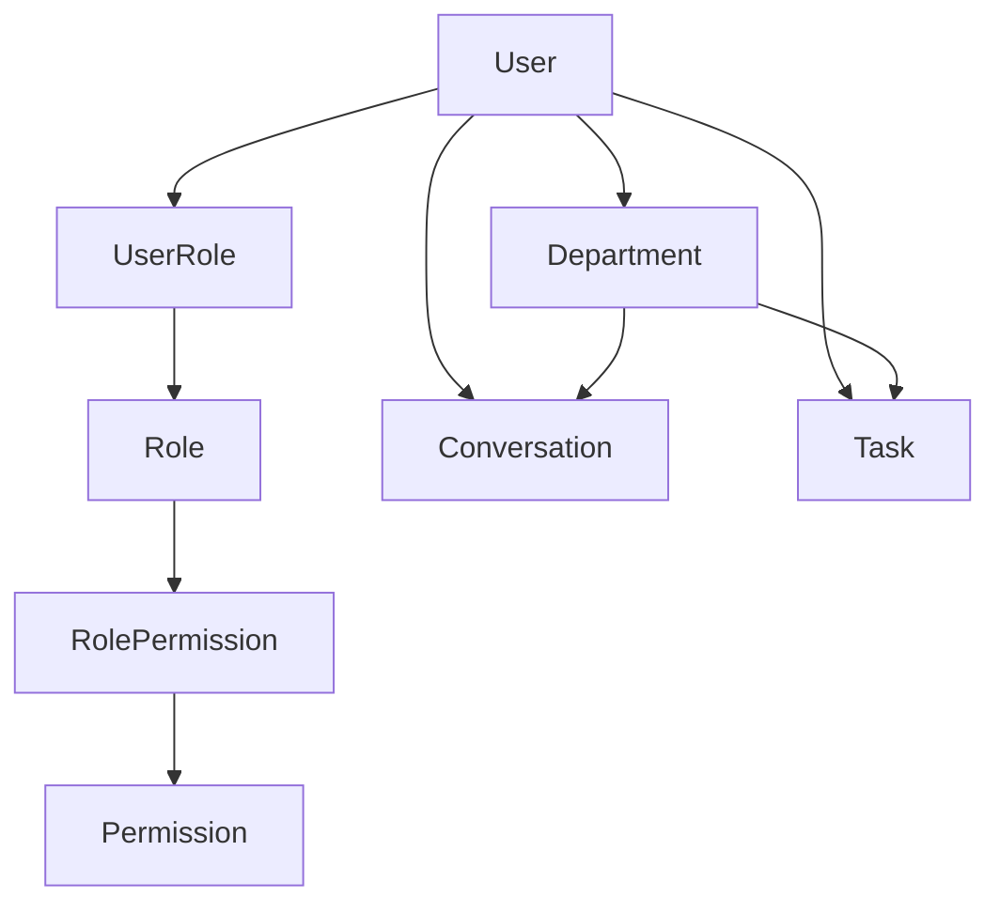

# 电力行业解决方案Agent 账户与权限体系设计文档

## 1. 文档信息

- `文档名称`：电力行业解决方案Agent 账户与权限体系设计文档
- `适用项目`：PowerAgent Docs and Demos / Django 平台层
- `文档版本`：v1.0
- `文档日期`：2026-03-21
- `目标读者`：后端开发、前端开发、测试、产品经理、技术负责人

## 2. 背景与目标

当前系统已经具备：

- 多会话历史
- 方案生成任务
- 证据卡展示
- PostgreSQL 平台层
- Agent Service + RAGFlow 的内部联调能力

但平台层的账户体系仍然非常轻量，当前仅有一个简化版 `User` 模型：

- Django `AbstractUser`
- 自定义字段：`display_name`

对于公司内部员工使用的产品，下一阶段至少需要具备：

1. 登录能力
2. 账户管理能力
3. 角色与权限能力
4. 部门归属能力
5. 内容可见性与管理边界
6. 超级管理员初始化能力
7. 后续对接 SSO / LDAP / 企业统一身份认证的扩展能力

本设计文档目标是：

- 为开发提供可直接实现的账户-角色-权限方案
- 保证首期内部可用，同时为后续正式平台化预留扩展边界

## 3. 设计原则

### 3.1 使用场景原则

本项目首期主要面向公司内部员工使用，因此：

- `不做自助注册`，管理员统一创建账户或脚本初始化
- `优先做账号开通、停用、角色分配、部门归属`
- `保留注册接口设计位`，但首期不开放前台注册页面

### 3.2 权限原则

采用 `RBAC（Role-Based Access Control）为主，资源归属控制为辅`。

也就是：

- 角色决定“能做什么”
- 资源归属决定“能看谁的内容、能管谁的内容”

### 3.3 部门原则

部门不是装饰字段，而是后续内容管理、统计和运营的关键维度。

首期建议部门用于：

- 用户归属
- 会话/任务/内容按部门筛选
- 部门管理员管理本部门账户
- 后续知识库、模板、模型配置的可见范围扩展

### 3.4 审计原则

任何涉及账户、角色、权限、停用、重置密码、内容删除等动作，必须写审计日志。

## 4. 总体方案

建议采用：

- `账户模型`：自定义 Django User
- `角色模型`：平台自定义 `Role`
- `权限模型`：平台自定义 `PermissionCode` + Django 内部 permission 兼容思路
- `部门模型`：树形或至少支持 parent 的 `Department`
- `用户-角色关系`：多对多
- `用户-部门关系`：多对一（主部门）+ 可选多对多扩展
- `资源归属控制`：内容记录带 `owner`、`department` 字段

整体关系如下：



## 5. 角色设计

首期建议先内置 5 类角色。

### 5.1 超级管理员 `super_admin`

定位：平台最高管理员

权限：

- 管理所有用户
- 管理所有角色
- 管理所有权限
- 管理所有部门
- 查看所有会话/任务/日志
- 配置模型、模板、系统参数
- 初始化和停用管理员

### 5.2 平台管理员 `platform_admin`

定位：系统日常运营管理员

权限：

- 管理用户（除超级管理员外）
- 分配角色
- 查看全平台内容
- 查看审计日志
- 管理模板、模型配置、基础配置
- 不允许修改超级管理员权限边界

### 5.3 部门管理员 `department_admin`

定位：部门负责人或部门运营管理员

权限：

- 管理本部门账户
- 查看本部门会话、任务与统计
- 可停用本部门普通用户
- 不可跨部门管理用户
- 不可修改平台级配置

### 5.4 高级业务用户 `power_user`

定位：方案经理、售前骨干、技术负责人

权限：

- 创建会话
- 生成方案
- 查看自身内容
- 在授权场景下查看本部门共享内容
- 导出结果
- 使用更多高级模板/模型配置

### 5.5 普通业务用户 `employee`

定位：普通内部员工

权限：

- 创建和管理自己的会话
- 使用默认模板和默认模型能力
- 查看自己的内容
- 不可查看他人内容

## 6. 权限点设计

建议不要只依赖 Django 原生 `is_staff/is_superuser`，而是定义一套显式权限码。

### 6.1 权限码命名规范

采用：

`资源.动作`

例如：

- `user.view`
- `user.create`
- `user.update`
- `user.disable`
- `department.view`
- `department.manage`
- `role.view`
- `role.assign`
- `permission.view`
- `conversation.view_self`
- `conversation.view_department`
- `conversation.view_all`
- `conversation.delete_self`
- `task.view_self`
- `task.view_department`
- `task.view_all`
- `task.cancel_self`
- `task.cancel_department`
- `template.view`
- `template.manage`
- `model_config.view`
- `model_config.manage`
- `audit.view`
- `system.bootstrap_admin`

### 6.2 首期推荐权限集合

#### 用户与组织

- `user.view`
- `user.create`
- `user.update`
- `user.disable`
- `user.reset_password`
- `department.view`
- `department.create`
- `department.update`
- `department.manage_member`
- `role.view`
- `role.create`
- `role.update`
- `role.assign`
- `permission.view`

#### 内容与任务

- `conversation.view_self`
- `conversation.view_department`
- `conversation.view_all`
- `conversation.delete_self`
- `conversation.delete_department`
- `task.view_self`
- `task.view_department`
- `task.view_all`
- `task.cancel_self`
- `task.cancel_department`
- `task.retry_self`

#### 平台配置

- `template.view`
- `template.manage`
- `model_config.view`
- `model_config.manage`
- `scenario_registry.view`
- `scenario_registry.manage`
- `audit.view`

## 7. 部门设计

### 7.1 部门模型建议

建议字段：

- `id`
- `name`
- `code`
- `parent_id`
- `manager_user_id`
- `status`：`active / inactive`
- `sort_order`
- `description`
- `created_at`
- `updated_at`

### 7.2 部门层级

首期即可支持：

- 一级部门
- 二级部门

例如：

- 解决方案中心
  - 电网业务组
  - 智慧能源组
- AI研发中心
  - Agent平台组
  - 知识工程组

### 7.3 用户与部门关系

首期建议：

- 用户仅绑定一个主部门 `primary_department`

可预留：

- 用户与多个部门的关联表 `UserDepartmentMembership`
- 适用于“跨部门兼岗”场景

## 8. 账户模型设计

建议在当前 `accounts.User` 基础上扩展，而不是新起一套并行账户体系。

### 8.1 当前模型现状

当前已有：

- `username`
- `password`
- `first_name`
- `last_name`
- `email`
- `is_staff`
- `is_superuser`
- `is_active`
- `display_name`

### 8.2 建议新增字段

#### 身份基础字段

- `employee_no`：工号，唯一
- `display_name`：展示姓名，已存在
- `mobile`：手机号
- `email`：邮箱，建议公司邮箱优先
- `avatar_url`：头像地址
- `job_title`：岗位名称

#### 组织归属字段

- `department_id`：主部门
- `manager_id`：直属上级，可选

#### 账户状态字段

- `account_status`：`pending / active / disabled / locked`
- `last_login_ip`
- `last_login_at`
- `password_changed_at`
- `must_change_password`：首次登录是否强制修改密码

#### 权限与范围字段

- `data_scope`：`self / department / custom / all`
- `is_department_admin`

#### 审计与维护字段

- `created_by`
- `updated_by`
- `created_at`
- `updated_at`
- `remark`

### 8.3 推荐保留字段

建议保留 Django 原生：

- `is_active`
- `is_staff`
- `is_superuser`

但语义上：

- `is_superuser`：仅超级管理员使用
- `is_staff`：表示可进入 Django Admin 或平台后台
- 业务上仍以 `角色 + 权限码` 为主

## 9. 数据模型建议

### 9.1 Department

```text
Department
- id
- name
- code
- parent_id
- manager_user_id
- status
- sort_order
- description
- created_at
- updated_at
```

### 9.2 User

```text
User
- id
- username
- password
- employee_no
- display_name
- email
- mobile
- avatar_url
- job_title
- department_id
- manager_id
- account_status
- data_scope
- must_change_password
- password_changed_at
- last_login_ip
- last_login_at
- is_active
- is_staff
- is_superuser
- created_by
- updated_by
- created_at
- updated_at
- remark
```

### 9.3 Role

```text
Role
- id
- code
- name
- description
- scope_type (platform / department / business)
- is_system_builtin
- status
- created_at
- updated_at
```

### 9.4 Permission

```text
Permission
- id
- code
- name
- module
- description
- is_system_builtin
```

### 9.5 UserRole

```text
UserRole
- id
- user_id
- role_id
- assigned_by
- assigned_at
```

### 9.6 RolePermission

```text
RolePermission
- id
- role_id
- permission_id
```

## 10. 资源权限设计

对于核心业务数据，建议引入“归属 + 权限码”双判断。

### 10.1 Conversation

建议新增字段：

- `owner_id`
- `department_id`
- `visibility`：`private / department / platform`

### 10.2 Task

建议新增字段：

- `owner_id`
- `department_id`

### 10.3 审计日志

建议补充字段：

- `department_id`
- `ip_address`
- `user_agent`
- `result_status`

## 11. 登录与认证设计

### 11.1 首期登录方式

首期建议支持：

- `用户名 / 工号 + 密码`

不支持：

- 自助注册
- 邮箱验证码注册
- 手机验证码注册

### 11.2 后续预留

预留以下方式：

- 企业 SSO
- LDAP / AD
- CAS / OAuth2 / OIDC

### 11.3 会话认证

建议：

- 平台前后端使用 `JWT + Refresh Token` 或 `Session + CSRF`

如果未来有独立前端和 App：

- 更推荐 `JWT + Refresh Token`

## 12. 超级管理员初始化方案

### 12.1 目标

通过脚本或 Django management command 初始化首个超级管理员，不依赖前台注册。

### 12.2 推荐方式

新增管理命令：

```bash
python manage.py bootstrap_super_admin \
  --username admin \
  --password '***' \
  --display-name '系统管理员' \
  --employee-no A0001 \
  --email admin@example.com
```

### 12.3 初始化行为

该命令应完成：

1. 检查是否已有超级管理员
2. 若没有则创建
3. 设置：
   - `is_superuser = true`
   - `is_staff = true`
   - `account_status = active`
4. 分配系统内置角色：`super_admin`
5. 写审计日志

### 12.4 幂等性要求

同一用户名重复执行时：

- 不重复创建
- 可选择：
  - 报错退出
  - 或 `--reset-password` 时覆盖密码

## 13. 建议的系统内置角色初始化

建议同时提供内置角色初始化命令：

```bash
python manage.py bootstrap_rbac
```

初始化内容：

- 内置角色
  - `super_admin`
  - `platform_admin`
  - `department_admin`
  - `power_user`
  - `employee`
- 内置权限码
- 内置角色与权限的绑定关系

## 14. 后台管理能力建议

建议首期后台至少提供：

1. 用户列表
2. 创建/编辑用户
3. 启用/停用用户
4. 重置密码
5. 部门列表与管理
6. 角色列表与权限查看
7. 给用户分配角色
8. 查看审计日志

## 15. 前端页面建议

建议后续补充这些页面：

- 登录页
- 账户管理页
- 部门管理页
- 角色权限页
- 个人中心页
- 修改密码页

## 16. 开发实施建议

### 16.1 第一期（最小可用）

目标：内部员工可登录并按角色使用。

包含：

- 扩展 `User` 模型字段
- 新增 `Department`
- 新增 `Role`、`Permission`、`UserRole`、`RolePermission`
- 超级管理员初始化命令
- 登录接口
- 用户列表与启停用
- 会话/任务按 `owner_id` 管控

### 16.2 第二期（部门管理）

包含：

- 部门管理员
- 部门内用户管理
- 部门维度内容筛选
- 部门统计

### 16.3 第三期（企业身份集成）

包含：

- SSO / LDAP
- 更细的数据范围
- 多组织/多租户预留

## 17. 需要补充的逻辑与字段建议

这里是除基础账户逻辑外，我建议你们尽早考虑但可以分期落地的内容。

### 17.1 必须尽早补充的逻辑

1. `账户停用逻辑`
- 停用后不能登录
- 停用后保留历史会话和审计日志

2. `密码重置逻辑`
- 管理员重置后应要求用户首次登录修改密码

3. `审计日志逻辑`
- 用户登录、登出、密码变更、角色变更、账户停用都要记录

4. `数据可见范围逻辑`
- 用户只能看到自己的内容
- 部门管理员可看到本部门内容
- 平台管理员可看全局内容

5. `删除策略`
- 用户原则上不物理删除，采用停用

### 17.2 建议补充的账户字段

建议补充但可以第二阶段落地：

- `login_name` 与 `employee_no` 分离策略
- `office_location`
- `hire_date`
- `security_level`
- `preferred_llm_provider`
- `default_scenario_scope`
- `last_password_reset_by`
- `failed_login_count`
- `locked_until`

### 17.3 建议补充的组织逻辑

- 部门负责人字段
- 用户直属上级字段
- 代理管理人机制
- 跨部门协作可见性

## 18. 与当前代码的关系和迁移建议

当前平台已有：

- 自定义 `accounts.User`
- conversations / tasks / audit 等业务模型

建议迁移路径：

1. 保留现有 `User` 模型，不重建认证体系
2. 在现有 `User` 上新增业务字段
3. 新增 `Department / Role / Permission / UserRole / RolePermission`
4. 给 `Conversation / Task / AuditLog` 补 `owner / department / visibility` 等字段
5. 新增 management command：
   - `bootstrap_super_admin`
   - `bootstrap_rbac`

## 19. 最终推荐意见

如果按“公司内部员工优先使用”的目标来做，首期最稳的路线是：

1. `不做注册`
2. `先做登录`
3. `先做账户-角色-权限-部门`
4. `通过脚本初始化超级管理员`
5. `通过后台创建普通用户`
6. `按 owner + department + role permission 控制资源访问`

一句话总结：

`首期采用“内部账号开通制 + RBAC + 部门归属 + 超级管理员脚本初始化”的方案最合适。`
