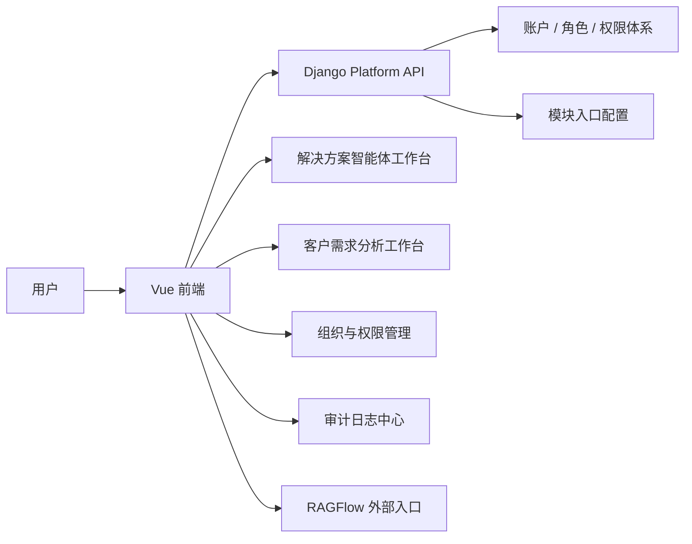
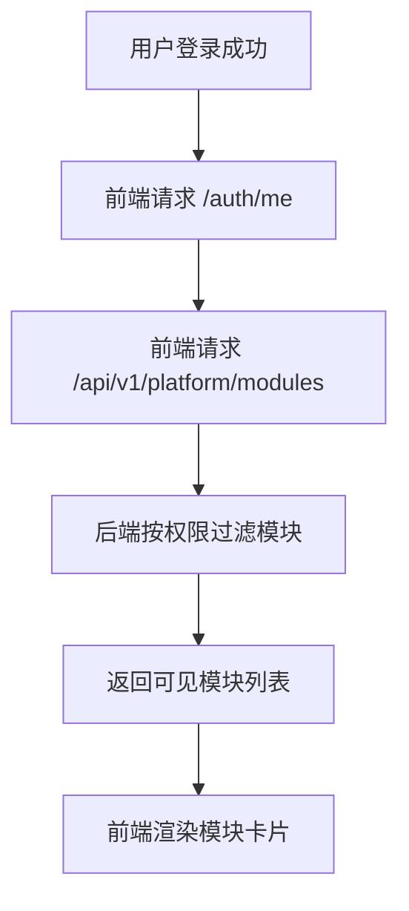
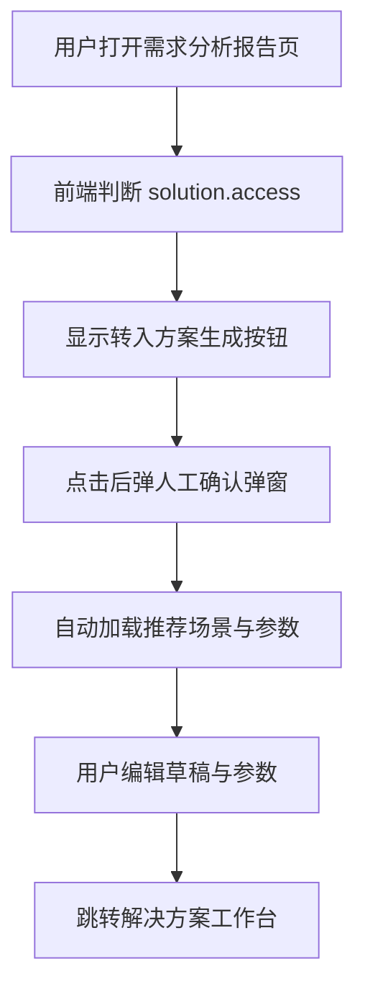

# 统一模块入口平台改造 技术设计稿

## 1. 文档目的

本文档用于将“统一模块入口平台改造 PRD”转化为可落地的技术设计方案，供前端、后端、测试和平台研发协同使用。

本文档重点回答：

1. 登录后默认入口如何切换为统一模块页
2. 如何按权限动态返回模块列表
3. 如何收口现有页面中的跨模块入口
4. 如何把 `RAGFlow` 正式纳入平台入口
5. 如何保留“需求分析报告 -> 方案生成”的业务联动

## 2. 技术目标

## 2.1 功能目标

1. 提供统一模块入口页
2. 根据用户权限动态显示模块
3. 登录后默认进入统一模块入口页
4. 现有工作台页面内部移除平台级入口
5. 保留需求分析报告页中的“转入方案生成”业务联动
6. 为 `RAGFlow` 提供正式模块入口和权限控制

## 2.2 非功能目标

1. 不破坏现有解决方案智能体与客户需求分析智能体主链路
2. 尽量复用现有权限模型
3. 不强依赖 `RAGFlow` 账号打通能力
4. 平台首页加载快、逻辑清晰

## 3. 总体架构



## 4. 改造范围

## 4.1 本次纳入范围

1. 平台统一模块入口页
2. 后端模块列表接口
3. 登录后默认路由调整
4. 模块卡片权限显隐
5. 工作台中的平台级入口收口
6. 报告页“转入方案生成”的权限校验
7. `RAGFlow` 模块入口正式化

## 4.2 暂不纳入范围

1. `RAGFlow` 与 Django 的单点登录
2. `RAGFlow` 用户体系改造
3. `RAGFlow` 页面深度嵌入
4. 多租户首页

## 5. 模块模型设计

## 5.1 模块对象建议

前后端统一使用“模块定义”概念。

建议字段：

1. `module_id`
2. `name`
3. `description`
4. `icon`
5. `route_type`
6. `route_target`
7. `required_permissions`
8. `open_mode`
9. `sort_order`
10. `is_external`

## 5.2 MVP 模块定义建议

### 1. 解决方案智能体

- `module_id=solution_workspace`
- `route_type=internal`
- `route_target=/`
- `required_permissions=[solution.access]`

### 2. 客户需求分析智能体

- `module_id=customer_demand_workspace`
- `route_type=internal`
- `route_target=/customer-demand`
- `required_permissions=[customer_demand.access]`

### 3. 知识库管理

- `module_id=knowledge_base_admin`
- `route_type=external`
- `route_target=http://127.0.0.1:9381`
- `required_permissions=[knowledge.access]`
- `open_mode=new_tab`

### 4. 组织与权限管理

- `module_id=access_admin`
- `route_type=internal`
- `route_target=/admin/access`
- `required_permissions=[platform.manage]`

### 5. 审计日志中心

- `module_id=audit_center`
- `route_type=internal`
- `route_target=/admin/audit`
- `required_permissions=[audit.view]`

## 6. 权限设计

## 6.1 模块入口权限

继续沿用现有权限体系，并显式约定模块级入口权限：

- `solution.access`
- `customer_demand.access`
- `knowledge.access`
- `platform.manage`
- `audit.view`

## 6.2 模块内权限

模块入口可见不等同于模块内拥有全部操作权限。

例如：

1. 进入组织与权限管理
2. 是否可创建用户
3. 是否可删除角色
4. 是否可查看审计详情

仍由现有模块内权限继续控制。

## 7. 后端设计

## 7.1 推荐新增接口

### `GET /api/v1/platform/modules`

作用：

1. 返回当前登录用户可见的模块列表
2. 供统一模块入口页渲染

返回示例：

```json
{
  "items": [
    {
      "module_id": "solution_workspace",
      "name": "解决方案智能体",
      "description": "基于场景、参数、知识库与模板生成行业解决方案",
      "icon": "cpu",
      "route_type": "internal",
      "route_target": "/",
      "open_mode": "same_tab"
    },
    {
      "module_id": "knowledge_base_admin",
      "name": "知识库管理",
      "description": "进入 RAGFlow 知识库平台",
      "icon": "database",
      "route_type": "external",
      "route_target": "http://127.0.0.1:9381",
      "open_mode": "new_tab"
    }
  ]
}
```

## 7.2 模块列表生成逻辑

建议采用后端配置表或静态注册表实现。

MVP 推荐：

1. 先用代码内注册表
2. 后端按当前用户权限过滤
3. 返回最终可见模块

优点：

1. 实现快
2. 改动风险低
3. 不引入额外数据库表

## 7.3 登录后默认跳转逻辑

后端无需直接控制跳转，但 `auth/me` 返回中建议保留足够的权限数据，让前端能够判断：

1. 用户是否已登录
2. 有哪些权限
3. 是否有平台管理权限

## 7.4 “转入方案生成”权限控制

当前报告页中的“转入方案生成”按钮，前端应依据：

- `solution.access`

进行显隐控制。

后端同时建议增加二次保护：

1. 若用户无 `solution.access`
2. 则不允许执行“转入方案草稿准备”相关后续接口（如未来后端承接此动作）

## 8. 前端设计

## 8.1 新增页面

建议新增统一平台入口页：

- `PlatformModulesView.vue`

路由建议：

- `/modules`

## 8.2 路由策略

### 登录后默认首页

建议将前端默认首页改成：

- `/modules`

### 工作台路由保留

保留现有：

- `/`
- `/customer-demand`
- `/admin/access`
- `/admin/audit`

避免一次性打断已存在逻辑。

## 8.3 路由守卫

前端路由守卫新增规则：

1. 未登录：
   - 跳登录页
2. 已登录访问 `/login`：
   - 跳 `/modules`
3. 访问具体模块页：
   - 按对应权限判断是否可进入

## 8.4 页面组件建议

统一入口页建议拆为：

1. `PlatformHeader`
2. `ModuleCardGrid`
3. `ModuleCard`
4. `UserSummaryCard`

## 8.5 现有页面收口改造

### 解决方案智能体工作台

移除：

1. 进入客户需求分析入口
2. 进入组织与权限管理入口

### 客户需求分析工作台

移除：

1. 作为平台导航使用的模块入口

### 保留动作

保留：

1. 需求分析报告页 -> 转入方案生成

## 9. RAGFlow 集成设计

## 9.1 MVP 方案

MVP 不直接改造 `RAGFlow` 认证机制。

当前实现建议：

1. 统一平台入口页控制谁能看到“知识库管理”
2. 点击模块卡片后，新标签页打开 `RAGFlow`

## 9.2 入口控制边界

平台侧负责：

1. 显示入口
2. 控制可见性

`RAGFlow` 自身仍负责：

1. 自己的登录态
2. 自己的账户权限

## 9.3 二阶段方向

可单独研究：

1. `OIDC / OAuth / SSO`
2. 反向代理鉴权桥接
3. 统一身份源接入

但不纳入当前 MVP。

## 10. 数据流说明

## 10.1 模块入口页数据流



## 10.2 报告转方案生成数据流



## 11. 测试建议

## 11.1 权限测试

至少准备以下账号组合：

1. 普通销售
2. 技术支持
3. 知识库维护人员
4. 平台管理员
5. 超级管理员

验证：

1. 模块卡片可见性是否符合预期
2. 直接访问模块路由时是否被正确拦截

## 11.2 导航测试

验证：

1. 登录后是否进入 `/modules`
2. 页面内部是否已移除不应保留的跨模块入口
3. `RAGFlow` 是否能从统一入口页直接打开

## 11.3 联动测试

验证：

1. 有 `solution.access` 的用户能从报告页进入方案工作台
2. 无 `solution.access` 的用户不能看到或不能使用该入口

## 12. 推荐实施顺序

### 第 1 步

1. 增加后端模块列表注册表和接口
2. 增加前端统一模块入口页

### 第 2 步

1. 登录默认跳转改为 `/modules`
2. 模块页按权限显示

### 第 3 步

1. 收口解决方案智能体与客户需求分析智能体中的平台级入口
2. 保留并校验“转入方案生成”业务联动

### 第 4 步

1. 增加 `RAGFlow` 正式入口
2. 评估账号打通方案

## 13. 一句话总结

本次技术改造的目标，是把当前系统从：

`多个工作台并列存在、彼此跳转`

收敛为：

`登录 -> 统一模块入口 -> 按权限进入模块 -> 保留必要业务联动`

从而建立真正的平台导航与权限边界。
