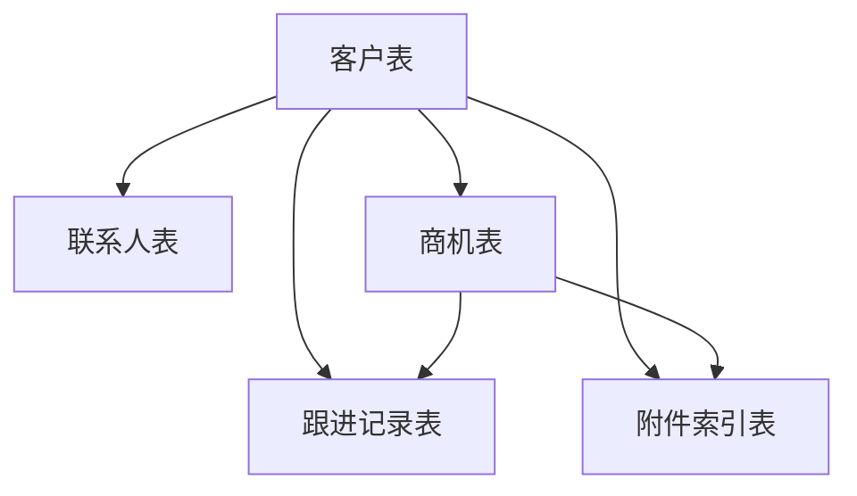

# 飞书 CRM 最小表结构设计

## 1. 文档目的

本文档用于定义当前阶段在飞书多维表格中承接 CRM 职能时，建议采用的 `最小表结构`。目标不是构建完整 CRM，而是支撑当前售前闭环：

1. 客户沟通
2. 需求分析
3. 解决方案生成
4. 售前任务流转
5. 飞书协同
6. 回访与资料沉淀

## 2. 设计原则

1. 只保留当前闭环需要的最小对象
2. 优先保证客户、商机、跟进记录可串联
3. 附件与智能体产出先以“索引”方式挂接，不在飞书中重复存储大文件
4. 与平台交互时统一保留可回写的 `record_id`
5. 允许后续平滑扩展到客户画像、商机阶段与附件治理

## 3. 最小表结构总览

建议在飞书多维表格中至少建立 5 张表：

1. `客户表`
2. `联系人表`
3. `商机表`
4. `跟进记录表`
5. `附件索引表`

如需更轻量，也可以先从 4 张开始：

- 客户表
- 联系人表
- 商机表
- 跟进记录表

附件索引表可在第二步补齐。

## 4. 客户表

### 4.1 作用

作为客户主档表，承接客户基础信息与售前客户画像基础字段。

### 4.2 建议字段

| 字段名 | 类型 | 是否必填 | 说明 |
|---|---|---:|---|
| 客户名称 | 单行文本 | 是 | 客户主显示名 |
| 客户编号 | 单行文本 | 否 | 企业内部客户编码 |
| 客户简称 | 单行文本 | 否 | 便于展示 |
| 所属行业 | 单选 | 是 | 如电网公司、园区、制造业、政府等 |
| 区域 | 单选 | 是 | 省/市/区域 |
| 客户级别 | 单选 | 否 | 重点客户、一般客户等 |
| 客户状态 | 单选 | 是 | 潜在、跟进中、方案中、签约中、已沉淀 |
| 销售负责人 | 人员 | 否 | 当前主销售 |
| 技术支持负责人 | 人员 | 否 | 当前主技术支持 |
| 最近跟进时间 | 日期时间 | 否 | 最近一次有效跟进 |
| 下次回访时间 | 日期时间 | 否 | 计划回访节点 |
| 客户画像摘要 | 多行文本 | 否 | 当前阶段人工或智能体整理的画像摘要 |
| 关键痛点 | 多行文本 | 否 | 售前阶段核心痛点 |
| 已有系统基础 | 多行文本 | 否 | 客户现有系统与能力基础 |
| 来源渠道 | 单选 | 否 | 转介绍、主动拓展、展会、历史客户等 |
| 平台客户外键 | 单行文本 | 否 | 若平台后续形成内部客户对象，可留引用 |

### 4.3 建议唯一性策略

- 客户名称 + 区域：作为当前阶段主要去重依据
- 若已有企业内部编码，则 `客户编号` 优先做唯一标识

## 5. 联系人表

### 5.1 作用

承接客户联系人与决策链信息。

### 5.2 建议字段

| 字段名 | 类型 | 是否必填 | 说明 |
|---|---|---:|---|
| 联系人姓名 | 单行文本 | 是 | 联系人姓名 |
| 所属客户 | 关联客户表 | 是 | 指向客户主档 |
| 岗位/角色 | 单行文本 | 否 | 如主任、信息化负责人、调度员等 |
| 联系电话 | 单行文本 | 否 | 手机或座机 |
| 邮箱 | 单行文本 | 否 | 邮件联系方式 |
| 决策层级 | 单选 | 否 | 决策人、影响人、使用人、协调人 |
| 是否关键联系人 | 复选框 | 否 | 是否关键角色 |
| 飞书可联通标识 | 复选框 | 否 | 是否适合飞书内协同 |
| 备注 | 多行文本 | 否 | 其他补充说明 |

### 5.3 当前阶段建议

- 一位客户至少保留 1~3 个核心联系人
- 不要一开始追求完整通讯录，先聚焦有效售前联系人

## 6. 商机表

### 6.1 作用

承接项目机会与售前推进状态，是需求分析、解决方案、售前任务的上层挂接对象。

### 6.2 建议字段

| 字段名 | 类型 | 是否必填 | 说明 |
|---|---|---:|---|
| 商机名称 | 单行文本 | 是 | 如“常州大通工业园储能优化项目” |
| 所属客户 | 关联客户表 | 是 | 指向客户 |
| 当前阶段 | 单选 | 是 | 初步接触、需求明确、方案设计、汇报中、商务推进、暂停 |
| 场景类型 | 多选 | 否 | 故障诊断、储能、配网规划、功率预测等 |
| 客户核心诉求 | 多行文本 | 否 | 当前最主要诉求 |
| 预计金额 | 数字 | 否 | 如需要可填 |
| 最近动作 | 多行文本 | 否 | 最近一次推进摘要 |
| 下一步动作 | 多行文本 | 否 | 下一步安排 |
| 下次回访时间 | 日期时间 | 否 | 商机级回访节点 |
| 是否已有需求分析 | 复选框 | 否 | 是否已形成需求分析报告 |
| 是否已有解决方案 | 复选框 | 否 | 是否已形成解决方案 |
| 平台商机外键 | 单行文本 | 否 | 平台后续如有对象可挂接 |

### 6.3 设计原则

- 需求分析和解决方案都建议挂在“商机”维度，而不是直接散落在客户维度
- 一个客户可存在多个商机

## 7. 跟进记录表

### 7.1 作用

沉淀每次客户沟通、需求分析生成、方案输出、任务推进的关键摘要，是售前闭环的历史轨迹表。

### 7.2 建议字段

| 字段名 | 类型 | 是否必填 | 说明 |
|---|---|---:|---|
| 跟进时间 | 日期时间 | 是 | 跟进动作发生时间 |
| 所属客户 | 关联客户表 | 是 | 指向客户 |
| 所属商机 | 关联商机表 | 否 | 若已关联商机则填写 |
| 跟进方式 | 单选 | 是 | 电话、现场拜访、线上会议、内部评审、方案汇报 |
| 参与人员 | 多行文本/人员 | 否 | 当前跟进参与人 |
| 跟进摘要 | 多行文本 | 是 | 当前动作摘要 |
| 风险点 | 多行文本 | 否 | 关键风险 |
| 下一步动作 | 多行文本 | 否 | 跟进建议 |
| 需求分析报告链接 | URL | 否 | 平台报告页链接 |
| 解决方案链接 | URL | 否 | 平台方案页链接 |
| 售前任务链接 | URL | 否 | 平台售前任务链接 |
| 回访时间 | 日期时间 | 否 | 与该条记录关联的下次回访 |
| 写回来源 | 单选 | 否 | 人工填写、需求分析智能体、解决方案智能体、售前闭环中心 |

### 7.3 使用建议

- 平台向 CRM 的主要回写对象优先就是这张表
- 避免直接覆盖客户/商机主档里的长文本摘要，优先沉淀为跟进记录

## 8. 附件索引表

### 8.1 作用

不直接把所有文件二进制存到飞书，而是在飞书 CRM 中保存附件索引，便于客户/商机维度检索。

### 8.2 建议字段

| 字段名 | 类型 | 是否必填 | 说明 |
|---|---|---:|---|
| 文件名 | 单行文本 | 是 | 附件名称 |
| 所属客户 | 关联客户表 | 是 | 指向客户 |
| 所属商机 | 关联商机表 | 否 | 若有则挂商机 |
| 附件类型 | 单选 | 是 | 需求分析报告、解决方案、会议纪要、录音、PPT、客户资料 |
| 云端链接 | URL | 否 | 云端归档位置 |
| 本地归档路径 | 单行文本 | 否 | 本地路径索引 |
| 上传时间 | 日期时间 | 否 | 上传或归档时间 |
| 关联报告链接 | URL | 否 | 平台报告页 |
| 关联方案链接 | URL | 否 | 平台方案页 |
| 上传来源 | 单选 | 否 | 平台自动归档、人工上传 |

## 9. 表间关系建议

关系说明：

1. 一个客户对应多个联系人
2. 一个客户对应多个商机
3. 一个客户/商机对应多条跟进记录
4. 一个客户/商机对应多个附件索引

## 10. 第一阶段最小落地建议

如果你们想尽快接起来，建议先建这 4 张：

1. `客户表`
2. `联系人表`
3. `商机表`
4. `跟进记录表`

然后第二步再补：

5. `附件索引表`

## 11. 与平台联通时的最小必备字段

如果要让平台对象能稳稳地挂回飞书 CRM，至少建议每一类业务都能拿到：

- `客户表.record_id`
- `商机表.record_id`

因此飞书多维表格里最小必须有：

1. `客户`
2. `商机`

而需求分析、解决方案、售前任务、归档记录都优先挂接到这两个对象。

## 12. 一句话结论

当前阶段最适合你们的飞书 CRM 最小表结构是：

- 客户表
- 联系人表
- 商机表
- 跟进记录表
- 附件索引表

其中真正的第一优先是：

- `客户表 + 商机表 + 跟进记录表`
