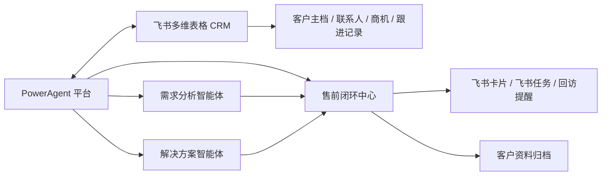

# 飞书多维表格 CRM 接入方案分析

## 1. 文档目的

本文档用于分析在当前项目阶段，将飞书多维表格作为 `CRM 主数据层` 接入售前闭环平台的可行性、边界、收益与实施路径。

本文重点回答：

1. 是否适合在当前阶段用飞书多维表格承接 CRM 职能
2. 飞书多维表格与当前平台应如何分工
3. 客户、需求分析、解决方案、售前任务、飞书协同之间如何打通
4. 本地暂不自建 CRM 的情况下，怎样实现整体闭环管理
5. 当前阶段最适合先接哪些数据对象和字段

## 2. 背景判断

当前平台已经具备以下能力：

1. `客户需求分析智能体`
   - 会中辅助
   - 会后需求分析报告
   - 报告结果可流转
2. `解决方案生成智能体`
   - 需求分析结果一键导入
   - 方案参数自动匹配与人工确认
   - 方案结果可流转
3. `售前闭环中心`
   - 售前任务管理
   - 飞书卡片消息
   - 飞书个人任务
   - 飞书用户/部门同步

当前缺口在于：

- 客户主档仍未形成统一主数据源
- 客户、联系人、商机、跟进记录、回访节点、附件索引还未形成统一归档口径
- 需求分析、解决方案、售前任务虽然已经闭环，但客户维度尚未统一绑定

因此需要一个现阶段可快速承接客户主档与跟进沉淀的外部系统。

## 3. 方案结论

### 3.1 结论

在当前阶段，将飞书多维表格作为 `轻量 CRM 主数据层` 接入，是一条 `高可行、低实施成本、与现有售前闭环最契合` 的路径。

### 3.2 推荐定位

推荐采用如下职责划分：

- `飞书多维表格 CRM`：客户主数据层
- `PowerAgent 平台`：智能处理与流程协同层

具体来说：

- 飞书多维表格维护：
  - 客户
  - 联系人
  - 商机/项目机会
  - 跟进记录
  - 回访时间
  - 附件索引
  - 客户画像基础字段
- 平台维护：
  - 需求分析会话
  - 会中录音与转写
  - 需求分析报告
  - 解决方案生成结果
  - 售前任务流转
  - 飞书卡片/飞书任务发送记录
  - 审计日志

### 3.3 不推荐路径

当前阶段不建议：

1. 立即在本地自建一套完整 CRM 页面与主数据维护能力
2. 平台与飞书各维护一份客户主档并长期并行
3. 让智能体结果不经确认地直接覆盖 CRM 主数据关键字段

## 4. 为什么当前阶段适合接飞书多维表格 CRM

## 4.1 组织接受度高

当前售前协同本身已经围绕飞书展开：

- 飞书卡片消息
- 飞书群/个人任务
- 飞书身份与部门同步

因此继续把客户主档与跟进管理落在飞书生态内，组织阻力最小。

## 4.2 与当前售前闭环天然契合

当前项目目标不是构建通用重型 CRM，而是打通：

1. 客户沟通
2. 需求分析
3. 解决方案生成
4. 售前任务协同
5. 资料沉淀
6. 回访管理

飞书多维表格恰好适合承接上述链路中的 `客户与商机主数据`。

## 4.3 比自建 CRM 更快形成价值闭环

如果此时自建 CRM，将额外引入：

- 客户主档维护 UI
- 联系人管理 UI
- 商机管理 UI
- 记录、筛选、权限、导出等大量基础能力

而这些并不是当前项目最核心的智能体价值点。当前更值得投入的是：

- 需求分析的质量
- 方案生成与参数化配置
- 售前任务协同
- 飞书任务/卡片/回访链路

## 4.4 客户画像也有自然落点

飞书多维表格虽然不是传统意义上的画像引擎，但完全可以先以结构化字段方式承接客户画像，例如：

- 行业
- 区域
- 电力场景类型
- 当前主要痛点
- 已有系统基础
- 关键决策人
- 跟进热度
- 项目阶段
- 典型关注点

这足以支撑当前阶段的售前智能体闭环。

## 5. 总体架构建议

## 5.1 角色分工

### 飞书多维表格 CRM 负责

1. 客户主档
2. 联系人主档
3. 商机/机会主档
4. 跟进记录台账
5. 回访计划台账
6. 附件与文档索引字段

### 平台负责

1. 需求分析与会中辅助
2. 解决方案生成与参数推断
3. 售前任务流转
4. 飞书卡片/任务协同
5. 智能体结果沉淀
6. 关键字段回写 CRM
7. 平台侧审计与权限控制

## 6. 建议接入的数据对象

## 6.1 客户表

建议字段：

- `客户名称`
- `客户编号`
- `所属行业`
- `区域`
- `客户级别`
- `客户状态`
- `销售负责人`
- `技术支持负责人`
- `最近跟进时间`
- `下次回访时间`
- `客户画像摘要`
- `来源渠道`

## 6.2 联系人表

建议字段：

- `联系人姓名`
- `所属客户`
- `岗位/角色`
- `手机号`
- `邮箱`
- `决策层级`
- `飞书可联通标识`
- `备注`

## 6.3 商机/项目机会表

建议字段：

- `商机名称`
- `所属客户`
- `当前阶段`
- `预计金额`（可选）
- `场景类型`
- `客户核心诉求`
- `是否已有需求分析`
- `是否已有解决方案`
- `最近动作`
- `下一步动作`

## 6.4 跟进记录表

建议字段：

- `所属客户`
- `所属商机`
- `跟进时间`
- `跟进方式`
- `参与人员`
- `摘要`
- `风险点`
- `下一步动作`
- `关联需求分析报告`
- `关联解决方案`

## 6.5 附件索引表

建议字段：

- `所属客户`
- `所属商机`
- `附件类型`
- `文件名`
- `云端链接`
- `本地归档路径`
- `上传时间`
- `关联报告`
- `关联方案`

## 7. 平台侧建议新增的映射字段

为实现真正打通，平台内部各业务对象建议增加 CRM 外键引用，而不是复制一份客户主档。

### 7.1 建议统一引入的引用字段

- `crm_provider`
  - 固定为 `feishu_bitable`
- `crm_base_id`
- `crm_table_id`
- `crm_record_id`
- `crm_customer_name_snapshot`
- `crm_opportunity_name_snapshot`

### 7.2 建议挂接对象

1. `客户需求分析会话`
2. `客户需求分析报告`
3. `解决方案生成会话`
4. `解决方案任务`
5. `售前任务`
6. `资料归档记录`

## 8. 关键业务流建议

## 8.1 从 CRM 发起业务

理想链路：

1. 在飞书 CRM 中选择客户或商机
2. 打开平台对应入口
3. 在平台中发起：
   - 需求分析
   - 解决方案生成
   - 售前任务
4. 平台自动带入 CRM 客户上下文

## 8.2 从平台回写 CRM

平台中的关键事件建议回写：

1. 需求分析报告生成完成
2. 解决方案生成完成
3. 售前任务创建/完成
4. 下次回访时间确认
5. 附件归档完成

## 8.3 推荐的写回策略

建议采用：

- `AI 生成建议内容`
- `人工确认后写回 CRM`

而不是：

- `智能体自动直接更新 CRM 主档`

## 9. 适合当前阶段的最小闭环

### 9.1 第一期最小接入范围

1. CRM 客户主档引用接入
2. 平台对象绑定 `crm_record_id`
3. 需求分析报告生成后可回写客户跟进摘要
4. 解决方案结果生成后可回写方案链接与状态
5. 售前任务创建后可回写任务摘要、负责人、回访时间

### 9.2 第二期增强范围

1. 联系人同步/选择
2. 商机阶段联动
3. 客户画像字段增强
4. 附件与资料索引同步
5. 从 CRM 直接反向打开平台对象

### 9.3 暂不建议纳入本期

1. 自动覆盖客户关键主档字段
2. 本地完整 CRM 维护界面
3. 复杂销售漏斗与回款体系
4. 售后工单与服务流程

## 10. 权限与治理建议

## 10.1 权限边界

- 飞书多维表格负责 CRM 数据访问与协同层权限
- 平台继续负责：
  - 智能体访问权限
  - 任务权限
  - 审计日志
  - 数据导出权限

## 10.2 写回治理

建议对 CRM 写回动作增加：

- 操作日志
- 责任人记录
- 写回来源记录
- 失败重试与人工修正机制

## 11. 风险与注意点

## 11.1 多维表格不是重型 CRM

优点：

- 上线快
- 组织接受度高
- 协同天然顺

限制：

- 复杂对象关系需要自己设计
- 深度 CRM 能力不如专业系统
- 后期若扩展到报价/合同/回款，可能需要进一步评估

## 11.2 平台与 CRM 不能双写失控

必须避免：

- 飞书 CRM 一套客户信息
- 平台本地再维护一套并长期分叉

正确方式应为：

- CRM 为主
- 平台引用并写回关键结果

## 11.3 写回动作要有“人工确认”边界

尤其是：

- 商机阶段
- 客户画像标签
- 关键回访计划
- 对外输出摘要

## 12. 最终建议

当前阶段最推荐的路线是：

1. `飞书多维表格 CRM` 作为客户与商机主数据层
2. `PowerAgent 平台` 作为智能体处理、流程流转与协同执行层
3. 平台不急于本地自建完整 CRM
4. 所有需求分析、解决方案、售前任务统一挂接 CRM 客户/商机主键
5. 平台生成结果通过人工确认后回写 CRM，形成闭环

## 13. 一句话结论

对当前项目来说，`飞书多维表格 CRM + PowerAgent 智能体平台` 是一条高可行、低阻力、能快速形成售前闭环价值的路线。
